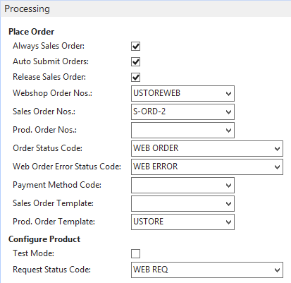
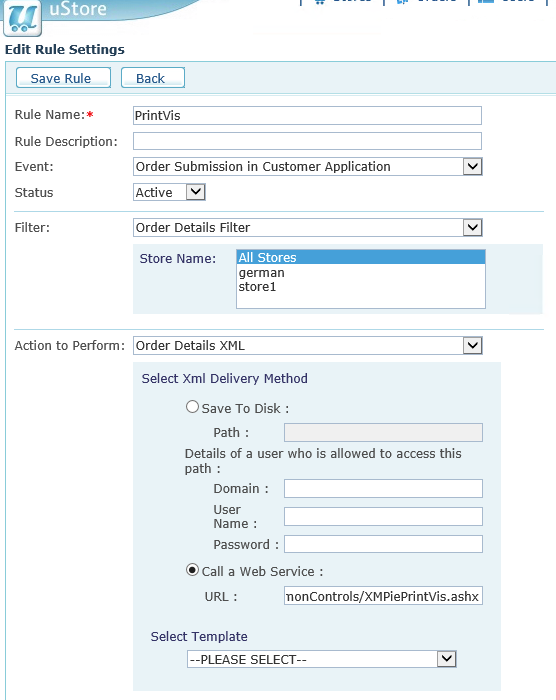

# PrintVis intergration with XMPie - uStore

## Introduction

This document will summarize the setup for the Web2PrintVis integration
with the 3rd-party product **uStore** by XMPie.

The uStore solution is a web shop for B2B and B2C. It offers easy and
flexible maintenance of the products sold over this portal. Products can
be configured manually.

On the PrintVis side, standard setup and interfacing structures are
used. This document only describes the special setup needed to run
uStore as a web frontend. Details about this functionality can be found
by searching for Web2PrintVis on the [PrintVis Support
Portal](https://support365.printvis.com/support/search/solutions?term=Web2PrintVis).

All jobs that are confirmed in uStore will create a sales order and
PrintVis case in 365 Business Central/PrintVis and detailed parameters
will be exchanged as well.

Details about the uStore setup can be found in the uStore manual,
available
at [XMPie](https://www.xmpie.com/support/product-documentation/).

Connect XMPie with the PrintVis Database

## 365 Business Central/PrintVis setup

WebService

The connection between uStore and PrintVis is realized through the XMPIE
web service, which needs to be set up and published on the 365 Business
Central/PrintVis database:

Path: /Departments/Administration/Services/Web Services: Make sure the
web service based on Codeunit 6010942 is set up and published.

The Field SOAP URL contains the URL for the uStore to communicate with
PrintVis. The Service Name needs to be **XMPIE**.

User

Set up a user for Microsoft Dynamics 365 Business Central.

-   For actual versions please use credential type OAuthentication
    (OAut2.0)

-   For onprem and older versions User/Password authentication can be
    still possible.

Make sure that the user has permission set SUPER.

Web2PrintVis Frontend Setup

It is not mandatory to name the store “USTORE.” Select XMPie in the
field “Web Shop System.”

You may need to personalize and show some of these fields / sections
since this integration was created prior to the new version of Web2PV.

Select **Webservice** as Method Receive Files. Enter the address to the
store’s Response URL (should be webshop base address + /uStoreWSAPI.

Namespace should be uStoreWSAPI.

Login and password should be a user/system account with permission to
integrate.

This is just an example of the setup, the above processing section can
be completed as desired.

For the field Prod. Order Template you need to setup a 365 Business
Central template using table ID 6010312. The field “Order Type” should
be filled with the order type you are using for XMPie orders.

Data Conversion

On the Frontend setup page there is a button to open the Data Conversion
page.

Create one line for Status Code that has Web Shop Value ‘3,’ -  this
status code should be used when uStore is ready with the composition
(PDF generated).

There is also the possibility to set up mapping between uStore shipping
agent and 365 Business Central shipping agent and shipping agent service
code here.

Status Code

To be able to send back signals to uStore, you need to set up the field
“External Status Description.” 

There is one predefined signal and a list of custom signals.

SENDTOPRODUCTION – to send the “send to production”- signal back, enter
the text SENDTOPRODUCTION on one of the status codes in the field
“External Status Description”.

There is also support for moving the uStore job to a specific queue in
uStore; Specify the queue number on the status code in the field
“External Status Description” - please look in the uStore setup for the
list of uStore queues.

Inventory

For all items that are set up in the catalog, PrintVis will send updated
inventory levels to uStore with any changes in stock.

** **

## uStore Setup

uStore uses a locally-published web application to be able to
communicate with 365 Business Central. Please follow the instructions.

Admin

Create a new trigger, click on Trigger setup, click on new

WebService address should
be: <http://127.0.0.1/uStore.CommonControls/XMPiePrintVis.ashx>

On Select template, select one and click on the copy icon. Give the copy
a name, PrintVis SOAP

Copy and paste this text into the Template:

<table>
<colgroup>
<col style="width: 100%" />
</colgroup>
<tbody>
</tbody>
</table>

<table>
<colgroup>
<col style="width: 100%" />
</colgroup>
<thead>
<tr>
<th>&lt;xsl:stylesheet xmlns:xsl="<a
href="http://www.w3.org/1999/XSL/Transform">http://www.w3.org/1999/XSL/Transform</a>"
version="1.1"&gt; 
&lt;xsl:output method="xml" encoding='UTF-8' indent="yes" /&gt; 
&lt;xsl:variable
name="PrintVisText"&gt;PrintVis&lt;/xsl:variable&gt; 
&lt;xsl:template match="/"&gt; 
<strong>&lt;root&gt;</strong> 
&lt;XmPie2PrintVis&gt; 
&lt;xsl:copy-of 
select="//Sqls/OrderDetailsXml/Row/OrderXml"/&gt; 
&lt;/XmPie2PrintVis&gt; 
<strong>&lt;/root&gt;</strong> 
&lt;/xsl:template&gt; 
&lt;/xsl:stylesheet&gt;</th>
</tr>
</thead>
<tbody>
</tbody>
</table>

Save the rule.

Create an app registration in Entra and collect the app ID and client
secret value

-   This is done in Microsoft Entra administration portal

Connect your app registration to Business Central

-   Search Microsoft Entra Applications in Business Central

-   Create a new entry with the Client ID and set the State to Enabled

-   Click Grant Consent

-   Assign the appropriate Business Central permission set(s) for this
    application

Install the WebApplication plugin for XMPie

Copy the XMPiePrintVis.asphx file to &lt;root of iis webserver folder
for xmpie&gt;\XMPie\uStore\App\Common\uStore.CommonControls

Place the other 3 files in &lt;root of iis webserver folder for
xmpie&gt;\XMPie\uStore\App\Common\uStore.CommonControls\bin

Open &lt;root of iis webserver folder for
xmpie&gt;\XMPie\uStore\App\Common\uStore.CommonControls\Web.config

Add this text before  &lt;/appSettings&gt;  
(replace username and password with correct values) If you have a domain
add the domain as normal DOMAIN\USERNAME

WebService should be the address to the web service that was published
in the beginning of this article.

<table>
<colgroup>
<col style="width: 100%" />
</colgroup>
<thead>
<tr>
<th>&lt;add key="WebService" value=" <a
href="https://printvis.company.com:10002/LIVE/WS/Printing/Codeunit/XMPIE">https://printvis.company.com:10002/LIVE/WS/Printing/Codeunit/XMPIE</a>"
/&gt; 
&lt;add key="AuthURL" value="APP AUTHORIZATION URL" /&gt; 
&lt;add key="ClientId" value="YOUR APP ID" /&gt; 
&lt;add key="ClientSecret" value="YOUR_CLIENT_SECRET_HERE" /&gt;</th>
</tr>
</thead>
<tbody>
</tbody>
</table>

Security considerations for the Web.config client secret

-   Never hard code secrets directly in code.  
    This is a major security risk.  
    Use configuration files or environment variables  
    to store secrets, as they can be easily changed without recompiling
    the application.

-   Consider Azure Key Vault:  
    For enhanced security, especially in production, use Azure Key Vault
    to store secrets. This provides centralized secret management,
    access control, and auditing capabilities.

-   Rotate secrets regularly:  
    Implement a process to periodically change client secrets to
    minimize the risk of compromise.

-   Restrict access:  
    Ensure that only authorized personnel have access to the web.config
    file or the Azure Key Vault containing the secrets.

-   Encrypt sensitive data:  
    If using web.config, consider encrypting the &lt;appSettings&gt;
    section to further protect the secret.

Test the plugin,
open <http://127.0.0.1/uStore.CommonControls/XMPiePrintVis.ashx>

In a web browser on the XMPie server. A log entry should be created in
PrintVis Inbound Log.

Setup on products in uStore

On the uStore product there is a setting for External ID, enter the 365
Business Central item no. here.
