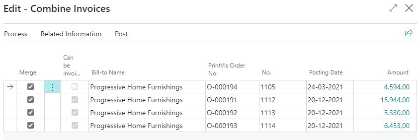

# Combined Invoicing

## Summary

Customers with frequent scheduled or smaller jobs may require you to send them 1 invoice for the jobs of a period rather than one for every job.

Here is how you can combine invoices from more orders.

### Create Invoice

On each job, create a new invoice and build up the lines.

Adjust the lines and the amount so you have the pricing and wording you want.

Make sure all jobs are in status INVOICE and all jobs have their own invoice prepared

### Combine Invoices

On the invoice you want to combine on, click on the Combine Invoice action:

The page shows the invoices which have been prepared for the customer:

You can tick/untick in "Merge" on the lines for each invoice:

When ready, then click on Merge button:

The marked lines will now be combined to 1 line.

On the Related Information now click on Invoice:

The invoice lines from all merged invoices will now be on this invoice and is ready for posting.

As you can see, each lines have an order number and the customer ledger entry and invoice line will be linked to the original order it came from.

Post the invoice.

Each job is linked to their part of the invoiced amount on the general ledger entries:

