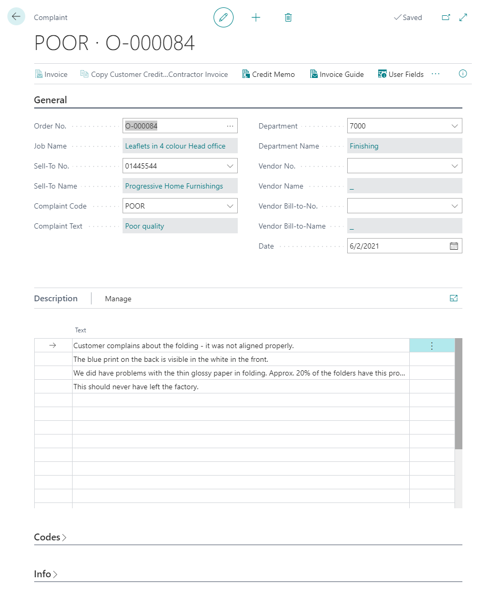

# Complaints

## Summary

This window is used for structured registration of the complaints received by the company.

It will help you form an overview of the complaints received in the long term and then you may group the complaints according to your own complaint codes.

It is also possible to create a credit memo to be attached directly to the graphic production order and, if necessary, to make out an invoice for a sub-supplier on the basis of an already made-out credit memo — see below.

A new complaint is created by pressing \*\*NEW\*\* and leaving the \*\*Number\*\* field. Then the next available number is entered and the complaint information is registered in the fields.

## Complaint Card

## Complaint Workflow

The Complaints functionality is intended to handle any complaints or reactions from customers, for example resulting in credits or rework of a job. So the working steps could be:

1. Customer makes a complaint (phone/email/otherwise).

2. A new complaint is created, pointing out the exact order which was complained about.

3. A complaint \*\*Code\*\* is determined by the context.

4. A text description of the complaint is written.

5. If relevant, the department which caused the flaw is pointed out.

6. If the complaint is due to a vendor error, the vendor is pointed out.

7. The company may have special \*\*User Fields\*\* to capture more information than the page has space for.

8. The \*\*User Fields\*\* are filled in appropriately.

9. It can now be decided if a credit memo is required.

10. A flat credit of \*x\* amount of money can be created by clicking the \*\*Credit Memo\*\* button.

11. If using this, make sure to fill in the \*\*Order no.\*\* or \*\*ID no.\*\* on the sales credit line, so the amount is influencing the job costing of that order.

The \*\*Invoice Guide\*\* is there so it is possible to access the ...

## The Action Buttons

| Action Button                              | Description                                         |

|-------------------------------------------|-----------------------------------------------------|

| Invoice                                   | Open the related Invoice, if available.             |

| Copy Credit memo to Subcontractor invoice | Copy Credit memo to Subcontractor invoice           |

| Credit Memo                               | Create a Credit Memo                                |

| Invoice Guide                             | Open the Case Invoice Guide for this order          |

| User Fields                               | Open the special Complaint User Fields              |

| Order                                     | Open the related Case Card                          |
