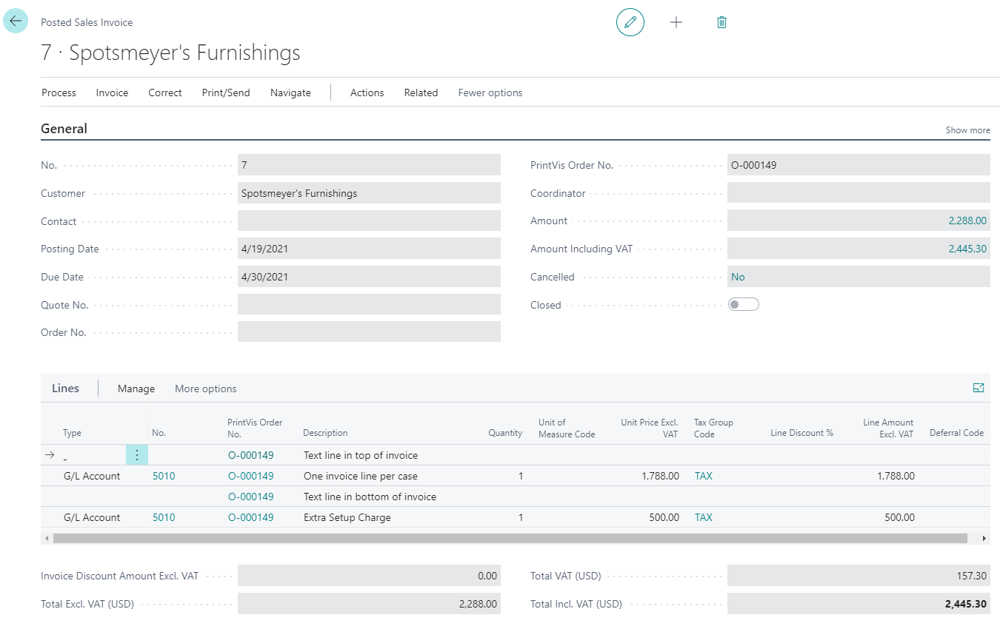

# Invoice Dimension Allocation

## Introduction

The \*\*PrintVis Invoice Dimension Allocation\*\* functionality is developed to create G/L entries from PrintVis invoices using \*\*Microsoft Dynamics 365 Business Central Dimensions\*\*. This new functionality replaces all previous methods, including internal and external lines.

The purpose is to post invoice lines with dimensions defined by values in a PrintVis case. These values are mapped to standard Business Central Dimensions, since PrintVis cost centers may not directly match the financial cost center dimension values.

The posting of G/L entries is done based on entries created by invoice lines. These entries are reversed and then split based on the PrintVis setup, with the required dimension values attached, and posted again.

## Setup

### PrintVis Invoice Dimension Allocation

The \*\*Invoice Dimension Allocation\*\* setup defines how invoices should be split and processed.

 Available Fields

- \*\*G/L Account No.\*\* – G/L Account where the invoice line is posted (based on the PrintVis G/L Posting Setup)
- \*\*Order Type\*\*
- \*\*Product Group\*\*
- \*\*Customer Group\*\*
- \*\*Sell-To No.\*\*
- \*\*From Posting Date\*\*
- \*\*To Posting Date\*\*
- \*\*Method\*\* 

- \*\*Estimating\*\*: Uses estimate cost structure to split invoice amounts  
- \*\*Job Costing\*\*: Uses job costing structure to split invoice amounts  
- \*\*Fixed\*\*: Uses fixed percentage allocation  
- \*\*Special Function\*\*: Uses special code for allocation

- \*\*Dim. Department\*\* – Adds Department dimension values to G/L entries
- \*\*Dim. Cost Center\*\* – Adds Cost Center dimension values to G/L entries
- \*\*Dim. Unit of Measure\*\* – Adds UOM dimension values to G/L entries
- \*\*Skip Lines With Existing Dim.\*\* – Skips invoice lines that already have dimension values

### Additional Setup for “Fixed” Split Method

When using the \*\*Fixed\*\* method, an additional configuration is needed.

To access it, press the \*\*assist button\*\* in the \*\*Method\*\* field.

On this page, fixed percentages can be set up to split the invoice amounts.

> ⚠️ \*\*Note:\*\*  

> The total percentage must equal \*\*100%\*\*. Otherwise, a warning will be displayed.

## PrintVis Dimension Setup

The \*\*Dimension Setup\*\* table maps PrintVis dimensions to Business Central dimensions.

Available Fields

- \*\*Type\*\* – PrintVis dimension type
- \*\*Code\*\* – PrintVis dimension code
- \*\*Dimension Code\*\* – Business Central dimension code
- \*\*Dimension Value\*\* – Business Central dimension value

### Setup Requirements on Dimension Mapping

For dimension postings, the following PrintVis types can be used:

- Department  
- Cost Center  
- Unit of Measure

> ✅ \*\*Important:\*\*  

> You \*\*must\*\* set up mappings for \*\*all values\*\* of any selected dimension type.  

> Missing mappings will cause the posting to fail, and error messages will appear in the Job Queue Log Entries.

## PrintVis General Setup

G/L entries are posted through a \*\*General Journal\*\*. This journal must be set up in \*\*PrintVis General Setup\*\* under the \*\*Invoicing\*\* FastTab.

> ⚠️ Ensure the journal does \*\*not copy VAT/Tax setup\*\* to the journal lines.

### Setup to Activate the Invoice Dimension Allocation Functionality

Posting can be performed in \*\*real-time\*\* or by using a \*\*Job Queue\*\*.

### Real-Time Posting Setup

To enable real-time posting:

- Set \*\*"Dimension Allocation on Post"\*\* (PrintVis General Setup → Invoicing FastTab) to `True`.

### Job Queue Setup

Invoice dimension allocation can also run via a \*\*Business Central Job Queue\*\*.

- Use \*\*Codeunit 6010335\*\*
- Set desired \*\*recurrence\*\*
- Monitor performance if many G/L entries are created
- Regularly check \*\*Log Entries\*\* for errors
- The \*\*Job Queue user\*\* receives Role Center notifications for errors

## Result on Posted Invoice Entries

### Invoice Draft

### Posted Invoice

### Result on G/L Entries

The result shows that:

- The invoice is reversed
- It is re-posted, split according to the estimate and with correct dimensions

> ✅ \*\*Example Method Used:\*\* `Estimate`

Dimension Set Entries

> 📌 \*\*Note:\*\*  

 The reversal and split posting does \*\*not use the same document number\*\* as the invoice.  

 To view the G/L entries:

- Remove filters on the document number

- Find the next G/L entry after the invoice entry

- Filter by that document number (based on G/L journal number series)
