# Invoicing based on templates

## Introduction

This document summarizes the following:

- A \*\*mandatory Sales Order and Posted Shipment\*\* will be created if invoicing from the shipment.
- The existing Invoice solution for Cases will be replaced with a new function called \*\*Invoice Templates\*\*.
- The system will \*\*automatically build invoices\*\*.
- Support for \*\*U.S. Sales Tax – Shipments to Multiple Tax Jurisdictions\*\*.

### Basic Setup

#### PV General Setup for Shipment Invoicing

1. \*\*Under Logistic\*\*, activate `Create Shipment Item`.

   - Select/create a \*\*No. Series\*\* for the items created during posting.

   - Also select an \*\*Item Template\*\* (should include finance settings and base UOM).

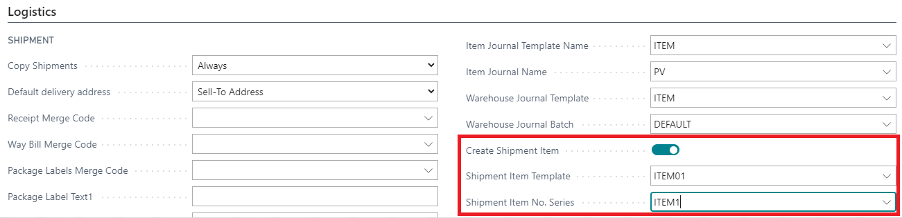

2. \*\*Under Sales Shipment\*\*, create \*\*two No. Series\*\* for handling shipments.

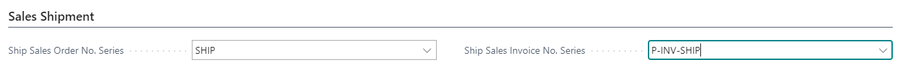

   > ⚠️ \*\*Note:\*\* Do not use an existing No. Series for these.

### Invoice Templates Setup

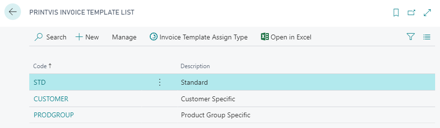

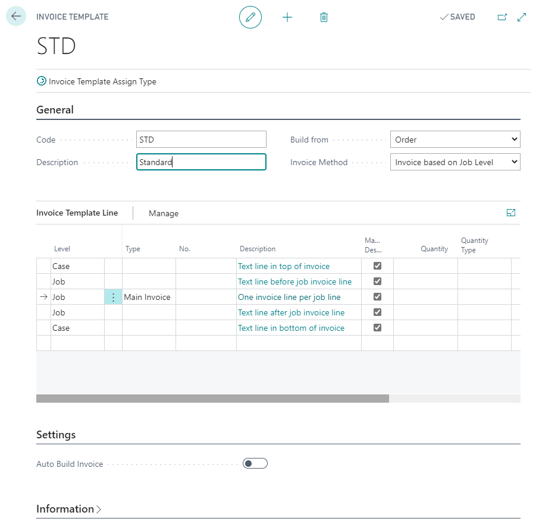

A \*\*new template-based invoice structure\*\* is introduced. It allows more flexibility and avoids the need for custom invoice reports.

The system will \*\*not split invoice lines\*\* into several internal lines to distribute revenue. That type of processing should be handled separately—e.g., via a G/L entry journal after posting.

You must set up \*\*at least one Invoice Template\*\* for invoice creation. Templates can be linked to:

- Order Type
- Product Group
- Customer Group
- Customer No.

> You can override the template in an already-created Invoice Journal.

 \*\*Invoice Template Line Types\*\*

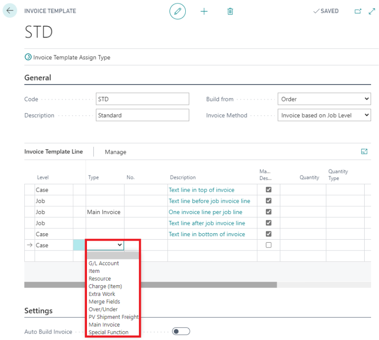

- \*\*G/L Account\*\* – Creates a G/L Account line (lookup Chart of Accounts).
- \*\*Item\*\* – Creates an item line (lookup Item List).
- \*\*Resource\*\* – Creates a Resource line (lookup Resources).
- \*\*Charge (Item)\*\* – Creates a Charge (Item) line (lookup Charge Items).
- \*\*Extra Work\*\* – Pulls in Extra Work registered with “Can be Debited” checked.
- \*\*Merge Fields\*\* – Creates lines based on merge field code setup.
- \*\*Over/Under\*\* – Uses quantity difference between ordered and shipped.
- \*\*PV Shipment Freight\*\* – Adds shipment Cost and Extra Fee amounts to invoice.

This function works no matter which invoice method is used. When case or job level is the method then there is a single line with the sum of all shipment costs/extra fees. When PV Shipment or PV Shipment Group on Tax Area are used then the shipment costs/extra fees are summed based on each shipment or tax area.

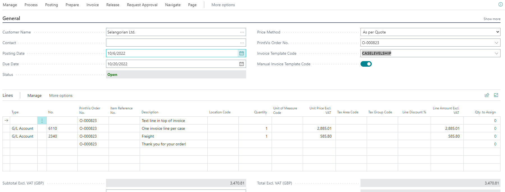

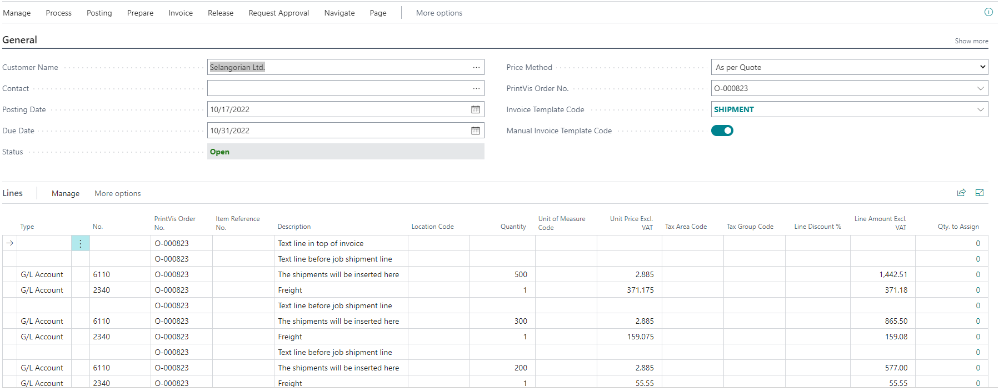

- Set the \*\*Freight G/L Account\*\* in the `No.` field

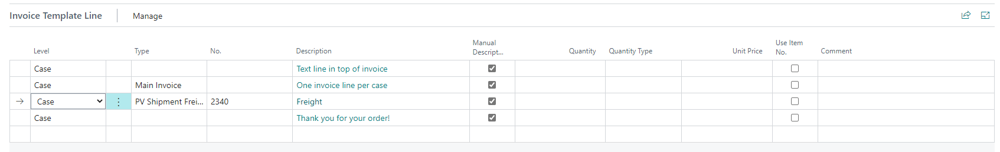

- \*\*Main Invoice\*\* – Uses merge fields and pulls in the G/L account from the PrintVis G/L Posting Setup page. Works by case, job, or shipment.
- \*\*Special Function\*\* – Uses a Codeunit number for full customization. Examples available in the PrintVis GitHub repo.

#### Auto Build Invoice

Settings

Enable \*\*Auto Build Invoice\*\* to trigger automatic invoice creation on \*\*status changes\*\*.

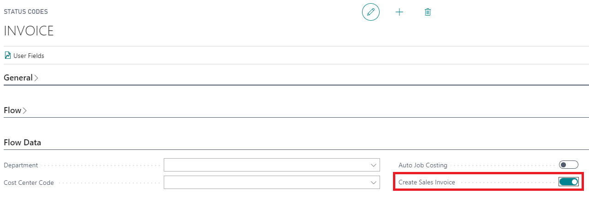

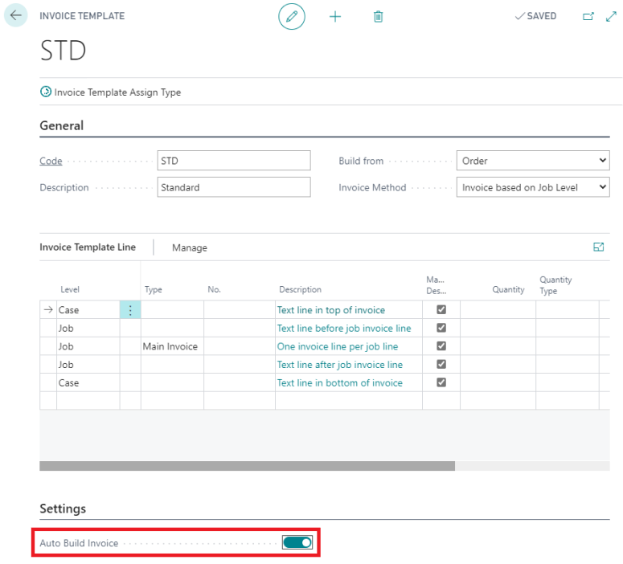

1. In \*\*Status Code setup\*\*, define which status triggers auto-build.

2. On the \*\*Invoice Template\*\*, mark the Auto Build setting.

> This allows hybrid use:

> - \\\*\\\*Small digital jobs\\\*\\\* → auto-invoice  

> - \\\*\\\*Complex jobs\\\*\\\* → manual invoice

#### Templates Assign Type

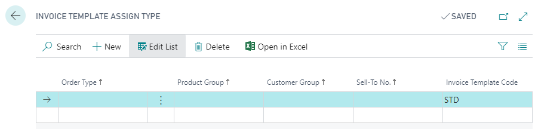

Create at least one assignment line linking an \*\*Invoice Template\*\* to filters:

- Order Type
- Product Group
- Customer Group
- Customer No.
- Invoice Template

#### Invoicing

The \*\*Invoicing Guide\*\* helps users create and view invoices within a case.

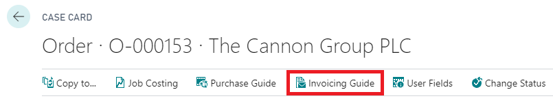

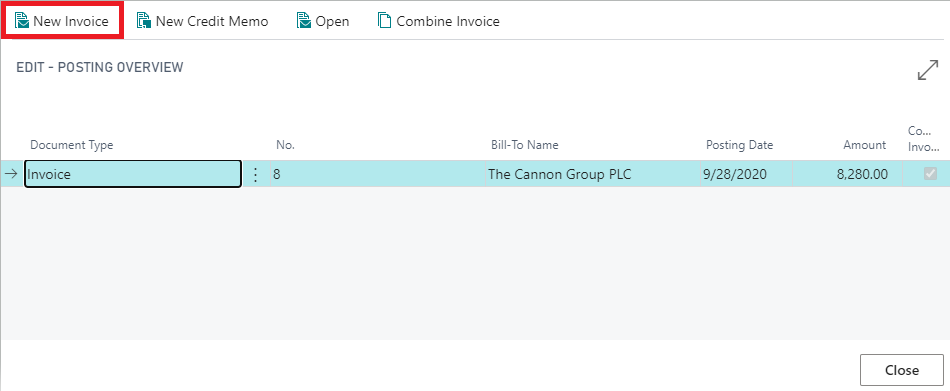

From the \*\*Invoicing page\*\*, under the \*\*Process menu\*\*, use the \*\*Build\*\* button to create the invoice. This uses the \*\*Invoice Template Code\*\* from the general section of the invoice.

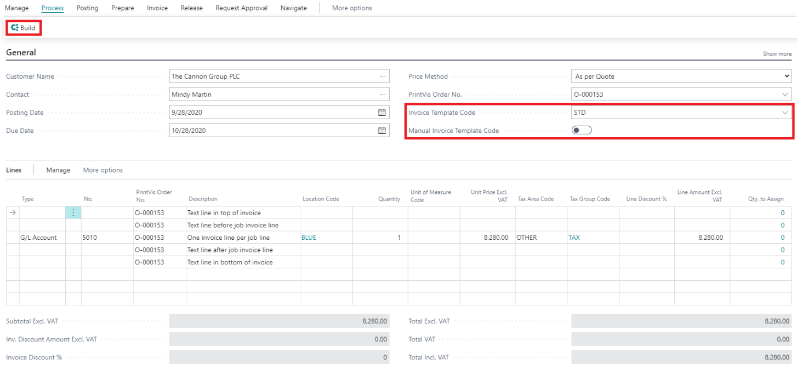

### U.S. Sales Tax – Shipments to Multiple Tax Jurisdictions

This section explains how to handle \*\*multiple shipments\*\* from a \*\*single Case\*\* that go to \*\*different tax jurisdictions\*\*.

### Create Shipments

When creating shipments:

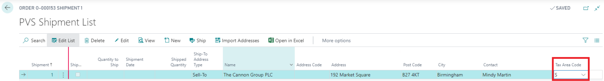

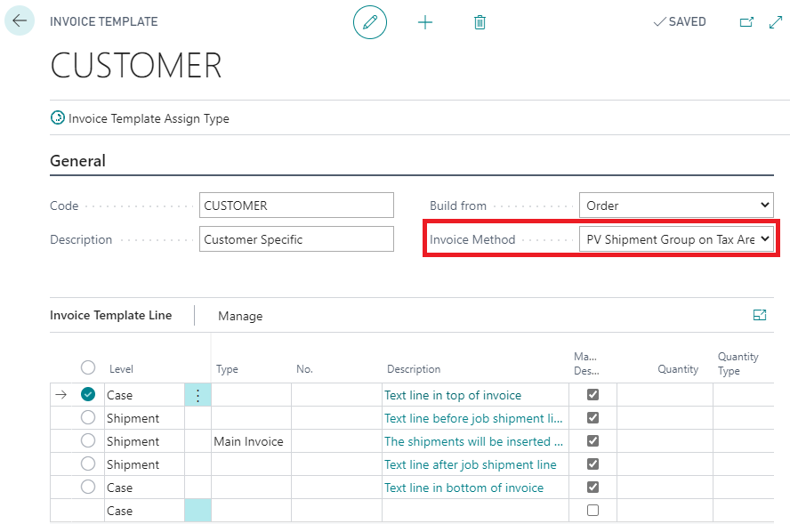

- Pay attention to the \*\*Tax Area Code\*\* on each \*\*Ship-To Address\*\*.
- This determines the correct \*\*tax jurisdiction\*\*.

If all shipments go to the \*\*same tax area\*\* (or are \*\*non-taxable\*\*), standard logic applies.

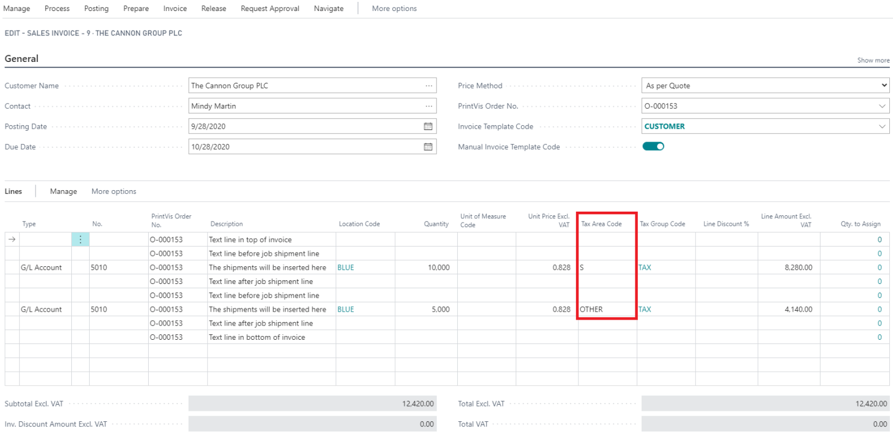
