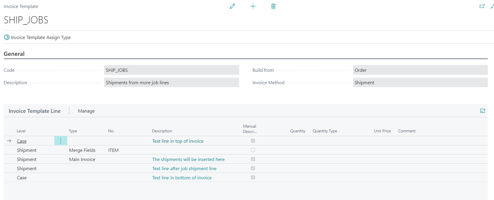
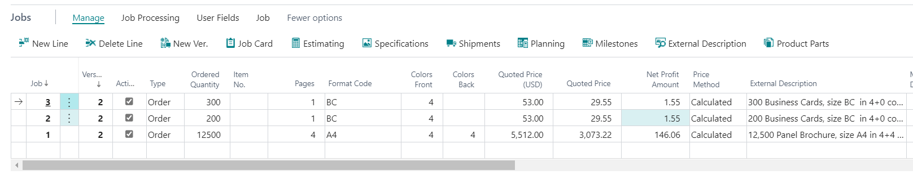
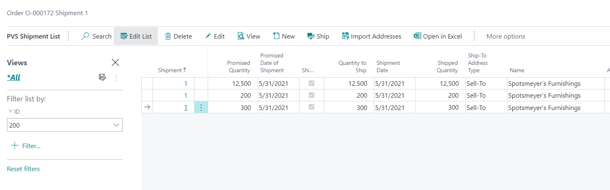

# Invoicing Per Job Line

## Introduction

On a PrintVis Case Card, many companies prefer to have 1 active job line.

It is in fact also possible to have more than one active job on a case card.

When this is the case, it becomes imporant to be able to separate the jobs and amounts so the customer can see what they are invoiced for.

## Setup

This is a methodology which requires an invoice template.

The invoice template would look like this:

Note that the Invoice method is Shipment.

## Example

The job lines on a case card look like this:

3 different jobs.

Each active job has its own shipment - here is a list where the Job number has been removed from the filter, so it shows all shipments:

The shipments are all Shipped.

At this point, you can see  a build-up of the invoice:

