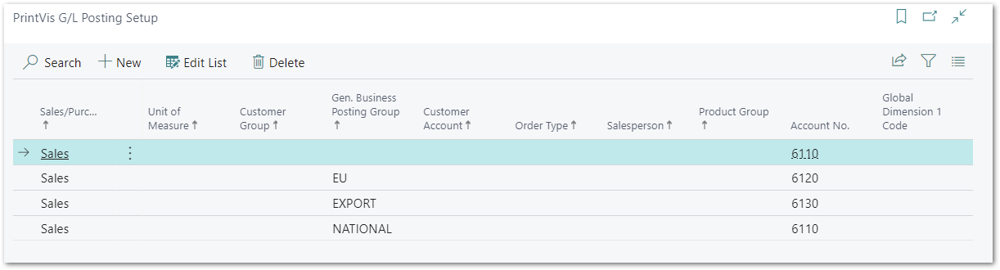

# PrintVis G/L Posting Setup

## Summary

The PrintVis G/L posting setup is made to create BC sales invoices directly from PrintVis cases and a setup which G/L account to assign to the sales line is required.

This setup is today often replaced by the PrintVis Invoice Template setup but can be still in use. Differentiation can be made for example by Gen. Business Posting Group, Order Types etc. Please see details below and check the article about the Invoice Template setup.

## Setup

Create a new entry for every required G/L account. Different accounts are available based on the following parameters:

* Gen. Business Posting Group
* Order Type
* Product Group
* PrintVis Unit of Measure
* Customer Group
* Customer Account (customer no.)
* Salesperson
* Global Dimension 1

After choosing the parameters, select or enter a valid G/L account no. (Field Account No.)

