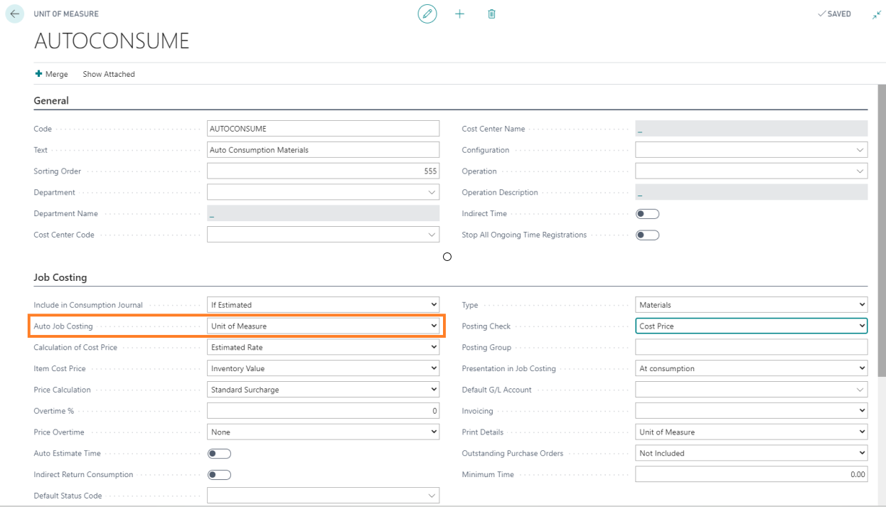

# Auto Job Costing setup

# Summary

Auto job costing allows the system to create the appropriate job costing entries automatically based on PrintVis Unit of Measure, item, and status code settings.

When a case moves to the auto costing status code, the items set up to auto post will be posted accordingly. The information below will assist you in setting up an item for auto job costing.

Auto job costing can also be used to consume calculated costs for subcontracting and labor hours.

## Unit of Measure

Auto job costing begins at the PrintVis Unit of Measure.

In the Auto Job Costing field, you have the following options:

- **Unit of Measure**: Post the total per unit of measure.
- **Calc. Detail**: Post the value of each calculation detail line in a single posting.

## Job Costing Journal

Create or edit a job costing journal to be used for auto consumption.

On the PrintVis General Setup page in the Job Costing section, set the Auto job costing journal to the created/edited job costing journal.

## Item Card

On the item card, set the Unit of Measure field to the new auto consume unit of measure.

## Status Code

There are 2 fields on the status code that can trigger the auto job costing: **Production Ended** or **Auto Job Costing**.

If the status code has Auto Job Costing checked, this status code will trigger the posting. The auto job costing also occurs if **Production Ended = Yes** is set on a status code, even if Auto Job Costing is unchecked.

### Please Note

The auto job costing will be processed on a status where:

- Auto Job Costing = TRUE  
  OR  
- Production Ended = Yes.

It is not necessary to set both on the same status.

Some customers would like to see the job costing before the job is fully ended. In this case, you just choose a status code during production with **Auto Job Costing = TRUE**.

If later a status is reached with **Production Ended = Yes**, and auto job costing was posted already, job costing will not be posted again.

## Please Note

- Items are only posted automatically if no manual posting has already been made for the same item on the case.
- If using advanced warehousing, location and bin defaults must be set up.
- There must be enough quantity in stock to post without error. The quantity cannot be <= 0.
- The user who is initiating the status code change that triggers the auto job costing must be a full or device BC user. If they have a team member license, it will give them an error that they are unable to post.

## Processing Examples

### Item Consumption

Add the item to a case in the calculation.

Moving the case to the status code selected above will automatically post the consumption.

### Labor Hour Consumption

**Setup**: PrintVis Unit of Measure

Make sure the PrintVis Unit of Measure for the auto consumption is assigned to the given operation on the configuration.

Result when changing status that posts:

