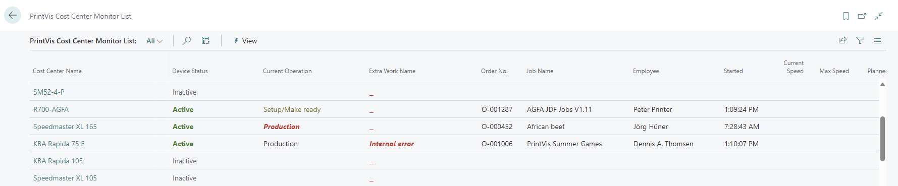
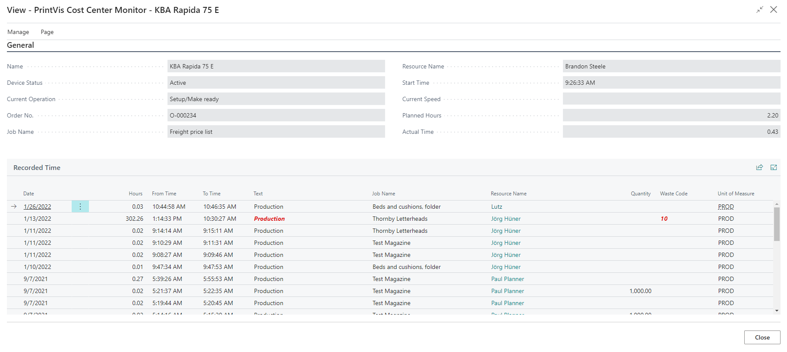
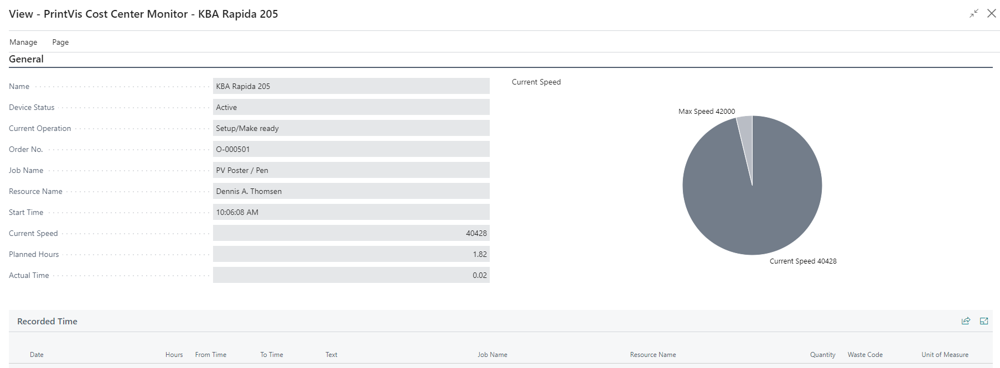
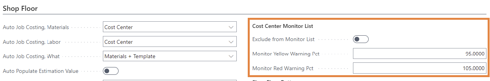
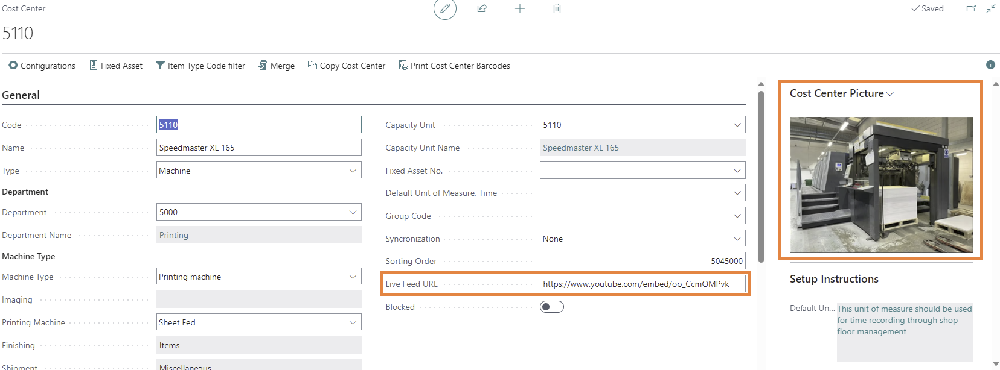
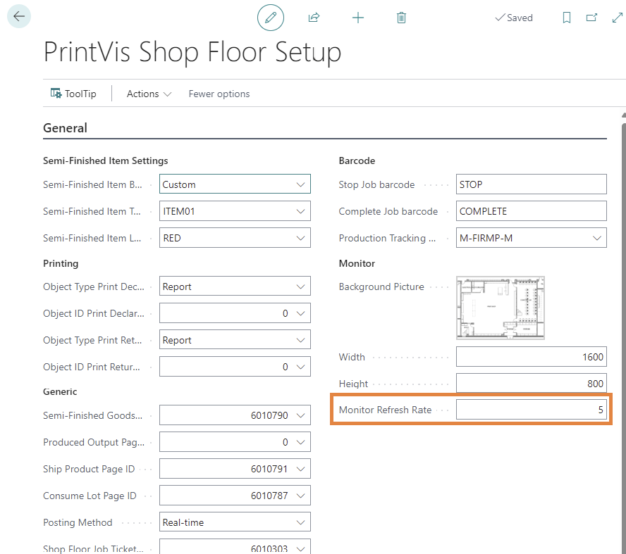

# Cost Center Monitor List

## Cost Center Monitor List

The \*\*Cost Center Monitor List\*\* provides an overview of all \*\*Cost Centers\*\* and their \*\*current production status\*\*.

> If more than one employee is logged into a single Cost Center, this list will display the one who started \*\*last\*\*.

## List Fields

This section describes the \*\*fields\*\* available on the Cost Center Monitor List.

| Field            | Description |

|------------------|-------------|

| Cost Center Name | The name of the cost center. |

| Device Status    | The current status of the device. This value will be \*\*Active\*\* if time is being recorded, and \*\*Inactive\*\* if the device is not recording time. |

| Current Operation| The current operation that is running on this cost center. |

| Order Number     | If the cost center is recording time against an order, the order number will be listed. |

| Job Name         | If the cost center is recording time against an order, the job name for that order will be listed. |

| Employee         | Displays the name of the employee who is recording time. |

| Started          | The time that the current operation was started. |

| Current Speed    | If the device has \*\*MOXA\*\* or \*\*JDF\*\* connectivity, this field displays the current speed of the device. |

| Max Speed        | Displays the max speed set for the device on the \*\*CIM Device setup\*\* page. |

| Planned Time     | If the cost center is recording time against an order, the planned time for that operation will be listed. |

| Actual Time      | Displays the actual time recorded for the operation. |

## Cost Center Detail (non-MOXA/JDF Connectivity)

The \*\*Cost Center Detail\*\* page displays the same top-level values as the \*\*Cost Center Monitor List\*\*, but includes additional details:

- At the \*\*bottom of the page\*\*, it shows all \*\*recorded time\*\* for that specific Cost Center.

- If a \*\*live-feed camera URL\*\* is assigned to the Cost Center, the \*\*live video feed\*\* will display directly on this page.

- The page \*\*updates every minute\*\* to reflect current activity.

| Field           | Description |

|------------------|-------------|

| Date             | The date the time was recorded. |

| Hours            | The amount of time that was recorded. |

| From Time        | When the recorded time was started. |

| To Time          | When the recorded time was stopped. |

| Text             | The operation that was recorded. This field will be \*\*red\*\* if the entry has a related waste code. |

| Job Name         | If the recording was against an order, this field displays the job name for that order. |

| Resource Name    | The employee who recorded the time. |

| Quantity         | If produced quantity was entered for this operation, this field displays that quantity. |

| Waste Code       | If a waste code was used, this field displays that waste code. |

| Unit of Measure  | The PrintVis UOM that was recorded. |

## Cost Center Detail (with MOXA/JDF Connectivity)

When opening a \*\*Cost Center\*\* that has \*\*MOXA/JDF connectivity\*\*, an additional \*\*speedometer\*\* is displayed to show the \*\*current speed\*\* of the machine.  

This page \*\*updates every minute\*\* to reflect real-time performance.

## Setup

On the \*\*Cost Center Setup\*\*, there are several fields used specifically for the \*\*Cost Center Monitor List\*\*.

| Field                   | Description |

|-------------------------|-------------|

| Exclude from Monitor List | If checked, this cost center will be excluded from the cost center monitor list. |

| Monitor Yellow Warning Pct | Whole percentage (e.g., 95). Colors the operation \*\*yellow\*\* on the monitor list when actual time exceeds planned time by this percentage. Example: Planned = 1 hr, value = 95 → yellow warning at 0.95 hr. |

| Monitor Red Warning Pct    | Whole percentage (e.g., 105). Colors the operation \*\*red\*\* on the monitor list when actual time exceeds planned time by this percentage. Example: Planned = 1 hr, value = 105 → red warning at 1.05 hr. |

The cost center also has a field for the Live Feed URL and a picture can be added to show on the tile list-view of the cost center monitor list.

On the Shop Floor setup it is possible to set the refresh rate for the monitor list. This setting is in seconds:

