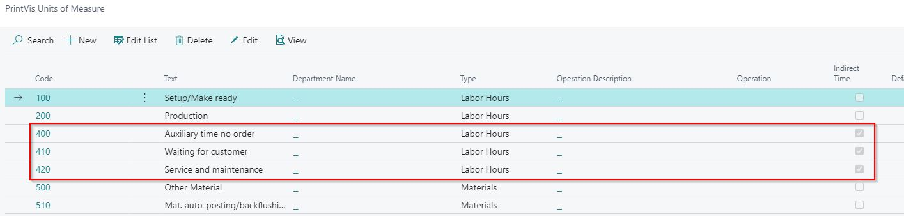
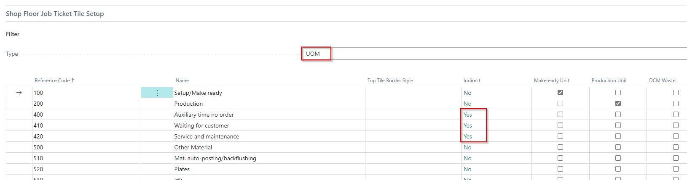

# Record Indirect Time on Job Ticket

## Summary

This article shows how to set up and record \*\*indirect time\*\* at the PrintVis Shop Floor.  

Indirect time refers to time that is \*\*not specific to a job\*\*, such as \*“meeting time”\* or \*“service and maintenance.”\*

### Setup

#### PrintVis Units of Measure

- You create \*\*units of measure\*\*, setting them to \*Indirect\*, for the administrative activities.

- These units are added as \*\*new lines\*\* on the \*\*Job Costing Journal template\*\* for the \*\*Cost Center\*\*.

- Remember to add both the \*\*Cost Center\*\* and the \*\*Configuration Code\*\*.

- If the \*\*hourly rates\*\* should differ for admin/indirect activities, consider creating an \*\*operation line\*\* with a special hourly rate and reference this operation number accordingly.

#### Cost Center

- \*\*Shop Floor setup\*\* is done at the \*\*Cost Center setup\*\*.

