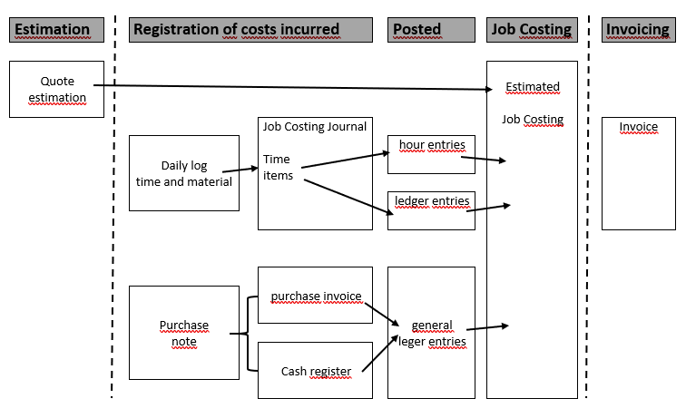
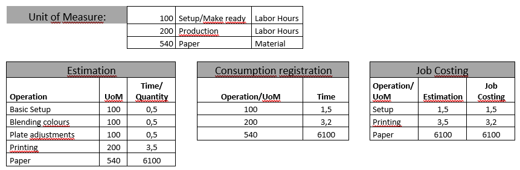
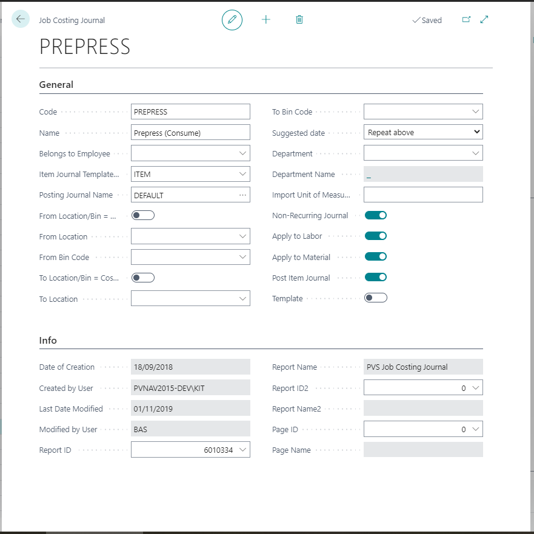
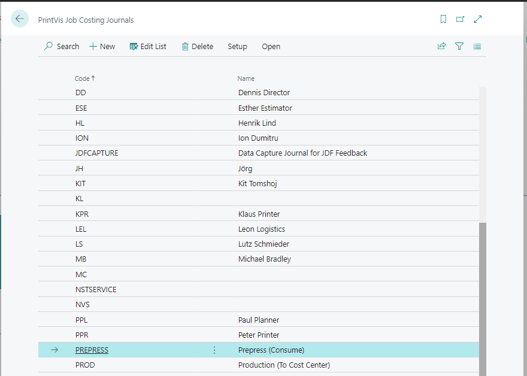
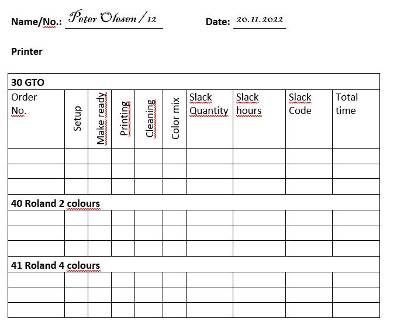
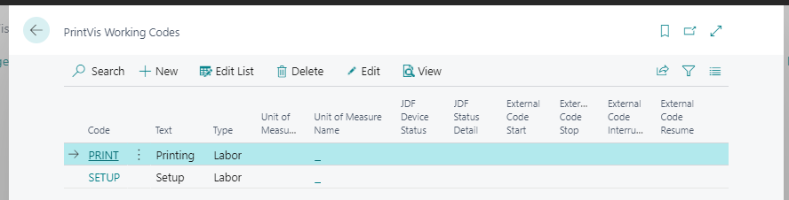


# Job Costing

## Summary

The purpose of the job costing module is to enable the company to register the incurred costs of a production to such a degree of detail that it is possible to compare these with the prognosis from the estimation phase. This means the job costing module can be an optimal tool for:

- Evaluating and determining the content of the final invoice
- Follow-up, and refinement, of the estimation process

The registered data can also be used in the system’s statistics module as well as in the job costing module.

## An Introduction to the Concepts Used

 Incurred Costs Registration

This refers to the registration of all costs/consumption associated with an order. These are used when calculating job costing which includes:

- Pure costs
- Self-costs
- Sales prices

 Job Costing

Job costing is the presentation of both incurred costs and estimated costs, usually in the form of a printout but potentially as a custom display. It allows comparing the registered costs of an order with those estimated during pricing.

> **Note:** To register incurred costs, master data must be set up in advance.

### The Basis for Job Costing

This section describes the role of master data in completing job costing tasks. The job costing data comes from:

- **Estimation phase**
- **Ongoing registration of incurred costs**

 Components

- **Job costing:** Receives the full calculated estimate.
- **Registration of incurred costs:** Comes from production and accounting (e.g., consumption journal).

 Three Types of Incurred Costs Registration:

1. **Time consumption** (hour entries)
2. **Inventory items** (ledger entries)
3. **External purchases** (subcontracting, etc.)

 Registration Process

- **Time/inventory data** → registered in a consumption journal → posted to accounts
- **External purchases** → registered via purchase invoice endorsed with order number

All incurred costs are transferred to job costing. The level of detail is defined by company requirements.

### Job Costing – The Broad Picture

Job costing primarily consists of a printout showing:

- Data from estimation
- Data from incurred costs

It also displays detailed entries:

- Hour entries
- Ledger entries
- Financial entries

### Units of Measure

These define how detailed the job costing should be. They control:

- Calculations for cost, self-cost, and sales price
- How records are displayed

> All operations must be tied to a unit of measure to ensure data is correctly transferred and registered.

## Setting Up Job Costing

 Initial Setup

- Define master data related to incurred costs registration before use
- Understand intermediate workflow processes

 Configuration Notes

- No predefined level of detail is provided
- Examples illustrate possible configurations
- Companies must determine appropriate detail level based on their needs

### Conditional master data
A precondition for job costing is that data has been set up in the following tables:

# Tables Required for Job Costing Setup

| **In Connection With**     | **Table(s) That Must Be Setup**                          | **Description**                                                                                                     |
|----------------------------|-----------------------------------------------------------|---------------------------------------------------------------------------------------------------------------------|
| **Calculation Master Data** (Hour Entries) | - Cost Centres    - Configurations    - Operations    - Hour Rates    - Additional Rates | - Cost Centres: Define organizational units   - Configurations: Preset settings   - Operations: Used to estimate time consumption   - Hour Rates: Contain rates used for estimating and job costing   - Additional Rates: Contain extra rates for estimating and job costing |
| **Inventory / Purchase** (Ledger Entries)  | - Items                                             | Items table contains cost prices and indicates whether the item should be held in stock                            |

Even though items will be set up in connection with Inventory/Purchase it is possible that you will need to create items solely for incurred costs registration. We will show you some examples of this type of \’item\’ in a later section.

### What is a Unit of Measure?

A **Unit of Measure** (UoM), as used in PrintVis, is a concept designed to configure and control various aspects of **job costing**, including:

- Calculation of cost price, self cost, and sales price during incurred cost registration
- Presentation of job costing input (via printout or display)
- Behavior of registrations during data input and bookkeeping
- Appearance on the electronic Job Ticket

> Units of measure are **not tied to a specific cost centre** and can be reused across multiple cost centres.  
> This reduces redundancy and enables comparative statistical analysis (e.g., printing time vs configuration across cost centres).

### Workflow When Setting Up the Job Costing

The job costing setup process consists of the following intermediate steps:

1. **Decide the degree of detail** to be used in the job costing  
2. **Configure the units of measure**
3. **Bind units of measure** to operations, items, and optionally G/L accounts
4. **Set up slack codes**
5. **Set up consumption journals**
6. **Test incurred cost registration**
7. **Add working codes** (if applicable) to incurred cost registration

### Deciding the Degree of Detail to be used in the job costing

This phase is about defining **which units of measure** to use in constructing the job costing.

- Job costing compares actual consumption with the estimate.
- Choose a realistic level of detail based on what can be practically recorded by users.

 Examples of Detail Levels Using Units of Measure

**Scenario**

Cost Centre: A printing machine  
Defined operations:

- Configuration of the machine
- Configuration of the plates
- Printing time
- Turning of paper
- Cleaning
- Slack/waiting time (as a separate unit of measure)

**Example 1 – High Detail**

If printers **record time precisely** for each operation, create a **unit of measure for each**:

- UoM: Machine Configuration  
- UoM: Plate Configuration  
- UoM: Printing Time  
- UoM: Paper Turning  
- UoM: Cleaning  
- UoM: Waiting Time  

This enables fine-grained job costing with detailed consumption analysis per operation.

 Job Costing – Estimated vs Registered Time

| **Operation**     | **Unit of Measure** | **Estimate** | **Registered** |
|------------------|---------------------|--------------|----------------|
| Configuration     | CONFIGURATION        | 1.0 hour     | 1.0 hour       |
| Arrangement       | ARRANGEMENT          | 2.0 hours    | 1.5 hours      |
| Printing Time     | PRINTING             | 7.0 hours    | 8.0 hours      |
| Turning           | TURNING              | 0.5 hours    | 0.5 hours      |
| Cleaning          | CLEAN                | 1.0 hour     | 1.5 hours      |
| Waiting Time      | WAITINGTIME          | 0.0          | 1.5 hours      |

If the registration is at the level of detail that we expect then the job costing will clearly indicate which operations have deviations between the estimated and the registered data.

Example 2 If we have instead experienced that the printers only register time classified as preparation, printing time and waiting time, then the degree of detail we used in example 1 might well result in a job costing as shown below. Here we cannot compare estimated and registered costs:

 Job Costing – Estimated vs Registered Time

| **Operation**     | **Unit of Measure** | **Estimate** | **Registered** |
|-------------------|---------------------|--------------|----------------|
| Configuration     | CONFIGURATION        | 1.0 hour     | 4.5 hours      |
| Arrangement       | ARRANGEMENT          | 2.0 hours    | 0.0 hours      |
| Printing Time     | PRINTING             | 7.0 hours    | 8.0 hours      |
| Turning           | TURNING              | 0.5 hours    | 0.0 hours      |
| Cleaning          | CLEAN                | 1.0 hour     | 0.0 hour       |
| Waiting Time      | WAITINGTIME          | 0.0          | 1.5 hours      |

In order to obtain a useful comparison it would be more pragmatic to operate with fewer units of measure: configuration/cleaning, printing and waiting time.

This would give an estimate with the following data:

# Job Costing – Estimate by Operation and Unit of Measure

| Operation      | Unit of Measure | Estimate    |
|----------------|-----------------|-------------|
| Configuration  | CONFIG/CLEAN    | 1.0 hour    |
| Arrangement    | CONFIG/CLEAN    | 2.0 hours   |
| Printing Time  | PRINT           | 7.0 hours   |
| Turning        | CONFIG/CLEAN    | 0.5 hours   |
| Cleaning       | CONFIG/CLEAN    | 1.0 hour    |

..and a job costing with the following data:

| Unit of Measure | Estimate    | Registered  |
|-----------------|-------------|-------------|
| CONFIG/CLEAN    | 4.5 hours   | 4.5 hours   |
| PRINT           | 7.0 hours   | 8.0 hours   |
| WAITINGTIME     | 0.0 hours   | 1.5 hours   |

Even though we cannot see if there are deviations on the individual operations under **CONFIG/CLEAN**, the job costing now shows data that can be compared – as well as being easier to read.

### Setting up Units of Measure

As we mentioned earlier, a unit of measure is a tool whereby you set up and control functions in the job costing. In the following, it will be these functions that dictate the sequence in which the fields on the filing card for a unit of measure are handled.

Calculating Cost Price, Self Cost and Sales Price during the Registration of Consumption

The fields **Calculation of Cost Price** and **Calculation of Price** (sales price) on the unit of measure control how cost and sales prices are calculated on hour entries and ledger entries respectively.

Cost Price Calculation for Hour and Ledger Entries

You can choose between the following possibilities:

- **Cost centre rate / item’s cost price**  
- **Rate from the estimate**  
- **Price list lookup**

**Cost Centre rate / Item’s Cost Price** is the default when creating units of measure. The cost price of hours and items is calculated according to the following rules:

| **Registering** | **Cost Price Calculated As**                                          | **Notes**                                                                                                                                                                 |
|-----------------|----------------------------------------------------------------------|---------------------------------------------------------------------------------------------------------------------------------------------------------------------------|
| **Hours**       | No. of hours × Cost price from the cost centre’s hour rate           | If a specific operation is given, a special hour rate may be associated with it.                                                                                           |
| **Items**       | Number × Cost price from the item card                               | 

The unit of measure indicates which item cost price type is used for incurred costs registration.                                                                         |

| **Option**              | **Description**                                                                                                                                                       |
|-------------------------|---------------------------------------------------------------------------------------------------------------------------------------------------------------------|
| Inventory value         | The same value the inventory ledger is reduced by. Correct method, depends on FIFO or average stocktaking. Cost price may change if FIFO and purchase invoices register.|
| Standard cost price     | Price in the Standard Cost Price field on the item card. Useful when no precise inventory management exists or to influence job costing. No coherence with actual inventory values.  |
| Last purchase price     | Last purchase price registered for an item. Price fluctuations immediately influence incurred costs registration.                                                  |
| Average cost price      | Average cost price of available stock at time of registration. Spreads price fluctuations over orders, smoothing effects of FIFO method.                           |

Rate from Estimation When you use this option the system will investigate if there is an estimated cost price available. If there is, it can be used either as an estimated hour rate or an estimated item price. If the system cannot find an estimated rate then the default way of calculating the cost price is used (Cost Centre/Item’s Cost Price).

Price list lookup

| **Registration of**     | **Calculated Cost Price**                                                                                                                                                       | **Notes**                                                                                                             |
|-------------------------|---------------------------------------------------------------------------------------------------------------------------------------------------------------------------------|-----------------------------------------------------------------------------------------------------------------------|
| **Hours**               | By a lookup in the price list associated with the operation on the registration.                                                                                                | If price list is missing, defaults to "Cost Centre Rate/Item’s Cost Price".   Rarely calculated from price list; used if time usage cannot be measured. |
| **Items**               | By a lookup in the price list of the item.                                                                                                                                     |                                                                                                                       |

Self Cost Price Calculation for Hour and Item Records

Self cost price calculation is based on the following rules:

| **Self Cost Price Calculation for Hour and Item Records** | **Rules**                                                                                                                                                                  |
|------------------------------------------------------------|----------------------------------------------------------------------------------------------------------------------------------------------------------------------------|
| **Hours**                                                  | No. of hours × Self Cost from the cost centre’s hourly rate.   If cost price comes from price list, Self Cost = Cost Price.                                            |
| **Items**                                                  | Self Cost on items and ledger entries = Cost Price + Cost Price Modifier from the Additional Rates table.                                                                  |

 Sales Price Calculation for Hour and Item Records

You can choose between the following options:

- Standard surcharge  
- Price lookup  
- Accumulated price lookup  
- Price from Estimation  

 Standard surcharge

This is the default option when creating units of measure. The sales price of hours and items is calculated according to time consumed according to the following rules:

| **Registration of** | **Calculate Cost Price As**                                                                                 | **Notes**                                                    |
|---------------------|-------------------------------------------------------------------------------------------------------------|--------------------------------------------------------------|
| **Hours**           | No. of hours × Sales Price from the cost centre’s hourly rate.                                              |                                                              |
| **Items**           | Self Cost = Sales Price (possibly with cost price modifier from Additional Rates table).                     | Commonly used for 'normal' items like paper, plates, etc.     |

Price lookup Consumption is calculated according to the following rules:

| **Registration of**         | **Calculate Cost Price As**                           | **Notes**                                  |
|-----------------------------|------------------------------------------------------|--------------------------------------------|
| **Items and, possibly, hours** | Lookup in the price list for the item (or operation) |                                            |

Sales Price Calculation for Hour and Item Records

You can choose between the following options:

- Standard surcharge  
- Price lookup  
- Accumulated price lookup  
- Price from Estimation  

 Standard surcharge

This is the default option when creating units of measure. The sales price of hours and items is calculated according to time consumed according to the following rules:

The post-calculated sales price is in this way independent of an item’s cost price and self-cost. This is used with scanning, film etc. Every registration results in a new lookup in the price list. This means that a customer only obtains a quantity discount if the scanning are registered all at once.

 Accumulated price lookup

Consumption is calculated in the same way as with Price Lookup. But now the system checks how much of the same item has been registered on the order already. This means that e.g. scanning can become cheaper and cheaper.

It is of course important that the price list that the lookup is made in uses the accumulated price lookup principle.

 Cost Price, Self-Cost, and Sales Price Calculations for Ledger Entries

A Unit of Measure contains no fields that can manage variations and consumption is calculated according to the following:

| **Ledger Entry Registration** | **Calculated As**                       | **Notes**                                         |
|-------------------------------|---------------------------------------|--------------------------------------------------|
| **Cost Price**                | Always the ledger entry’s actual value |                                                  |
| **Self-cost**                | Standard additional rate added to cost price | Differences may exist between subcontract and material rates |
| **Sales Price**              | Standard additional rate added to self-cost |                                                  |

Entries in the Job costing Printout

There are three fields that are important to the appearance of the job costing:

General tab

| **Field**                 | **Comment**                                                                                                        |
|---------------------------|--------------------------------------------------------------------------------------------------------------------|
| Text                      | The name of the Unit of Measurement.                                                                               |
| Sorting                   | You can control the order that the Units of Measure are displayed in by a number in this field.                     |

| **Invoicing/Job costing tab Field** | **Comment**                                                                                                       |
|------------------------------------|-------------------------------------------------------------------------------------------------------------------|
| Presentation in job costing        | Controls when, and with which value, this unit of measure is displayed on the screen.   Default: ‘by consumption’ means it’s included if anything is registered. Always included if an estimate exists unless 'not to be transferred' is chosen. |
| Printout details                  | Controls how many lines the Unit of Measure uses in the job costing printout.   Options: - Unit of Measure: Shown once on a Cost Centre. - Item: Every item with Unit of Measure is shown, e.g. total paper used. - Registration: Every registration is shown. |

How should registrations behave when entering data/posting

The following fields each have a function of either a security-related character, or as help while entering data related to Units of Measure:

General tab

| **Field**      | **Comment**                                                                                                                          |
|----------------|--------------------------------------------------------------------------------------------------------------------------------------|
| Department     | If the field is filled in then the Unit of Measure is only used within the selected department.                                       |
| Cost Centre    | Functions as help while entering data. If filled, the value will auto-fill the Cost Centre field in the Consumption Journal.          |
| Setting        | Functions as help while entering data. If filled, the value will auto-fill the Configurations field in the Consumption Journal.       |
| Operation      | Functions as help while entering data. If filled, the value will auto-fill the Operation field in the Consumption Journal.            |
| Indirect time  | Checked if the Unit of Measure is for indirect costs. An order number on a registration is not mandatory. Used for statistics on time consumed and paid hours without an order. |

| **Registration of Consumption tab Field** | **Comment**                                                                                              |
|------------------------------------------|----------------------------------------------------------------------------------------------------------|
| Type                                     | If set to Own Hours, Materials or Subcontract then the Unit of Measure is only used for that type.        |
| Posting Check                            | Options:   - Cost price: error if no cost price.   - Sales price: error if no sales price.   - None: journal entry allowed without prices (e.g. number printed without economic impact). |

How should Units of Measure behave on the Electronic Job Ticket

If the electronic job ticket is used for registering what has been consumed then the journal is constructed when the user chooses to register consumption. In order to control which Units of Measure the journal must consist of, you use the following field:

Registration of Consumption tab

| **Field**                  | **Comment**                                                                                                                  |
|----------------------------|------------------------------------------------------------------------------------------------------------------------------|
| Include in Consumption Journal | The following options are available:   - If estimated: Included if used in the estimate.  - If it exists on the Cost Centre: Included if it exists on an included Cost Centre.  - Always: Always included (e.g. Customer time, indirect time).  - Never: Not included in Consumption Journal. |

Standard Setup of Units of Measure

The recommended initial setup of Units of Measure for registering consumed hours and items is shown in the schema below:

| **Field**                | **Hour entries**                  | **Ledger entries**             |
|--------------------------|---------------------------------|-------------------------------|
| Cost price calculation    | Cost Centre Rate/ Cost Price of item | Cost Centre Rate/ Cost Price of item |
| Cost price of item       | Inventory value                  |                               |
| Sales price              | Standard surcharge               | Standard surcharge             |
| Type                     | Own hours                       | Materials                     |
| Entry check              | Cost price                      | Cost price                    |

| **Invoicing/Job costing** |                                 |                               |
|--------------------------|---------------------------------|-------------------------------|
| Presentation in job costing | When consumption               | When consumption              |
| Printout details         | Unit of Measure                 | Item (paper) or Unit of Measure |

Any divergence from the above would require absolutely special reasons. All other fields are to be considered on their merits, from Unit of Measure to Unit of Measure.

### Binding of Units of Measure to Operations, Items and G/L Accounts

When you have created the Units of Measure they must be bound to the relevant operations in the Cost Centres and Calculation Units. You can also bind them to items and G/L Accounts.

The reasons for binding Units of Measure are:

- **Operations**  
  Binding Units of Measure to Operations and Calculation Units creates a connection to the estimate — and thereby the possibility of comparing estimates with job costings.

- **Items**  
  You can bind a Unit of Measure to individual items to ease data entry while registering consumption; when you enter an item number in the Consumption Journal the Unit of Measure is attached.

- **G/L Accounts**  
  You can bind a Unit of Measure to a G/L Account to ease data entry while registering consumption; when you enter an account number in the daybook or purchase invoice the Unit of Measure is attached.

### Extra Work Codes

It is highly probable that turnover could be increased if extra work could be registered and invoiced. But this extra work must, of course, be documented.

When registering consumed hours or items there is the possibility of adding an Extra Work Code to each registration. You can then quantify this additional work and distinguish between what can be invoiced and what can't.

Extra Work Codes can be useful for statistical purposes but can also be used in the Job costing to add the price of extra work that can be invoiced to the quote price.

On a typical Job costing printout, extra work is calculated separately at the end.

Examples of extra work codes could be:

- Machine errors  
- Problems with paper  
- Operating errors  
- Plate errors etc.

 Creation of Extra Work Codes

Below is an example of the table Extra Work Codes. This is where Extra Work Codes are created:

The table contains the following fields:

| **Field**           | **Comment**                                                                                 |
|---------------------|---------------------------------------------------------------------------------------------|
| Code                | The code you key in when entering data into the Consumption if you want to register slack time. Any combination of letters and numbers can be used. |
| Item Type           | Used for creating statistics for slack time on item types like Paper, Plates, Film, Dyes, Punch, and Repro. |
| Can be debited      | Check if the slack can be debited. If not checked, the slack cannot be debited.              |
| Job Cost Sales Price=0 | Check if the post-calculated sales price must be zero.                                     |
| Supplier Error      | Check if the slack code indicates supplier errors (for statistical purposes).                |
| Department Code     | If the slack code refers to a specific department, indicate it here.                        |
| Text                | A text describing the slack code, used in various printouts.                                |

## Registration of Consumption

Incurred costs registration is done for hour entries and ledger entries in a consumption journal and, for financial ledger entries, in a daybook or a purchase invoice. This section is only concerned with the registration of consumed items in the Consumption Journal.

### Consumption Journal

Before using the Consumption Journal there are a few matters that need consideration with regard to setting up the journal’s functionality.

 Setup of journal

Among other things the journal can be set up to post hour entries and item entries directly or post hour entries and transfer item entries to an item journal – from where they can be posted. The Consumption Journal must have an item journal associated with it. It is also possible for each employee that registers consumption to have her own Consumption Journal. Below is an example of a record used to set up a Consumption Journal:

 Registering consumption

The actual registration occurs when the user fills in a line in the journal for every hour entry and for every (stock-controlled) item entry. Below is an example of a Consumption Journal:

The following fields in the journal must be filled in when entering data into the consumption journal:

| **Type**       | **Order no.** | **Unit of Measure** | **Capacity** | **Cost Centre** | **Item no.** | **Hours** | **Number** |
|----------------|---------------|--------------------|--------------|-----------------|--------------|-----------|------------|
| Direct time    | Time          | x                  | x            | x               | x            |           |            |
| Indirect time  | Time          |                    |              | x               | x            |           |            |
| Item           |               | x                  | x            |                 | x            | x         |            |

An order no. must not be supplied in the case of indirect time, as this time must not burden the order.

## Unit of Measure Groups

Grouping of Units of Measure is only used to collect them under different headings in statistics printouts or screens to achieve an attractive layout. Examples of Unit of Measure groups could be:

- Own Hours  
- Materials  
- Subcontracts etc.

Unit of Measure groups are created with just two fields: **Code** and **Name**. On the Unit of Measure you can indicate (Statistics tab) the Unit of Measure Group the unit belongs to.

## Work Codes

The purpose of Work Codes is entirely to make the task of registering hour and item entries easier. When you, on the basis of a daily log, enter consumption into a journal, you can use work codes to enter the information you associated with them. In this way there is less data to key in. When you define work codes your starting point needs to be the daily log.

**Example:**

A (Danish) printing shop uses a daily log like the one below:

On this log there are two cost centres and the Roland can have two different configurations. There are Units of Measure for all operations: configuration, organization, printing time, cleaning and colour mixing.

To make a systematic definition of the work codes we decide to use the following items from the daily log:

- Employee number  
- Cost Centre/Configuration  
- Unit of Measure/Operation

| Work Code | Meaning                                                                                   |
|-----------|-------------------------------------------------------------------------------------------|
| 12301     | Peter Olesen (Employee no. 12) has worked on the GTO machine (Cost Centre 30) and has carried out the operation Configuration (1) |
| 12302     | Same as above but now the operation Organization (2)                                     |
| 12401     | Peter Olesen has printed in 2 colours on the Roland (Cost Centre/ Configuration 40) and carried out the operation Configuration (1) |
| 12413     | Peter Olesen has printed in 4 colours on the Roland (Cost Centre/ Configuration 41) and carried out the operation Print (3)          |

Following this pattern we create work codes for all operations on the GTO, Roland 2-Colour and Roland 4-Colour for all the employees who operate these machines. Below, an example showing the table Work Codes:

When you register consumption using work codes the system automatically fills in the fields in the consumption journal that correspond to those in the work code.

## Items used only for Incurred Costs Registration

Setting up items is covered in the course "Inventory/Purchase" but it is relevant here to look at that special type of item that is only used in connection with consumption registration. In the following we give some examples of situations where, in the interests of simplifying the entry of consumption data, you can choose to create services as special kinds of items. This allows us to calculate the price of a service in units – just like an item.

**Examples:**

- **DTP operations**  
  If you have been used to thinking of your DTP-operations in terms of ’items’ with a fixed cost and sales price then you can create these operations as special ’consumable items’.

- **Bookbinding**  
  If you do not wish to register time in the bindery you can create the function as an item. You can use (consume) one unit and key a cost price into the order yourself.

- **Freight**  
  Once a month a bill for all your freight arrives from your carrier. The invoice is not split into orders, and it arrives too late to be registered in the order anyway. Here you can create an article (’Freight’) where you use one item and supply the price yourself.

### Avoid Double Registration

In the system you can use the field **No Warehouse Management** in the item record to avoid registering an item twice. If the field is checked then the item is no longer controlled by Warehouse Management and must be registered as consumed in the finance system. If the field is not checked then the item is under the control of Warehouse Management and must be registered via a Consumption Journal (hour or item).

The field is examined during the registration of hours/items consumed. This means:

- An error message will be generated if an attempt is made to register an item that is not controlled by Warehouse Management.
- No post is generated in the job costing if the bookkeeping department keys in an order number for an invoice that contains an item number that is controlled by Warehouse Management — the system expects that the item is registered on the basis of the printer’s daily log via the Consumption Journal.

### Data Capturing Methods

In this material the registration of consumed hours and items has been based upon the entry of data from the printer’s daily log. Many other methods can of course be used:

- Via electronic job ticket  
- Bar code reader  
- Integration with Mac programs  
- Files from a print machine etc.  
- And whatever the future will bring of integration possibilities.

Regardless of the method used the data must end up in a consumption journal so that they can be posted in Finance.
