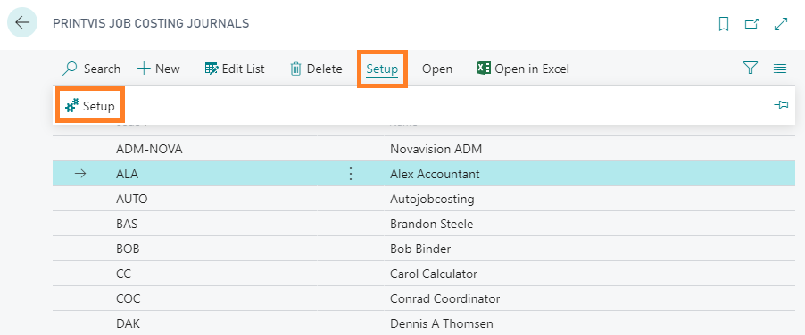

# Job Costing Journal Setup

## Summary

With this setup you maintain the job costing journals. Most often the journal will be created automatically in connection with the PrintVis User Setup. There will typically be a journal for each user in the system. We recommend that you also create a few general journals that might be used for group processing or auto processing of hours or materials.

## Setup

The Job Costing Journal setup can be found by searching “PrintVis Job Costing Journals” in the search box. Once the list is opened, pick the journal to setup (or create a new journal) and click Setup -> Setup

| \*\*Field\*\*                             | \*\*Description\*\*                                                                                                                                                                                                                                                                                                                                                                                                                                                                                   |

|--------------------------------------|---------------------------------------------------------------------------------------------------------------------------------------------------------------------------------------------------------------------------------------------------------------------------------------------------------------------------------------------------------------------------------------------------------------------------------------------------------------------------------------------------|

| Code                                 | Code is the identification field for the job costing journal. Length is max 100 characters                                                                                                                                                                                                                                                                                                                                                                                                       |

| Name                                 | Job Costing Journal name                                                                                                                                                                                                                                                                                                                                                                                                                                                                          |

| Belongs to Employee                  | If this journal is to belong to a specific employee, you select the employee from this list that is pulled from the PrintVis User List.                                                                                                                                                                                                                                                                                                                                                          |

| Item Journal Template / Posting Journal Name | Item postings are not posted directly from the job costing journal. The lines will be moved to an item journal and posted there. The item journal template holds the number series, etc. to assist in completing the item journal. The posting journal name is the name of the item journal where the items will be posted. Recommended to use a dedicated item journal, often called “PrintVis”, for investigation and manual postings. Example: Entry couldn't be posted in the item journal "ITEM", batch "PRINTVIS" |

| From Location = Cost Center          | When this field is checked, the from location/bin code is equal to the location/bin code set on the cost center by default.                                                                                                                                                                                                                                                                                                                                                                       |

| From Location / From Bin Code        | When these fields are chosen, the from location and bin codes are always set to these values by default.                                                                                                                                                                                                                                                                                                                                                                                          |

| To Location = Cost Center            | When this field is checked, the to location/bin code is equal to the location/bin code set on the cost center by default.                                                                                                                                                                                                                                                                                                                                                                         |

| To Location / To Bin Code            | When these fields are chosen, the to location and bin codes are always set to these values by default.                                                                                                                                                                                                                                                                                                                                                                                            |

| From/To fields General Note          | If the from and to fields are completed, the item posting is a “transfer” type, meaning the item will be moved from one location/bin to another. It is not a consumption of raw materials with impact on job costing.                                                                                                                                                                                                                                                                              |

| Suggested date                       | If a new line is put in the journal, this field sets the suggested date. Options: - Repeat above (repeats previous journal entry) - Today (today’s date) - Working date (the system working date)  \*\*See picture below\*\*                                                                                                                                                                                                                                                                                               |

| Department / Department Name         | If this journal belongs to a certain department, enter it here.                                                                                                                                                                                                                                                                                                                                                                                                                                   |

| Import Unit of Measure filter        | Specify a filter if you only want certain unit of measures to be included when building suggested journal lines. Useful to present only a subset of units to users.                                                                                                                                                                                                                                                                                                                               |

| Non-Recurring Journal                | When selected, the posting lines are removed after posting. If not selected, posted lines remain in the list.                                                                                                                                                                                                                                                                                                                                                                                     |

| Apply to Labor                       | Select this if the journal will be used for time recording.                                                                                                                                                                                                                                                                                                                                                                                                                                       |

| Apply to Material                    | Select this if the journal will be used for item registration.                                                                                                                                                                                                                                                                                                                                                                                                                                    |

| Post Item Journal                    | If selected, the journal posts items directly. If not selected, the item journal template is disabled and posting journal name is used as a Job Costing Journal (not an item journal). Typically used when shop floor workers enter consumption info for manager approval.                                                                                                                                                                                                                       |

| Template                             | If this journal is a template for new job costing journals, this field is checked. A template can be assigned to a cost center to define automatic job costing of time and materials.                                                                                                                                                                                                                                                                                                            |

| Import Values                        | If checked, importing to the journal will auto-fill the quantity with the estimated value. If unchecked, the quantity remains empty for manual entry.                                                                                                                                                                                                                                                                                                                                             |

| Info Report ID fields                | These fields can be used to set reports displayed at the top of the job costing journal page.                                                                                                                                                                                                                                                                                                                                                                                                      |

| Info Form ID                         | This field can be used to define a custom page for the job costing journal.                                                                                                                                                                                                                                                                                                                                                                                                                       |

