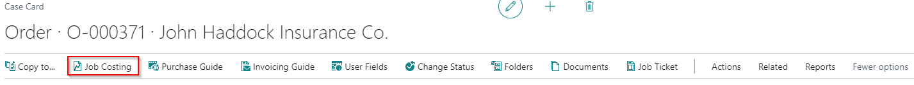
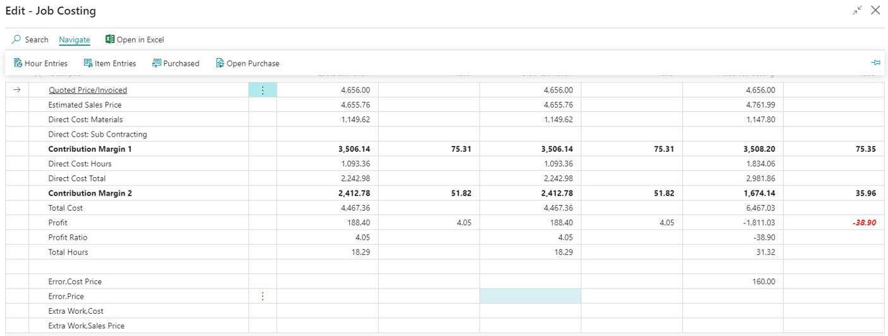
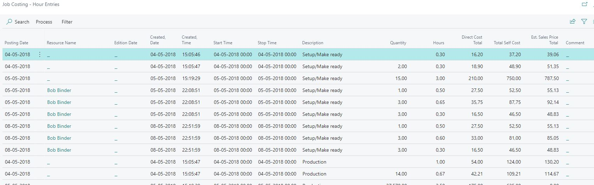
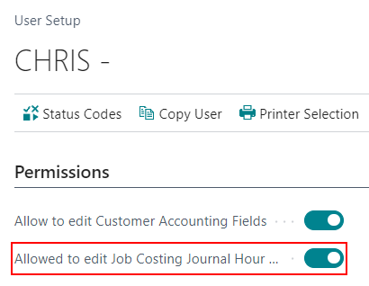
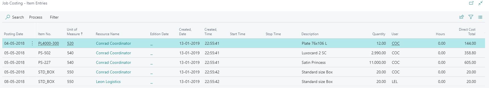
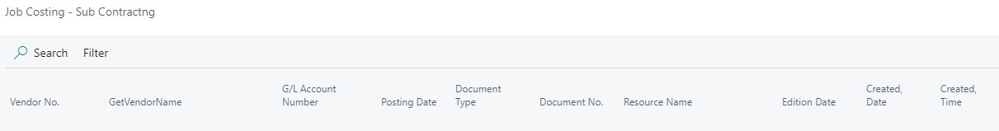
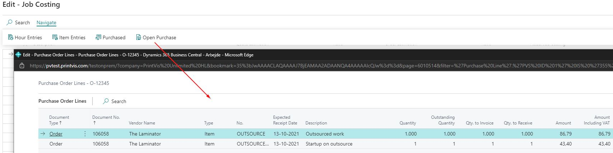
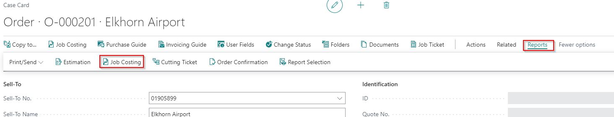
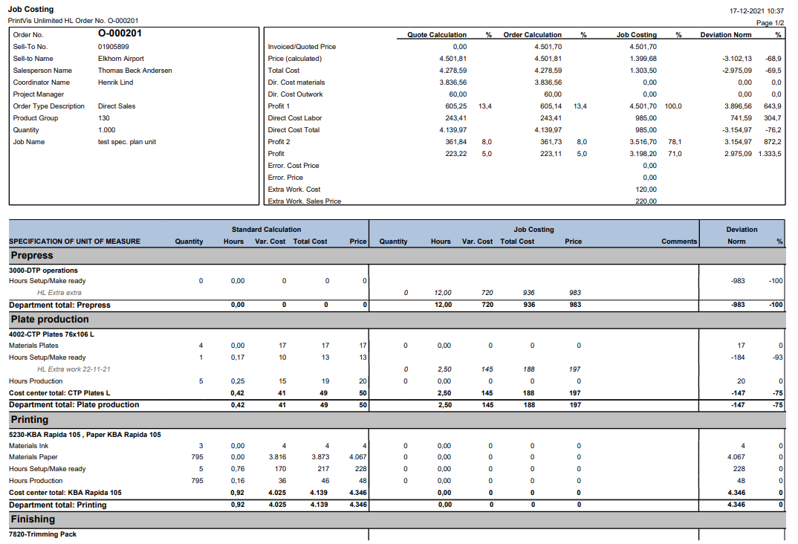

# Job Costing Report

## Summary

This side describes the evaluation possibilities of the job costs per order.

### Job Costing Overview

The Job Costing can be found on case card:

The job costing window consists of 6 FastTabs which in combination provides an overview of order totals and of the individual registrations on the order. The 6 register are described below:

Totals

Job Costing - Hour Entries

Job Costing - Item Entries

Job Costing - Items

Job Costing - Purchase

Purchase Order Lines

Totals

### Job Costing

The first tab provides a total overview of the orders:

Quote Estimation - The Quote Estimation shows the calculation of the active quote made to the customer, that is on the basis of the preconditions which are known at this time. An active quote is the active quote job line in Graphic case card.

Order Estimation - The Order Estimation shows the calculation of the items which the customer has actually ordered. The standard calculation shows the sum of the calculations in the active job lines of the Order type - these may be found on Graphic Case Card.

Actual Job Costing - The Actual Job Costing shows the sum of registered hours, materials and direct purchases. The job costing entries show the sum of postings on the order with all the jobs of the order.

Farthest to the right, the Normal Calculation and the Actual Job Costing are compared - both amounts and percentages.

| **Line No.** | **Field**                    | **Description**                                                                                     |
|--------------|-------------------------------|-----------------------------------------------------------------------------------------------------|
| 1            | Quoted Price/Invoiced         | Offered Price from Quote / Order line. The invoice amount is shown after posting the invoice.       |
| 2            | Estimated Sales Price         | Calculated price including profit.                                                                  |
| 3            | Direct Cost: Materials        | Material Costs without surcharge.                                                                   |
| 4            | Expected Cost: Materials        | Order material cost from pending invoice amounts.                                                      |
| 5            | Direct Cost: Sub Contracting  | Outwork/Sub-contracting Costs without surcharge.                                                    |
| 6            | Expected Cost: Sub Contracting | Outwork/Sub-contracting Costs from pending invoice amounts.                                        |
| 7            | Contribution Margin 1         | Result of line No.: 1 - 3 - 4                                                                       |
| 8            | Direct Cost: Hours            | Sum of direct costs (from Direct Cost setup at Cost Center rates per hour).                         |
| 9            | Direct Cost Total             | Result of line No.: 6 + 3 + 4                                                                       |
| 10           | Contribution Margin 2         | Result of line No.: 1 - 3 - 4 - 6                                                                   |
| 11           | Total Cost                    | Line No. 6 + Overhead                                                                               |
| 12           | Profit                        | Result of line No.: 1 - 9                                                                           |
| 13           | Profit Ratio                  | Profit in percent                                                                                   |
| 14           | Total Hours                   | Sum of total hours                                                                                  |
| 15           | Error, Cost Price             | Sum internal extra work direct costs                                                                |
| 16           | Error, Price                  | Sum internal extra work sales price (12 + surcharge + profit)                                       |
| 17           | Extra Work, Cost              | Sum customer extra work direct costs                                                                |
| 18           | Extra Work, Sales Price       | Sum customer extra work sales price (15 + surcharge + profit)                                       |

### Using the button "Hour Entries":

Job Costing - Hour Entries

In this table, all job costing of time operations are displayed - including time (and maybe quantity), cost prices, prices - who has made the job, when it was registered, in which cost center, which Unit of Measure is applied, etc. Each posting is displayed in an individual line and via the list you have a precise picture of all registered time for the production of the order.

Via the Job Costing window, the graphic production order is displayed, typically with one line per Unit of Measure in the job. In this window, the user may view information on estimated and job costed quantity, hours, cost prices and prices for each line. The window also contains information on waste time that may be debited and waste time which may not be debited.

Job Costing Journal button opens the Job Costing Journal with filter on journal and case ID (same filtering as opening Job Costing Journal from the Case Card).

It is possible to make adjustments to Job Costing hour entries lines. In order to do so, user will need to have "Allowed to Edit Job Costing Journal Hour Entries" Boolean checked on:

Editable fields on the Job Costing Hour Entries page are:

Posting Date

Hours

Quantity

Cost Center Code

Resource Code

There is also an edited field displayed for the lines. If any information is changed, then the edited field gets a checkmark. Also, any information that is changed will be updated on the PrintVis Time Recording page from the Shop Floor.

### Using the button "Item Entries":

Job Costing - Item Entries

In this table, all job costing of Materials are displayed - with quantity, item no., cost prices and sales prices, which Unit of Measure is applied, etc. Each posting is displayed in an individual line and via the list you have a precise picture of all registered material for the production of the order. If any incorrect registration has been made, the company super user may access and edit the individual labor entries via the Edit Job Costing button. The Edit Item Entry window is opened for the line selected in the table.

Job Costing Journal button opens the Job Costing Journal with filter on journal and case ID (same filtering as opening Job Costing Journal from the Case Card).

### Using the button "Purchase" or "Open Purchase":

Job Costing - Items / Purchase

This fasttabs displays the G/L entries created in connection with the posting of Purchase Invoices in not inventory controlled Items or Services bought specifically for the Graphic Production Order. Please note that you may not view individual entries from this window if a purchase consists of more item lines - it is not purchase lines which are presented but the actual G/L entries. However, via the Navigate button at the bottom of the window, you may form an overview of individual entries and possibly also individual purchase lines.

Job Costing Journal button opens the Job Costing Journal with filter on journal and case ID (same filtering as opening Job Costing Journal from the Case Card).

Purchase Order Lines

This register displays the not posted purchase orders for this job.

### Job Costing Report

The standard report is:

6010305 - Job Costing

All reports can be indicated on the screen or be printed out.

From Case Card

This report shows the total overview and the single values per cost centre.

