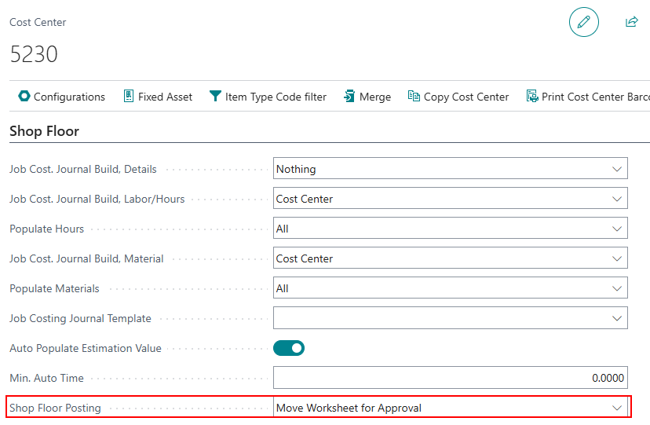
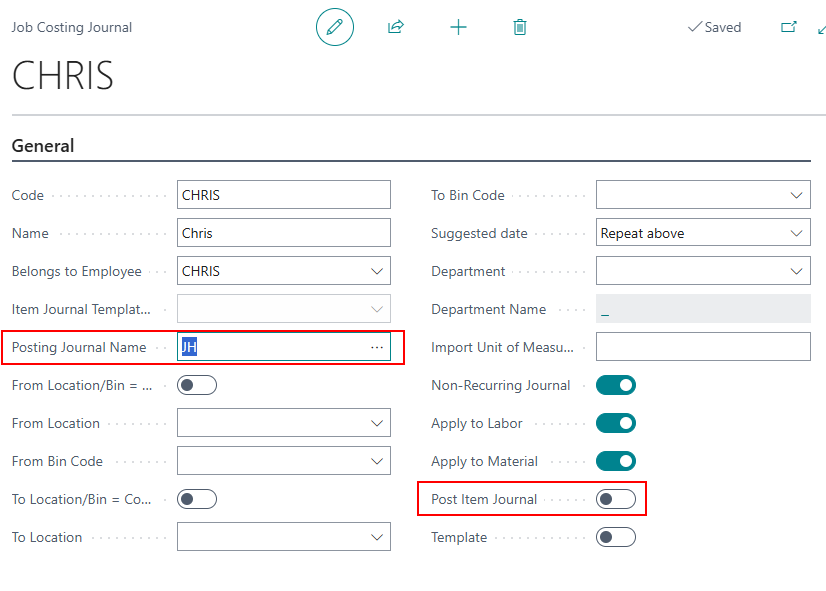
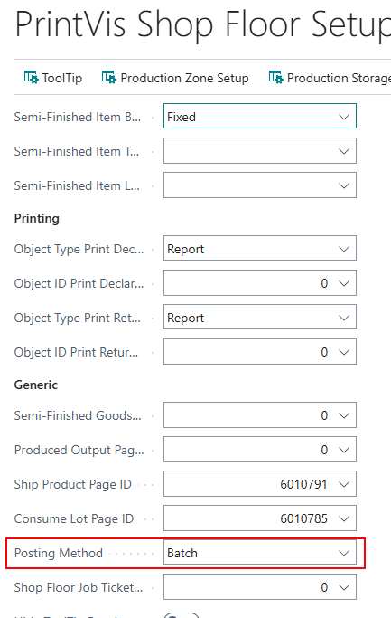
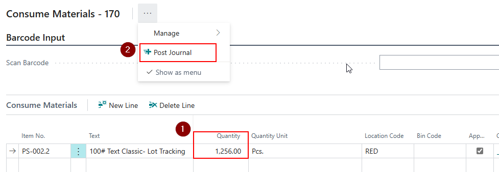
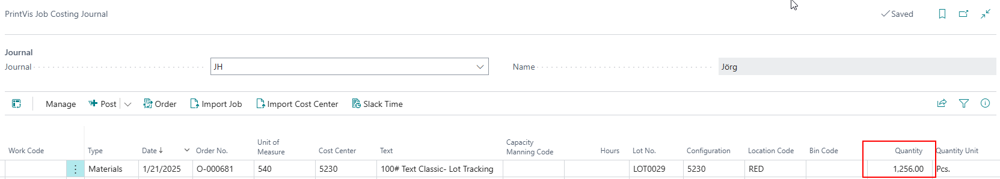

# Move Worksheet for Approval

## Introduction

When a **Shop Floor user** does **not have permission** to post material consumption in real-time, it is recommended to **move the worksheet to a journal** for another user (with the proper permissions) to review and post.  

This is configured through setup on the **Cost Center**, **Job Costing Journal**, and **Shop Floor Setup** pages.

## Cost Center Setup

The **Shop Floor Posting** setting controls when Job Costing Journal lines are posted. Available options:

- **Real Time** – Posts the job costing journal when clicking "Post" on the Shop Floor.
- **Post Worksheet upon Approval** – Creates lines in the user’s worksheet when clicking "Post". Users can review recordings before posting at the end of the shift.
- **Move Worksheet for Approval** – Creates lines in another user's Job Costing Journal (based on setup).  
  This is typically used when a shop floor worker has a **Time Registration license** and **does not have permission** to post material.

## Job Costing Journal Setup

- Enable the **Post Item Journal** (Boolean).
- Assign a **manager or another user’s** Job Costing Journal in the **Posting Journal Name** field.  
  This ensures that job costing lines are created in the correct journal when users click “Post” on the Shop Floor.

## Shop Floor Setup

On the **PrintVis Shop Floor Setup** page:

- Set **Posting Method** to **“Batch”**.

> **Note:** This setting is required any time a cost center is set to **“Move Worksheet for Approval.”**  
Other cost centers set to **“Real-Time”** will not be affected and will continue to post in real time.

## Result

On the **Shop Floor**, the user opens the **Consume Material** or **Semi-Finished Goods** page, enters the quantity, and clicks **“Post.”**

- A job costing line is created in the **corresponding PrintVis Job Costing Journal** (as per setup).
- Another user can then **review**, **approve/change**, and **post** the line.

