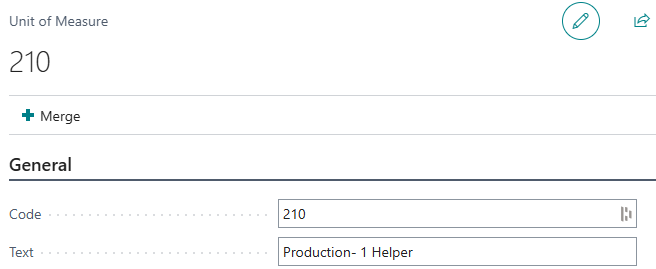
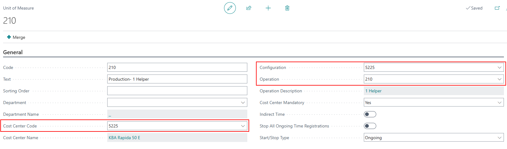
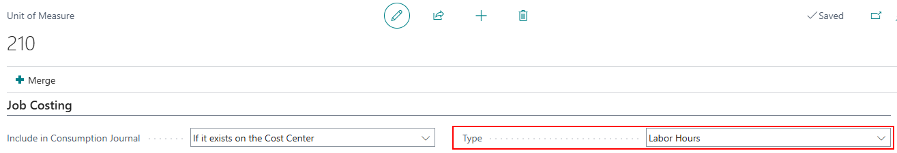
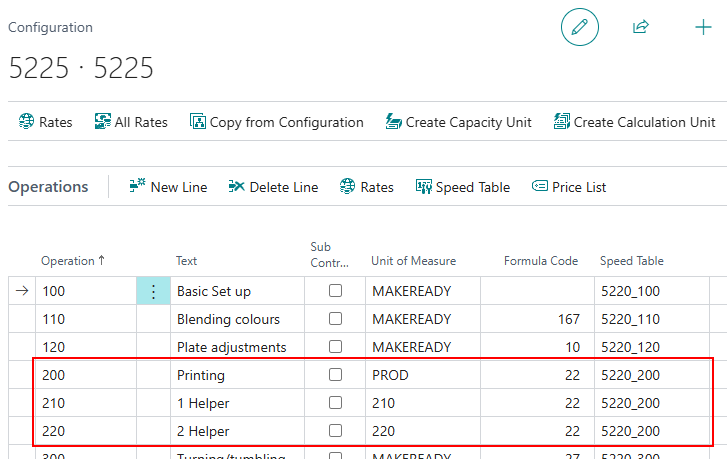
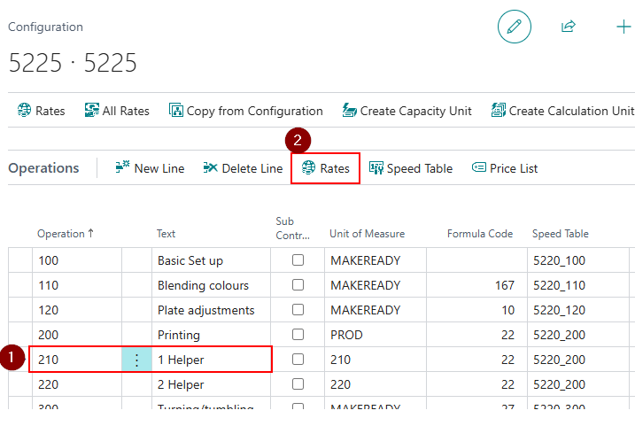
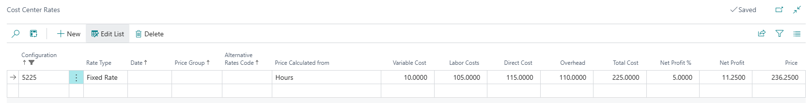
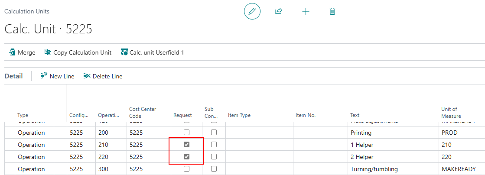
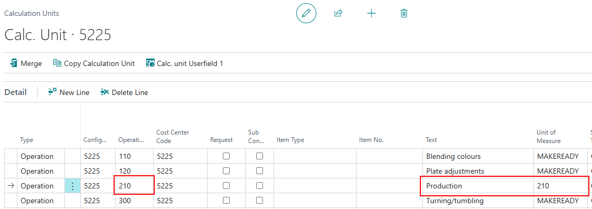
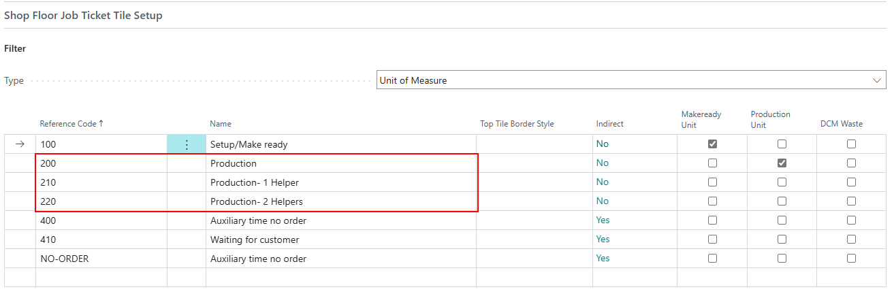
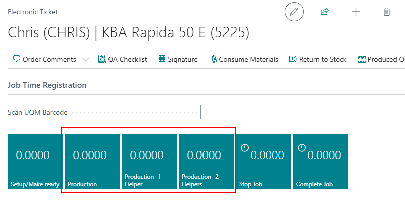

# Multi-user Time Registration on Shop Floor

## Introduction

Most of the time there is a **single user** clocked into a **single Cost Center**, recording time on a **single job**.  
However, there are scenarios where **multiple users** (helpers) record time on the same Cost Center and job.  
With increased labor, the **labor cost increases**. This article discusses how to handle that scenario, including setup and examples.

There are two options available:

- **Option 1**: Each user / helper is clocking into the same Cost Center, same job, and at the same time. This option is used if wanting to keep track of each user that is registering time on the job. It will require that each user has a log in.
- **Option 2**: The main production worker records time on the Cost Center and job using unit of measure setup for 1 helper, 2 helpers, etc. This option is used if having seasonal helpers and not wanting to keep track of each specific user clocking registering time on the job but still wanting to keep track of cost and time recorded on a job.

## Setup Option 1

Only setup that is required is that each user that will be clocking into the cost center / jobs. **Each user will need to have their own job costing journal** as well (even if it is just having that individual job costing journal passing time registration / item posting to a manager journal to be posted).

With the setup above, each user will be able to clock into the same job, on the same cost center, and at the same time. Each user can clock into the same Unit of Measure, or different Unit of Measures on the job, depending on the requirements for the job.

## Setup Option 2

Several areas require setup:

- **Unit of Measure**
- **Operations**
- **Operation Rates**
- **Shop Floor Tile Setup**

### Unit of Measure

Create a **PrintVis Unit of Measure** for each scenario involving helpers:

- If **0 helpers** → create 1 Unit of Measure.
- If **1 helper max** → create 2 Units of Measure.
- If **2 helpers max** → create 3 Units of Measure, and so on.

> This setup depends on company needs.

Steps:

1. Search for and open **PrintVis Unit of Measure**.

2. Create a new card.
3. Provide a **Code** and **Description** to identify the unit clearly.
4. If linked to a specific **Operation**, update:
   - **Cost Center Code**
   - **Configuration**
   - **Operation**

> You’ll need a Unit of Measure per operation to ensure correct rates are applied.

If used for **general production (0 helpers)**, you can leave the Cost Center/Configuration/Operation fields blank to use default Cost Center rates.

- Set the **Type** to: `Labor Hours`.

Refer to the main PrintVis Unit of Measure documentation for additional setup options.

### Cost Center Configuration

To enable **accurate estimating**, add the various **Operation lines** (for helper scenarios) to the **Cost Center Configuration**.

Operations

In the **Operations** section of Cost Center Configuration:

- Add lines for each helper scenario.
- Assign:
  - The corresponding **Unit of Measure**
  - A **Formula**
  - A **Speed Table** (optional; varies if speed changes with helpers)

Operation Rates

Once operations are created, define rates:

- For the **no helper** scenario, no additional operation rate is required (Cost Center rates apply).
- For **helper scenarios**, only add **Labor Cost** on top of existing Cost Center rates.
  - Variable Cost, Overhead, and Profit can remain unchanged.

Steps:

1. Open the Operation line.
2. Click **Rates**.
3. The **Cost Center Rates** page opens, linked to the selected Operation.
4. Enter only the **additional labor cost** where applicable.

### Calculation Unit

There are two ways to configure this:

 1. Estimator Chooses Number of Helpers

- Create a **Calculation Unit** from the Cost Center Configuration.
- Enable the **"Request"** field for optional helper operations.
- Estimators can check/uncheck helper lines as needed.

 2. Use Most Common Helper Setup

- Define the most common helper count as the **"Production"** operation line.
- Remove unused operation lines from the Calculation Unit.
- Optionally rename the **Text** to be user-friendly (e.g., "Production").
- Keep the **Unit of Measure** and **Operation number** aligned with the configuration.

## Shop Floor Tile Setup

To allow shop floor users to select the appropriate helper scenario:

1. Go to the **Cost Center Card**.
2. In **Shop Floor Job Ticket Tile Setup**:
   - Change **Line Type** to `Unit of Measure`.
   - Add relevant **PrintVis Unit of Measures**.
   - Only 1 line can be marked as **Production Unit** (typically the 0-helper UOM).

On the Shop Floor:

- The user will see **tiles** corresponding to each UOM scenario.
- They can click the appropriate tile based on the number of helpers present.
- This supports dynamic labor tracking as helpers join or leave the job.
