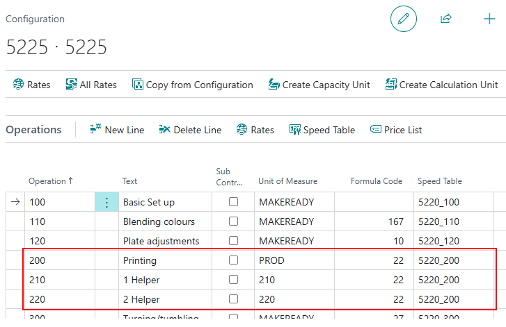

# Multi-user Time Registration on Shop Floor

## Introduction

Most of the time there is a **single user** clocked into a **single Cost Center**, recording time on a **single job**.  
However, there are scenarios where **multiple users** (helpers) record time on the same Cost Center and job.  
With increased labor, the **labor cost increases**. This article discusses how to handle that scenario, including setup and examples.

## Setup

Several areas require setup:

- **Unit of Measure**
- **Operations**
- **Operation Rates**
- **Shop Floor Tile Setup**

### Unit of Measure

Create a **PrintVis Unit of Measure** for each scenario involving helpers:

- If **0 helpers** → create 1 Unit of Measure.
- If **1 helper max** → create 2 Units of Measure.
- If **2 helpers max** → create 3 Units of Measure, and so on.

> This setup depends on company needs.

Steps:

1. Search for and open **PrintVis Unit of Measure**.

2. Create a new card.
3. Provide a **Code** and **Description** to identify the unit clearly.
4. If linked to a specific **Operation**, update:
   - **Cost Center Code**
   - **Configuration**
   - **Operation**

> You’ll need a Unit of Measure per operation to ensure correct rates are applied.

If used for **general production (0 helpers)**, you can leave the Cost Center/Configuration/Operation fields blank to use default Cost Center rates.

- Set the **Type** to: `Labor Hours`.

Refer to the main PrintVis Unit of Measure documentation for additional setup options.

### Cost Center Configuration

To enable **accurate estimating**, add the various **Operation lines** (for helper scenarios) to the **Cost Center Configuration**.

Operations

In the **Operations** section of Cost Center Configuration:

- Add lines for each helper scenario.
- Assign:
  - The corresponding **Unit of Measure**
  - A **Formula**
  - A **Speed Table** (optional; varies if speed changes with helpers)

Operation Rates

Once operations are created, define rates:

- For the **no helper** scenario, no additional operation rate is required (Cost Center rates apply).
- For **helper scenarios**, only add **Labor Cost** on top of existing Cost Center rates.
  - Variable Cost, Overhead, and Profit can remain unchanged.

Steps:

1. Open the Operation line.
2. Click **Rates**.
3. The **Cost Center Rates** page opens, linked to the selected Operation.
4. Enter only the **additional labor cost** where applicable.

### Calculation Unit

There are two ways to configure this:

 1. Estimator Chooses Number of Helpers

- Create a **Calculation Unit** from the Cost Center Configuration.
- Enable the **"Request"** field for optional helper operations.
- Estimators can check/uncheck helper lines as needed.

 2. Use Most Common Helper Setup

- Define the most common helper count as the **"Production"** operation line.
- Remove unused operation lines from the Calculation Unit.
- Optionally rename the **Text** to be user-friendly (e.g., "Production").
- Keep the **Unit of Measure** and **Operation number** aligned with the configuration.

## Shop Floor Tile Setup

To allow shop floor users to select the appropriate helper scenario:

1. Go to the **Cost Center Card**.
2. In **Shop Floor Job Ticket Tile Setup**:
   - Change **Line Type** to `Unit of Measure`.
   - Add relevant **PrintVis Unit of Measures**.
   - Only 1 line can be marked as **Production Unit** (typically the 0-helper UOM).

On the Shop Floor:

- The user will see **tiles** corresponding to each UOM scenario.
- They can click the appropriate tile based on the number of helpers present.
- This supports dynamic labor tracking as helpers join or leave the job.
