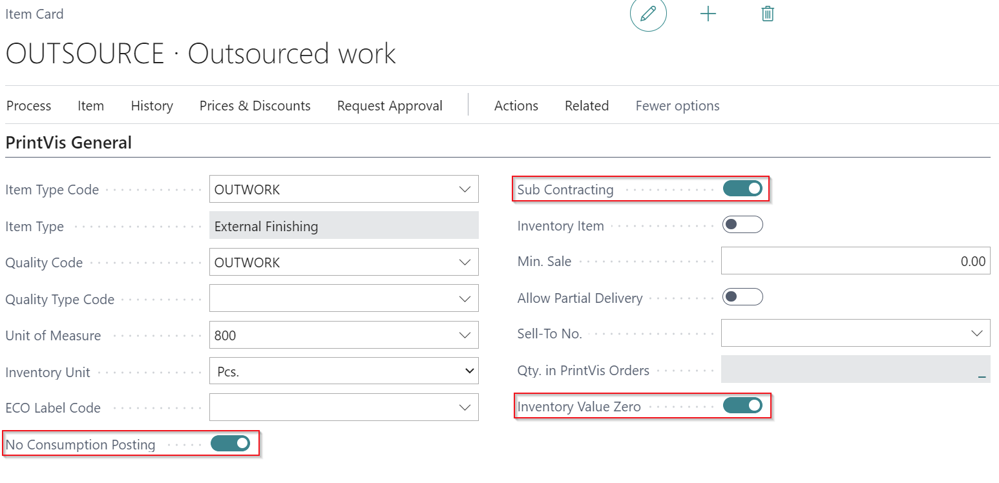
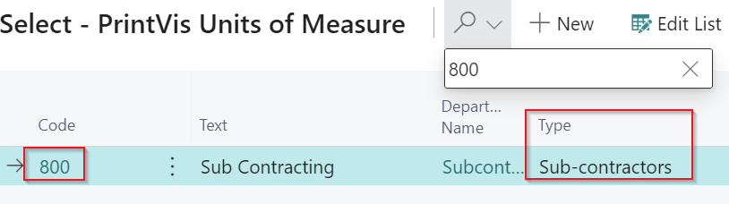
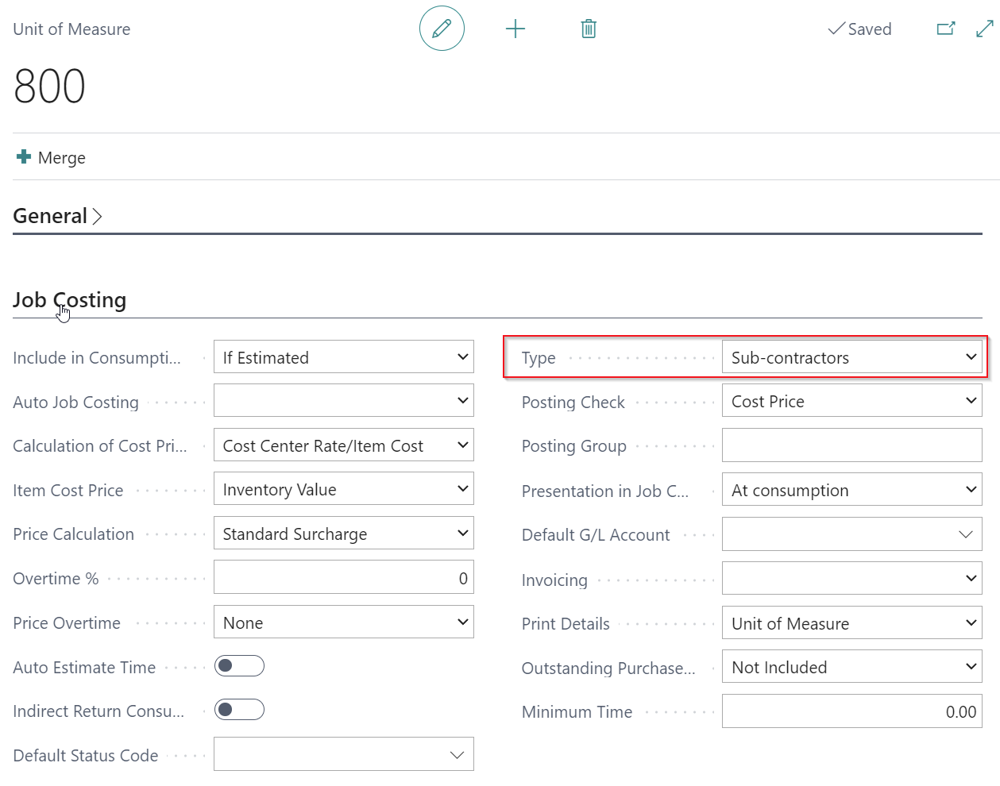
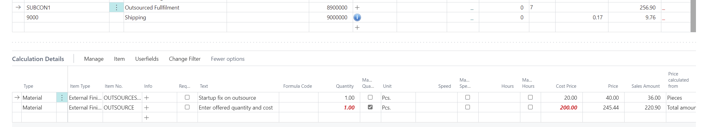
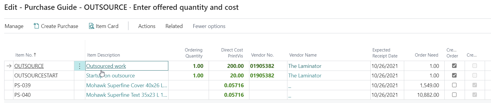
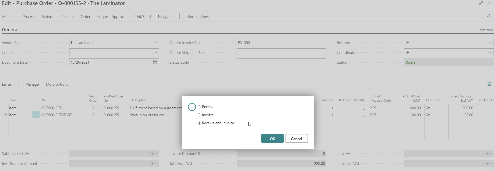
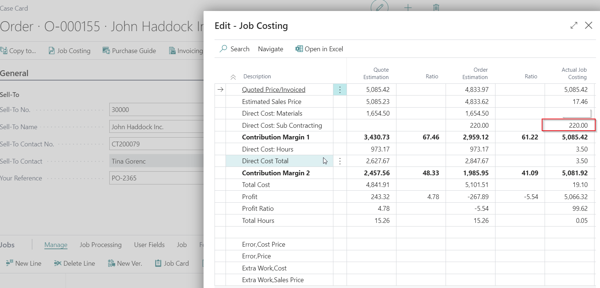
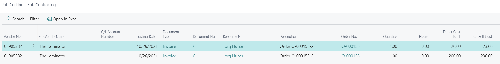

# Posted Purchase Orders as Job Costing - Subcontracting / Outwork

## Summary

PrintVis provides the ability to post purchase invoice values directly as job costing. This is handled by using a “dummy” item that needs specific settings, for example that no consumption on this item is required and possible. PrintVis is using an item for that because the item can be directly used in a calculation detail line, which then provokes information on the Purchase Guide. With that, everything can be easily handled with the standard Business Central functionality for purchase orders. The item will never get an inventory value.

This is typically used for subcontractors and nothing is handled on stock, but the full invoice amount is required as job costing just for one order. This is a specific functionality that is just to be used with PrintVis job costing.

If you try to post material consumption without a purchase order, the item must have the following setup.

For items which are not **External Finishing / Subcontracting Work**, the job costing is posted by a **PrintVis Job Costing Journal** consumption posting.

An item can be only used as:
- Inventory handled item, or
- A PrintVis "No Consumption Posting" item.

## Setup

### Item Card

Set the following fields:

- `No Consumption Posting` = **TRUE**
- `Sub Contracting` = **TRUE**
- `Inventory Value Zero` = **TRUE**
- `Unit of Measure` = Select one that is of type: **Sub-contractors**

### PrintVis Unit of Measure

## Workflow for Outsourced Work and Posting Result

### Data in Estimating Window

### Purchase Guide

### Purchase Order

### Result - Job Costing

PrintVis Job Costing after Purchase Order has been posted as invoice.

Job Costing Details

