# PrintVis Unit of Measure / UoM Group

## Summary

\*\*PrintVis Unit of Measure\*\* is a concept invented for use in PrintVis. A unit of measure is a tool whereby the following job costing functions are configured and controlled:

- Calculation of \*\*cost price\*\*, \*\*self cost\*\*, and \*\*sales price\*\* during the registration of incurred costs on the unit of measure.
- Presentation of the input to job costing in the form of either a \*\*printout\*\* or a \*\*display picture\*\*.
- How registrations shall behave during \*\*data input/bookkeeping\*\*.
- How a unit of measure shall appear on the \*\*electronic Job Ticket\*\*.

Units of measure are \*\*not attached to a specific Cost Center\*\* but can be used across all Cost Centers. This helps to \*\*reduce the number\*\* of units of measure that need to be introduced into the system. At the same time, it also enables the possibility, via \*\*statistics\*\*, of investigating, for example, the relationship between configuration and printing time across Cost Centers.

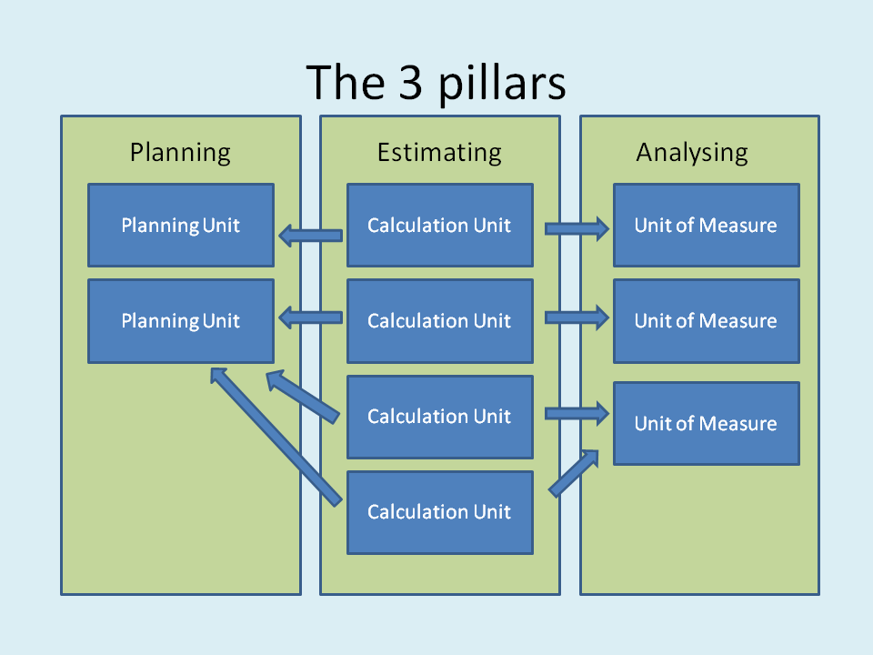

## Setup

The Unit of Measure setup can be found by searching:  

\*\*“PrintVis Unit of Measure”\*\*

### General

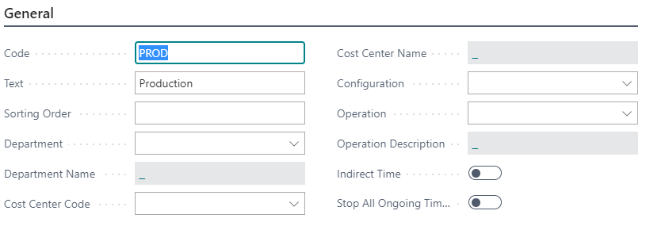

| Field                         | Description |

|-------------------------------|-------------|

| Code                          | Code is the identification field for the Unit of Measure. Length is max. 20 characters. |

| Text                          | Unit of Measure name. |

| Sorting Order                 | With this field, an alternative sorting order can be entered. The LookUp forms will usually select this Sorting Order. If no sorting order is defined, the lists will be ordered by the default primary key order. |

| Department                    | Via enquiries in the field, attachment to a specific Graphic Department is selected. If you make no selections, a selection must be made manually at the actual job costing. |

| Cost Center Code              | By a look-up in the field, a connection to a specific Cost Center is selected. If you make no selections, a selection must be made manually at the actual job costing. |

| Configuration                 | By a look-up in this field, you attach a specific configuration to the selected job costing. This decides the Cost Price, the Total Cost, and the Price unless otherwise defined via setup on the Job Costing Fan. If no selections are made, a selection must be made manually at the actual job costing. |

| Operation                     | By a look-up in this field, you may attach a specific operation to the selected Configuration/Cost Center. When a specific Operation is selected, the set-up hour rate for the selected operation is used. Thus, only one operation should be stated if the operation has a certain hour rate to consider. |

| Indirect Time                 | Select this field if the Unit of Measure is to be used for registration of non-order related time (e.g., cleaning of machines, non-job related waiting time, etc.). |

| Stop all ongoing time registrations | This field is related to indirect times only. If set to "Yes", starting this indirect unit will stop all ongoing time registrations for the Cost Center. |

| Start/Stop Type               | This is a presetting for the Start/Stop Type field on calculation details (calculation operations) to differentiate setup and production operations and materials. In the calculation details, a mapping can be set, specifying which calculation operation should be mapped with which PV Unit of Measure for the visualization of job costing against calculated budget in the PV job costing reports. |

### Job Costing

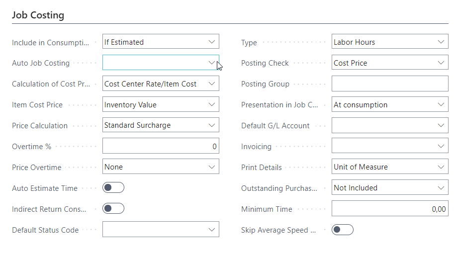

| Field | Description |

|-------|-------------|

| Included in Consumption Journal | Controls when a Unit of Measure is presented automatically for job costing. Affects Shop Floor Job Ticket and Job Costing Journal from Graphic Production Order.  Options: - If Estimated - If it exists on the Cost Center - Always - Never |

| Auto Job Costing | Used if the system should job cost the estimate automatically upon order termination.  Options: - Unit of Measure (per UoM) - Calc. Detail (per calculation line) |

| Calculation of Cost Price | Default: "Cost Center Rate/Item Cost Price". You may also choose: - Estimated Rate - Price List look-up |

| Item Cost Price | Only visible when Cost Price Estimate includes "Item Cost Price" and Type ≠ User Hours. Options: - Inventory value - Standard cost price (manually controllable) - Last Direct Unit Cost - Average cost price |

| Price Calculation | Defines how Sales Price is calculated. Default: Standard Surcharge. Other options: - Price Look-up - Accumulated Price Look-up - Estimated Price |

| Overtime % | Sets a percentage to calculate overtime pay, added to labor cost. |

| Price Overtime | Activated when Overtime % is entered. Adds overtime % to Sales Price (for hours). |

| Auto Estimate Time | Used for operations in pcs (e.g. scanning). Looks up speed table to auto-calculate time. |

| Indirect Return Consumption | When checked, entire purchase value of an item is posted even if partially used. |

| Default Status Code | Allows automatic order progression to selected status code upon job costing. |

| Type | Options: - Blank - User Hours - Materials - Sub Contracting This choice controls what gets registered and how prices are calculated. |

| Posting Check | Ensures price values are applied before posting. Options: - Cost price - Sales price - None |

| Posting Group | Affects invoice line breakdown and is tied to the invoicing setup. |

| Presentation in Job Costing | Controls UoM display in job costing. Options: - At consumption (default) - As estimation if no consumption - As estimation - Always transfer - Do not transfer |

| Default G/L Account | Links UoM registration to a specific G/L account for invoicing. Tied to invoicing setup. |

| Invoicing | Default: blank (uses setup principle). Options: - Deviations of numbers invoiced separately - Deviations of hours invoiced separately - Not to be invoiced |

| Print Details | Controls how UoM is presented on invoice: - Unit of Measure (default) - Item - Registration |

| Outstanding Purchase | Controls handling of unposted purchases: - Not included - Included and selected (fictitious posting) - Selected (fictitious marking only) |

| Minimum Time | Sets a minimum time registration (e.g., 0.15 = 15 min). Values below are rounded up. |

| Skip Average Speed Calculation | Prevents use of average speed in time estimation. |

| Hide on Job Costing Report | When enabled (for materials), hides this UoM from the PintVis Job Costing Report. |

### Shop Floor

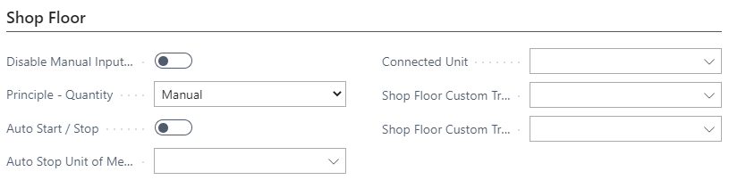

| Field | Description |

|-------|-------------|

| Disable manual input Hours | If marked, the employee cannot modify the hours in Shop Floor. |

| Principle - Quantity | Select how quantity input is handled: - \*\*Manual\*\* – used in Shop Floor or Job Costing Journal - \*\*Don't use\*\* – disables quantity input - \*\*Machine Counter\*\* – quantity comes from a direct machine connection |

| Auto Start / Stop | Enables automatic starting and stopping of the unit of measure. |

| Auto Stop Unit of Measure | Select from the Unit of Measure table. This is the unit of measure that will be stopped. |

| Connected Unit | Select from the Unit of Measure table. Can be used to attach a unit of measure for printing time if using a machine counter for paper consumption. |

| Shop Floor Custom Trigger Report Start | Option to trigger a custom report when a job starts in Shop Floor. |

| Shop Floor Custom Trigger Report Stop | Option to trigger a custom report when a job stops in Shop Floor. |

### Statistics

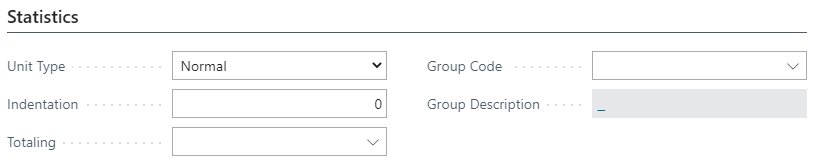

| Field       | Description                                                                                                                             |

|-------------|-----------------------------------------------------------------------------------------------------------------------------------------|

| Unit Type   | Default is \*\*Normal\*\*, meaning registrations on the Unit of Measure are presented individually. Options include creating Units of Measure as a \*\*Heading\*\* for a series or to provide a \*\*Sum\*\* totaling units within a group. |

| Indentation | Used for Units of Measure that appear between a Heading and a Sum (for grouping purposes).                                               |

| Totaling    | Used with the \*\*Sum\*\* type selection. Requires manually defining a filter by listing Unit of Measure codes separated by a vertical line `¦`. |

| Group Code  | Allows attachment of the Unit of Measure to a Unit of Measure Group for general statistical grouping.                                  |

## Overview

### 1.Setup Unit of Measure

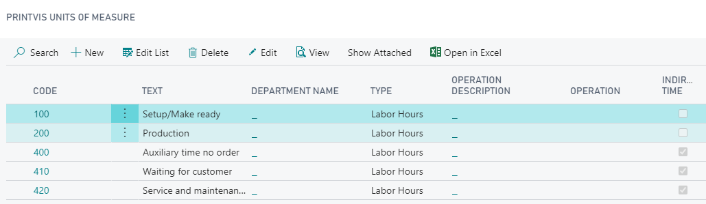

### 2.Setup Cost Center

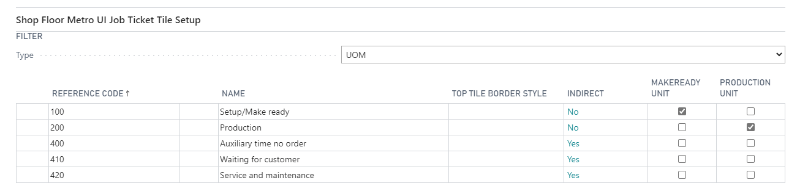

## Result on Shop Floor

### 3.1 Indirect Time on Production Plan from the Cost Center

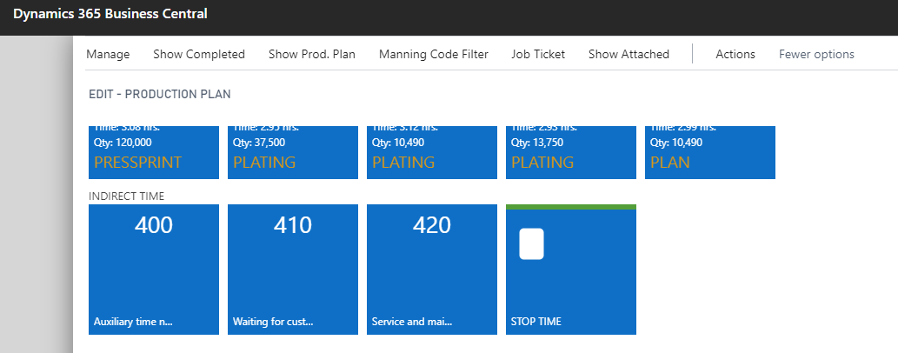

### 3.2. Setup / Production Time on the Job

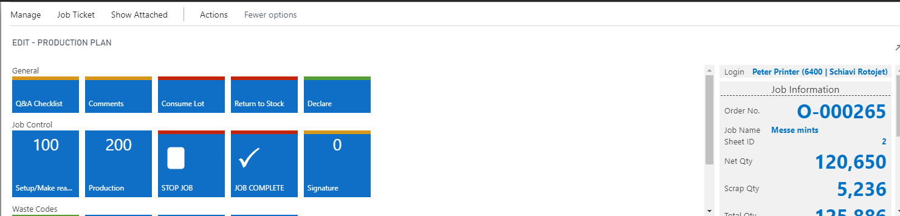

## Unit of Measure Group

### Setup

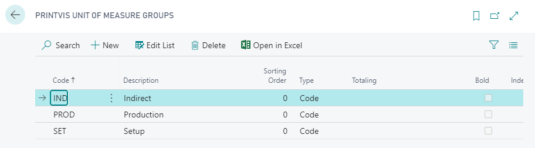

### Usage

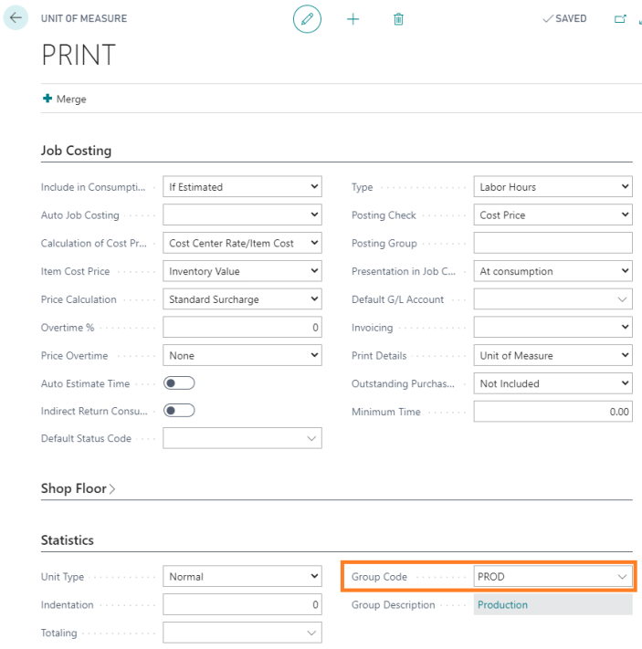
