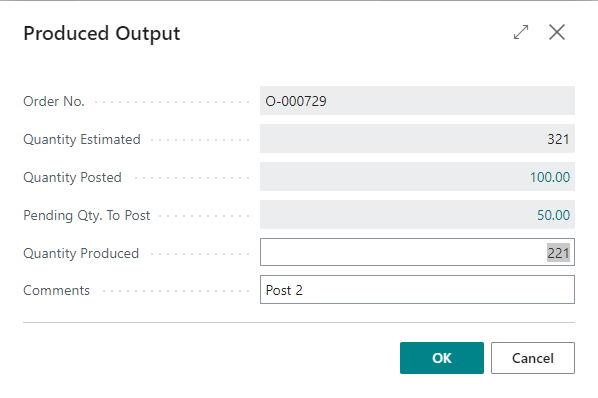
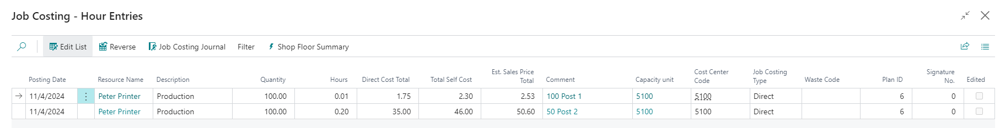
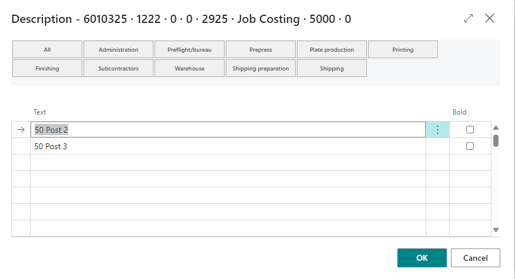

# Shop Floor Produced Output

## Produced Output
The produced output page allows for the recording of output quantity to be attached to time recordings. These quantities can be found on the job costing entries.

| **Field**              | **Description**                                                                                       |
|------------------------|-------------------------------------------------------------------------------------------------------|
| Order No.              | The **order number** associated with the entry.                                                       |
| Quantity Estimated     | The **estimated quantity** for this plan unit.                                                        |
| Quantity Posted        | The **quantity already posted** to a job costing entry.                                               |
| Pending Qty. To Post   | The **pending quantity** produced for the actively running unit of measure.                          |
| Quantity Produced      | The **quantity** the user wants to **post** for this entry.                                           |
| Comments               | Allows entry of **comments** to be posted to the job costing entry for the active running UOM.        |

## Job Costing
On the job costing entries, the produced quantity is added to the hours entries with their associated comments:

A comment line is created for each produced output entry with the quantity produced then comment for each entry:

