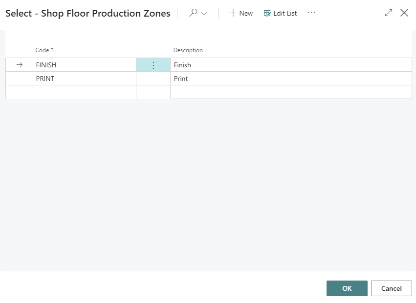
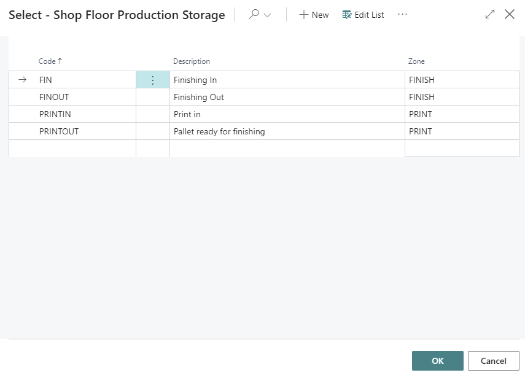
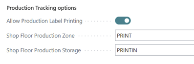
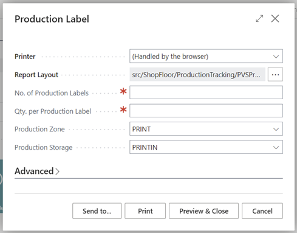
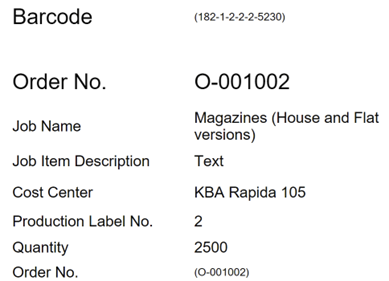
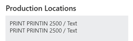
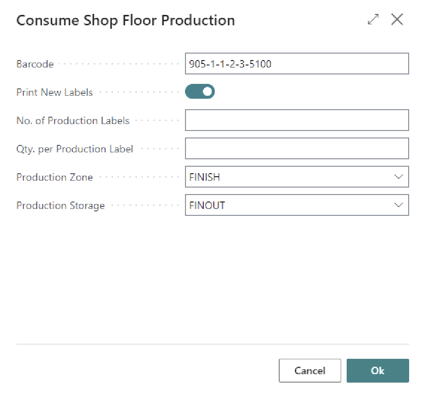
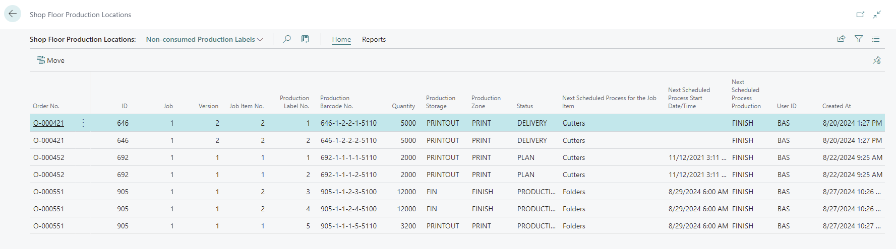
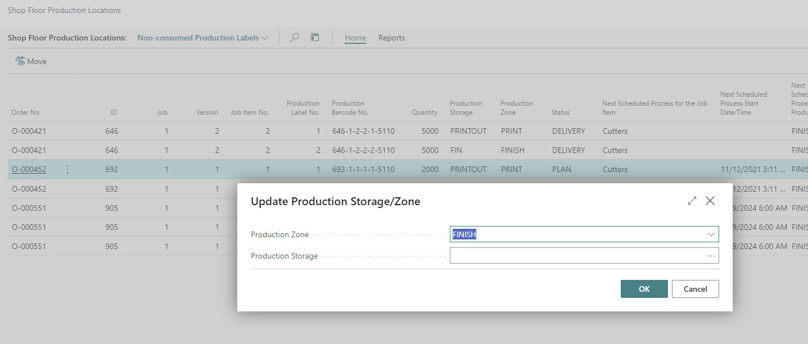
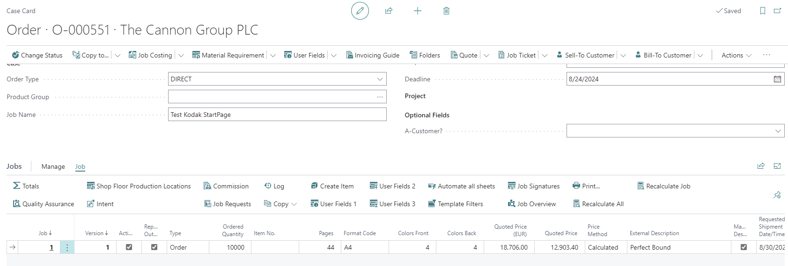

# Shop Floor Production Tracking

## Description

Shop floor production tracking allows a company to track semi-finished production as it travels and is produced/consumed on the shop floor. This tracking is done outside of standard Business Central inventory to avoid all the postings and ledger entries. Users are able to print labels to track quantity and locations of semi-finished material as it travels from work center to work center using PrintVis Production Zone and Storage locations. There is also a page that allows material handlers to see what semi-finished goods are on the shop floor and need moved from one work center to another. They can register these movements to keep these locations up-to-date.

This gives a good overview over where semi-finished products are located in production without having to have an advanced warehouse setup with Semi-Finished and Finished Goods. Our existing Business Central semi-finished goods and release finished goods functionality is still available.

## Setup

On the Shop Floor Setup page it is required to select a number series for the production tracking barcodes.

Shop Floor Production Zone and Storage locations need setup using the PrintVis SF Production Zone and PrintVis SF Production Storage pages.

On the cost center setup page, there is a section labeled Production Tracking options. This is where you can show/hide production tracking options and set the outbound production zone/storage for a cost center.

## Usage

### Printing Labels

When allow Production Label Printing is enabled for a cost center, a Production Label action is available on the shop floor for that cost center. A unit of measure time recording must be started before a user can create a production label. The quantity for the production label is also associated with the job costing time recording. The user specifies the number of labels, the quantity per label and confirms the default outbound zone/storage location.

The default label will look like the below with the barcode value and order number value in the ( ) being a barcode in a live environment.

The electronic job ticket factbox will display all non-consumed production labels for that order with current zone storage quantity / job item description values.

### Consuming Labels

When allow Production Label Printing is enabled for a cost center, a Consume Production action is available on the shop floor for that cost center. The user scans or enters the production label barcode number and can decide whether to print new production labels directly from here or leave that unchecked to only consume.

Consuming the production label marks the entry as consumed but does not remove the entry from the records. All entries are removed from the record when a case is archived to avoid continued growth of those records. If the company prefers to keep these records instead of deleting them upon case archive that would require custom development to override that function.

### Viewing / Moving Production Labels

The shop floor production locations page allows material handlers or shop floor workers see where all the production labels are located, where they are supposed to go next, and provides the ability to move production labels from one zone/storage location to another.

There are a couple preset filter options including: All, non-consumed production labels, need moved, and need moved today.

The move action allows the user to move a production label from one zone/storage location to another. It is possible to highlight multiple lines and move more than one label at a time. The zone will automatically populate the zone of the next cost center and the user would select the storage location and click Ok.

The production locations page can also be accessed from the Shop Floor Production Locations action on the Job menu on the case card. It will filter to the production labels for the case.

