# Shop Floor

## Introduction

This document will summarize the required setup for the shop floor functionality and explain the various options within it.

The setup required is performed from the Cost Centers, the PrintVis User List, PrintVis Units of Measure, the Shop Floor setup, and from the Capacity Group Setup. The nature of the Shop Floor application is to present data, primarily in tiles instead of lines, to give it the easiest possible look.

However, some views provide a better overview with a deeper set of information in Lists rather than Tiles. Hence you may per-user choose between those two views. Once opened however, the Shop Floor Page is all tiles for start/stop functionality etc.

The purpose of the Shop Floor application is to provide an interface which is easy to access with touch-sensitive screens as well as easy to operate with finger touch rather than mouse and keyboard. Furthermore, the tiles presented in different colors make for an easy view from a distance as to whether the time is counting and which unit of measure it is in.

## General Shop Floor Setup

### 1. PV Shop Floor Setup

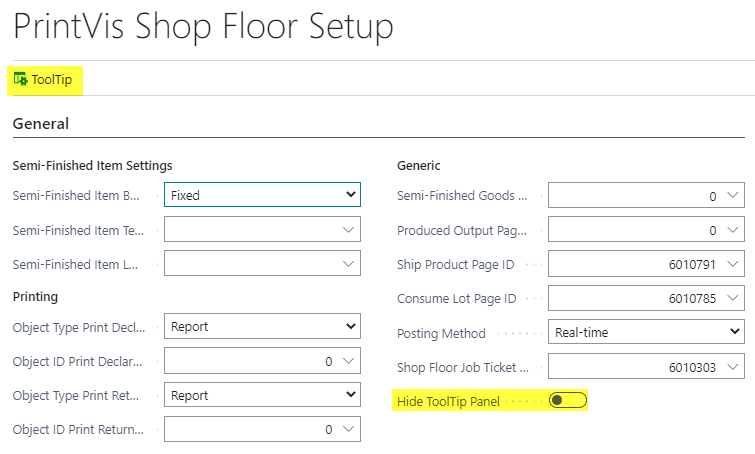

The action \*\*"ToolTip"\*\* opens the same ToolTips as in the Planning Board. This will be shown in the Shop Floor Role Center. It's possible to hide not-needed lines in the table or the complete ToolTip if not needed via the function on this page.

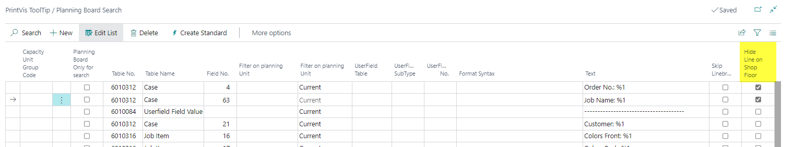

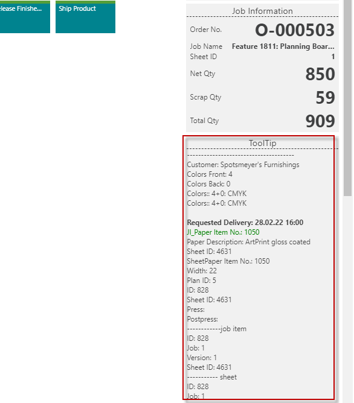

### 2. Semi-Finished Items Settings

Semi-Finished Items settings relate to partially-manufactured goods produced during each step of the production process. This would be used to allow operators to tell the system how many good sheets/books/sections came out of their individual production step.

On the shop floor application, this information is given in the \*\*Declare Production\*\* page.

Declare production will create an increase in stock on an item – this will be visible from the \*\*Case Card Job Costing\*\*.

> \*\*Note\*\*: To declare the production, the job needs to have been started, otherwise there is nothing to declare.

The setup here is to help the system create the item which will carry the transactions.

| \*\*Field\*\*                        | \*\*Description\*\*                                                                                                                                                                                                                                                                                                     |

|----------------------------------|---------------------------------------------------------------------------------------------------------------------------------------------------------------------------------------------------------------------------------------------------------------------------------------------------------------------|

| \*\*Shop Floor Item build-up\*\*     | Determines if and how the system should create items for handling semi-finished goods.                                                                                                                                                                                                                              |

| Fixed                            | One single item will carry transactions for all orders always.                                                                                                                                                                                                                                                      |

| Product group                    | One item will be created per product group.                                                                                                                                                                                                                                                                          |

| Order No.                        | One item will be created per order number for the transactions.                                                                                                                                                                                                                                                    |

| \*\*Example\*\*                      | Semi-finished items can have the following options: • Fixed item – e.g. ‘SEMI’ • Product group • Order No.  In a normal setup, a fixed item number like \*\*SEMI\*\* is sufficient, as the production order ID and number are used for reference.                                                   |

|                                  | Locations might not need to be set up, unless required by the factory setup.                                                                                                                                                                                                                                       |

|                                  | Declaring semi-finished goods this way results in a \*\*positive adjustment\*\* for the SEMI item.                                                                                                                                                                                                                      |

|                                  | A \*\*zebra printer\*\* typically prints a pallet label with barcodes for this amount.                                                                                                                                                                                                                                   |

|                                  | At the next cost center, this material is consumed when the process starts. There should be \*\*no SEMI items remaining\*\* once the production order is produced and shipped.                                                                                                                                         |

| \*\*Shop Floor Item Template / Item No.\*\* | Points to the item used as a template for item creation if \*\*build-up\*\* is set to \*\*Product Group\*\* or \*\*Order No.\*\* If \*\*Fixed\*\*, it directly indicates which item will be used for all transactions.                                                                                                      |

| \*\*Shop Floor Item Location\*\*     | Allows setting a \*\*fixed location\*\* for the item transactions.                                                                                                                                                                                                                                                      |

### 3. Printing

This setup area relates to action from the system when the Shop Floor user clicks OK on the Declare Production or the Return to Stock pages.

| \*\*Field\*\*                            | \*\*Description\*\*                                                                                                                                                                     |

|--------------------------------------|-------------------------------------------------------------------------------------------------------------------------------------------------------------------------------------|

| \*\*Object Type Print Declare Production\*\* | Specifies which object type is triggered by \*\*OK\*\* on the \*Declare Production\* page. Options: - Report - Codeunit                                                            |

| \*\*Object ID Print Declare Production\*\*   | Points to the object number triggered by \*\*OK\*\* on the \*Declare Production\* page.                                                                                                    |

| \*\*Object Type Print Return to Stock\*\*    | Specifies which object type is triggered by \*\*OK\*\* on the \*Return to Stock\* page. Options: - Report - Codeunit                                                              |

| \*\*Object ID Print Return to Stock\*\*      | Points to the object number triggered by \*\*OK\*\* on the \*Return to Stock\* page.                                                                                                       |

### 4. Generic

This section gives an option for hooks to custom pages for certain areas of the Shop Floor application.

| \*\*Field\*\*                     | \*\*Description\*\*                                                                                                                                                                                                                                                                                                                                                                                                                                                                                                                |

|-------------------------------|--------------------------------------------------------------------------------------------------------------------------------------------------------------------------------------------------------------------------------------------------------------------------------------------------------------------------------------------------------------------------------------------------------------------------------------------------------------------------------------------------------------------------------|

| \*\*Declare Production Page ID\*\* | Default Page ID: \*\*6010790\*\* (if setup field is empty). Used when the actual produced quantity is posted to stock as a \*\*Semi-Finished item\*\*. Requires setup for Semi-Finished Item settings.                                                                                                                                                                                                                                                                                       |

| \*\*Ship Product Page ID\*\*       | Default Page ID: \*\*6010791\*\* (if setup field is empty). This page shows shipments when no number from the \*\*PV Shipment No.\*\* series exists on the shipment. These shipments are templates used to create the shipment for the order via custom objects/pages.  \*\*Note:\*\* In a future release, shipments list might be opened from the case with a click. No release date yet.                                                                                                                   |

| \*\*Consume Lot Page ID\*\*        | Default Page ID: \*\*6010787\*\* (if setup field is empty). This page loads all items estimated for the current \*\*Cost Center\*\* into a journal. Users only need to select \*\*Location\*\* and \*\*Bin\*\* (if applicable), and enter consumed quantity.  Alternatively, use \*\*Page ID 6010785\*\*, which provides a \*\*Lot ID\*\* field for scanning or entering a lot number (e.g. via barcode scanner). Item info appears and consumed quantity can be entered.                               |

|                               | \*\*Note:\*\* This field applies \*\*only\*\* if \*'Shop Floor Item Consumption'\* is blank on the \*\*PV user setup\*\* for the current user.                                                                                                                                                                                                                                                                                                                                                       |

| \*\*Posting Method\*\*            | Sets the general rule for how transactions (Declare Production, Consume Lots, Return to Stock, Ship Lots) are posted (e.g. via item journals). Options: - Batch - Realtime                                                                                                                                                                                                                                                                                                    |

| \*\*Shop Floor Job Ticket Report\*\* | Select the report (default is \*\*6010303\*\*) for showing the \*\*job ticket\*\* directly on the page. This setup applies to \*\*all cost centers\*\*, but you can also configure it individually per cost center. Se picture below                                                                                                                                                                                                                                                                            |

#### PrintVis User Card

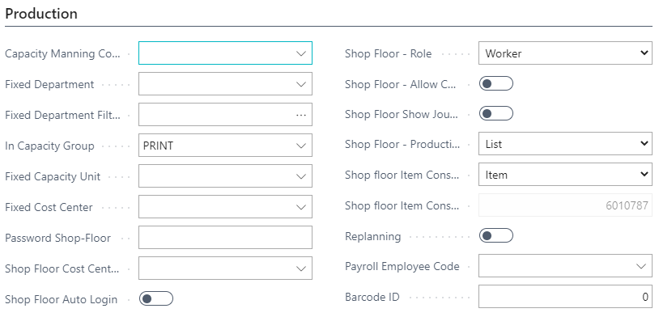

In the Production Pane we find fields which impact the user’s access on the Shop Floor.

| \*\*Field\*\*                        | \*\*Description\*\*                                                                                                                                                                                                                                                                                                                                                                                                                                                                                     |

|----------------------------------|-----------------------------------------------------------------------------------------------------------------------------------------------------------------------------------------------------------------------------------------------------------------------------------------------------------------------------------------------------------------------------------------------------------------------------------------------------------------------------------------------------|

| \*\*Capacity Manning Code\*\*        | Used as a stamp in the \*Capacity Manning Code\* field on every time and material line recorded in the application. Also serves as a filter on production plans for pre-press in the \*\*Classical Shop Floor application\*\*.                                                                                                                                                                                                                                                                          |

| \*\*Fixed Department\*\*             | If set, the user always starts in a specific department and sees only the capacities within it. \*\*Applies to Classical Shop Floor application.\*\*                                                                                                                                                                                                                                                                                                                                                  |

| \*\*Fixed Department Filter\*\*      | Similar to \*Fixed Department\* but intended as a filter. Limits visible capacities to the set department only. \*\*Applies to Classical Shop Floor application.\*\*                                                                                                                                                                                                                                                                                                                                     |

| \*\*In Capacity Group\*\*            | If set, the user starts in a specific \*Capacity Group\* and sees only capacities within it. \*\*Applies to Classical Shop Floor application.\*\*                                                                                                                                                                                                                                                                                                                                                      |

| \*\*Fixed Capacity Unit\*\*          | User starts in a fixed \*Capacity\* and sees only that capacity. \*\*Applies to Classical Shop Floor application.\*\*                                                                                                                                                                                                                                                                                                                                                                                   |

| \*\*Fixed Cost Center\*\*            | User starts in a fixed \*Cost Center\* and sees only that one. \*\*Applies to Classical Shop Floor application.\*\*                                                                                                                                                                                                                                                                                                                                                                                     |

| \*\*Password Shop Floor\*\*          | Password for logging in to a Shop Floor capacity. \*\*Does not replace\*\* the standard Microsoft 365 Business Central password.                                                                                                                                                                                                                                                                                                                                                                        |

| \*\*Shop Floor Cost Centers\*\*      | Defines which cost centers a user can access. User will also only see colleagues working within these cost centers.                                                                                                                                                                                                                                                                                                                                                                               |

| \*\*Shop Floor Auto Login\*\*        | If enabled, user can log in to a cost center without needing a password.                                                                                                                                                                                                                                                                                                                                                                                                                            |

| \*\*Shop Floor – Role\*\*            | Determines user role in Shop Floor: - \*\*Worker\*\*: Basic access - \*\*Department Manager\*\*: Includes planning overview (filtered to department) - \*\*Company Manager\*\*: Full planning access without filtering                                                                                                                                                                                                                                                                                  |

| \*\*Shop Floor Allow Case Edit\*\*   | Allows \*Department Manager\* and \*Company Manager\* roles to \*\*edit\*\* the Case Card during production.                                                                                                                                                                                                                                                                                                                                                                                                  |

| \*\*Shop Floor Show Journal Logout\*\* | Displays the user’s journal upon logout to ensure all entries are complete and/or posted.                                                                                                                                                                                                                                                                                                                                                                                                           |

| \*\*Shop Floor Production Plan\*\*   | Determines style of production plan view: - \*\*Tiles\*\*: Color-coded tile view - \*\*List\*\*: Table view                                                                                                                                                                                                                                                                                                                                                                                           |

| \*\*Shop Floor Item Consumption\*\*  | Specifies which page opens to "Consume Lot": - \*\*Items\*\* → Page ID 6010787 - \*\*Lot Number\*\* → Page ID 6010785 - \*\*Special Function\*\* → Custom Page ID input for customized solutions                                                                                                                                                                                                                                                                                                        |

| \*\*Replanning\*\*                   | If enabled, moving a unit later on the schedule automatically reschedules subsequent \*variable planned units\*, provided there is time and availability. Works on the \*\*planning board\*\* and \*\*production plan page\*\*. A message appears if a unit cannot be replanned.                                                                                                                                                                                                                               |

| \*\*Payroll Employee Code\*\*        | Can be used as a reference if there’s a local payroll system linked to Shop Floor time registrations.                                                                                                                                                                                                                                                                                                                                                                                               |

| \*\*Barcode ID\*\*                   | Stores and matches an employee number for barcode scanning (e.g. scanning a print instead of manual login). \*\*Note:\*\* Not part of the current standard solution.                                                                                                                                                                                                                                                                                                                                |

#### Cost Center

The general Shop Floor pane relates to all rules for this cost center on any Shop Floor application.

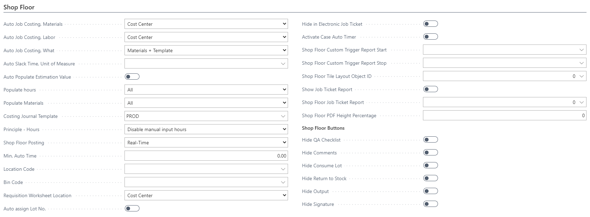

| \*\*Field\*\*                           | \*\*Description\*\*                                                                                                                                                                                                                                                                                                                                                                                                                                                                                                                                                                                                                                                                                                       |

|-------------------------------------|-------------------------------------------------------------------------------------------------------------------------------------------------------------------------------------------------------------------------------------------------------------------------------------------------------------------------------------------------------------------------------------------------------------------------------------------------------------------------------------------------------------------------------------------------------------------------------------------------------------------------------------------------------------------------------------------------------------------|

| \*\*Auto Job Costing, Materials\*\*     | Specifies which level of material is included from the user’s registration window: - \*\*Cost Center\*\*: Materials attached to selected cost center - \*\*Capacity\*\*: Materials attached to capacity unit - \*\*Department\*\*: Materials attached to the department - \*\*All\*\*: Includes all materials                                                                                                                                                                                                                                                                                                                                                                                                             |

| \*\*Auto Job Costing, Labor\*\*         | Specifies which level of time recordings is included: - \*\*Cost Center\*\*: All time operations at selected cost center - \*\*Capacity\*\*: Time operations attached to the capacity unit - \*\*Department\*\*: Time operations from the related department                                                                                                                                                                                                                                                                                                                                                                                                                    |

| \*\*Auto Job Costing, What\*\*          | Defines which registration options are shown for materials and operations: - \*\*All\*\*: All estimated lines, including generated lines from related cost centers - \*\*Direct\*\*: Only estimated lines with direct links to unit of measure - \*\*Estimated\*\*: Only estimated operations/items on selected cost center - \*\*Template\*\*: Lines from a fixed job costing journal template - \*\*Nothing\*\*: No registration allowed for time or materials                                                                                                                                                                                                                             |

| \*\*Auto Slack Time, UOM\*\*            | Defines the Unit of Measure to register slack time (time between end of one activity and start of next)                                                                                                                                                                                                                                                                                                                                                                                                                                                                                                                                                                                                             |

| \*\*Auto Populate Estimation Value\*\*  | Determines if estimation values should be auto-applied to all calculated values                                                                                                                                                                                                                                                                                                                                                                                                                                                                                                                                                                                                                                     |

| \*\*Populate Hours\*\*                  | Select which hours should be included: - \*\*All\*\* - \*\*Matching\*\* - \*\*Planning Unit\*\* - \*\*Matching Sheet\*\* - \*\*Nothing\*\*                                                                                                                                                                                                                                                                                                                                                                                                                                                                                                                                                                                |

| \*\*Populate Materials\*\*              | Select which materials should be included: - \*\*All\*\* - \*\*Matching\*\* - \*\*Planning Unit\*\* - \*\*Matching Sheet\*\* - \*\*Nothing\*\*                                                                                                                                                                                                                                                                                                                                                                                                                                                                                                                                                                            |

| \*\*Costing Journal Template\*\*        | Specifies the costing template to use when lines must be created from a fixed template                                                                                                                                                                                                                                                                                                                                                                                                                                                                                                                                                                                                                              |

| \*\*Principle - Hours\*\*               | Defines how time posted by users should be handled: - \*\*Unit of Measure\*\*: Uses setup from UOM on operation lines - \*\*Disable manual input hours\*\* - \*\*Enable manual input hours\*\*                                                                                                                                                                                                                                                                                                                                                                                                                                                                                                                        |

| \*\*Shop Floor Posting\*\*              | Select posting method for Shop Floor time entries: - \*\*Real Time\*\*: Posts when registration stops or Approved button is clicked - \*\*Move Worksheet for Approval\*\*: Moves lines to general journal upon user approval for someone else to post (defined on department)                                                                                                                                                                                                                                                                                                                                                                                                 |

| \*\*Min. Auto Time\*\*                  | If registered hours are below this threshold, the system will not post automatically                                                                                                                                                                                                                                                                                                                                                                                                                                                                                                                                                                                                                                 |

| \*\*Location Code\*\*                   | Location associated with the cost center                                                                                                                                                                                                                                                                                                                                                                                                                                                                                                                                                                                                                                                                              |

| \*\*Bin Code\*\*                        | Bin associated with the cost center                                                                                                                                                                                                                                                                                                                                                                                                                                                                                                                                                                                                                                                                                   |

| \*\*Requisition Worksheet Location\*\*  | Determines default location for requisition worksheet: - \*\*Cost Center\*\*: Uses location from cost center - \*\*Vendor\*\*: Uses location from vendor card Can be manually overridden on the worksheet                                                                                                                                                                                                                                                                                                                                                                                                                                                                 |

| \*\*Auto assign Lot No.\*\*             | Automatically assigns lot number when declared                                                                                                                                                                                                                                                                                                                                                                                                                                                                                                                                                                                                                                                                        |

| \*\*Hide in Electronic Job Ticket\*\*   | If checked, hides the cost center in the electronic job ticket view                                                                                                                                                                                                                                                                                                                                                                                                                                                                                                                                                                                                                                                   |

| \*\*Activate Case Auto Timer\*\*        | Enables automatic time registration on cases when checked                                                                                                                                                                                                                                                                                                                                                                                                                                                                                                                                                                                                                                                             |

| \*\*Shop Floor Custom Trigger Report Start\*\* | Report that scans for \*\*start\*\* files in hot folders for the cost center (requires setup in Batch Manager)                                                                                                                                                                                                                                                                                                                                                                                                                                                                                                                                                                                                       |

| \*\*Shop Floor Custom Trigger Report Stop\*\*  | Report that scans for \*\*stop\*\* files in hot folders for the cost center (requires setup in Batch Manager)                                                                                                                                                                                                                                                                                                                                                                                                                                                                                                                                                                                                        |

| \*\*Shop Floor Tile Layout Object ID\*\*| If using a custom codeunit for tile layout, specify it here                                                                                                                                                                                                                                                                                                                                                                                                                                                                                                                                                                                                                                                           |

| \*\*Show Job Ticket Report\*\*          | Enables the \*\*Show Job Ticket Report\*\* action on this cost center                                                                                                                                                                                                                                                                                                                                                                                                                                                                                                                                                                                                                                                    |

| \*\*Shop Floor Job Ticket Report\*\*    | Specifies job ticket report number for this cost center (if different from default)                                                                                                                                                                                                                                                                                                                                                                                                                                                                                                                                                                                                                                  |

| \*\*Shop Floor PDF Height Percentage\*\*| Percentage to use when displaying PDF content                                                                                                                                                                                                                                                                                                                                                                                                                                                                                                                                                                                                                                                                         |

| \*\*Shop Floor Buttons\*\*              | Allows toggling visibility of buttons on the shop floor page for this cost center. Example: hide the \*\*Signature\*\* button for non-offset press centers.                                                                                                                                                                                                                                                                                                                                                                                                                                                                                                                                                        |

The information and settings here will form the layout of the Planning Unit Tile in the application.

#### The Job Ticket Tile Setup

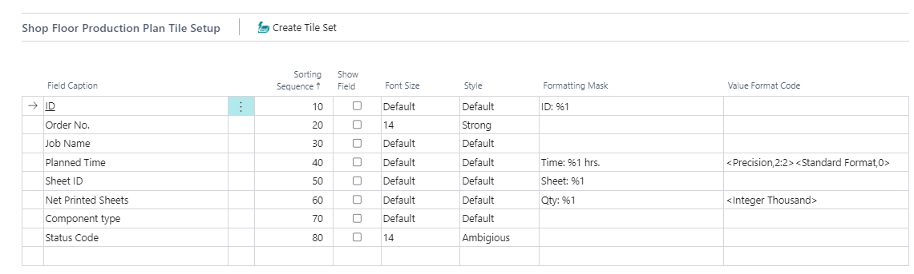

When first empty, click on the \*\*Create Tile Set\*\* button to initiate the tile components.

You may add other information to be presented, by selecting the \*\*Table\*\* and which \*\*Field\*\* you require seeing. However, as there is very limited space to present information on each tile, be aware of that fact when choosing what to present. There are 4 tables from which you may select fields. These are:

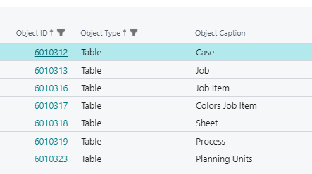

For reference, a tile may look like this:

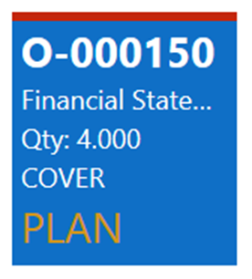

Each of the 8 lines is ready to show on the tile. But as the tile is limited in space, only some of them will fit. By setting the fields on each line the best possible use of the space can be obtained.

#### Team Settings

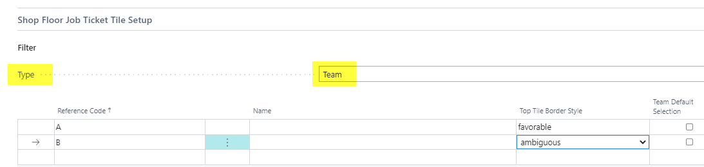

This is an optional feature. It will allow the user to record how many people are currently working on this machine. Required setup is to create \*\*capacity manning codes\*\* which are not persons but teams.

The teams could have a day/night distinction or a size distinction such as \*\*T3\*\*, or \*\*T4\*\* for a team with 4 people in it. It could then have a specific salary set up, depending on the size of team. This will make the recorded time more expensive if a larger team is working on it (and maybe the runtime will be shorter as a larger team can maintain a higher speed).

The setup here is to list the teams which could be used on this cost center.

If there is setup of teams, these will be visible, each with a tile in the job ticket area.

- \*\*Default Tick\*\* will mean that this team will be the startup team, with which the time and salary rate is recorded.

- \*\*Top Tile Border Style\*\* will help set a top border color on the tile, where...

> \_(Note: the sentence about border color is incomplete; please provide the rest if you'd like it finished.)\_

| \*\*Setting\*\*   | \*\*Color\*\*            |

|---------------|----------------------|

| \*(blank)\*     | No border color      |

| Favorable     | Green line at top    |

| Unfavorable   | Red line at top      |

| Ambiguous     | Purple line at top   |

| Subordinate   | Orange line at top   |

#### Waste Code Settings:

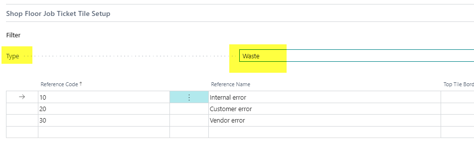

Waste Code settings which apply to this cost center will be listed here.

They can also be adorned with a top border color on each tile to allow users to recognize them where:

| \*\*Setting\*\*    | \*\*Color\*\*          |

|----------------|--------------------|

| \*(blank)\*      | No border color    |

| Favorable      | Green line on top  |

| Unfavorable    | Red line on top    |

| Ambiguous      | Purple line on top |

| Subordinate    | Orange line on top |

The space for text/code on the tile is very limited and there is only room for 3-5 letters. Shortening the code or going for a digit code may make a lot of sense.

#### Unit of Measure Settings

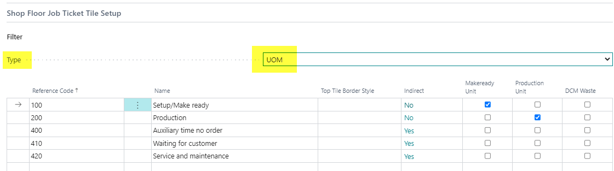

In this section, the possible time recording units of measure are listed. List both direct and indirect units.

The direct units will show up as a tile on the job ticket, whereas the indirect units will be presented on the lower part of the Production Plan View.

The \*\*Top Tile Border Style\*\* field is relevant to direct units only, as they are showing as tiles.  

Also, set the makeready and production fields. This helps the system see how far the production has come, if the production is connected to a Manufacturing Integration/CIM or DCM device.

You may also add a Unit of Measure, which in fact belongs to another Cost Center, or to a specific operation for that Cost Center, to allow Helpers register their time alongside the Machine running.

#### PrintVis Unit of Measure

There is a setting for the Unit of Measure, which will have an impact on the Shop Floor time registration. This is specifically for 'Indirect time' Units of Measure, which can now be set to 'Stop all ongoing time registration' to prevent normal time to continue running while registering Indirect time.

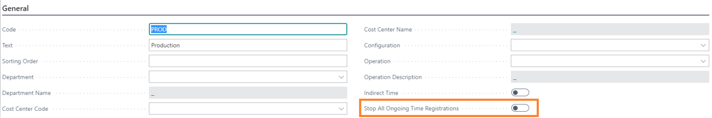

#### Capacity Group

There is a new setting Capacity Groups, as to what to have presented on the Production Plan for users logging in to a Capacity Unit, belonging to the Capacity Group in question.

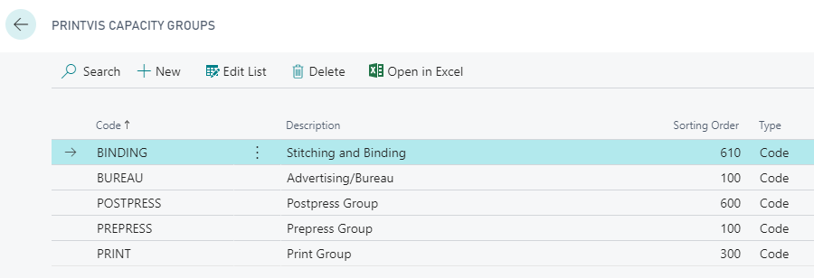

The setting is either to see scheduled tasks for each Individual Capacity Unit, or to see the Plan for the entire Capacity Group. Often in Digital Print, at Cutting- or Folding Machines, the jobs present can be done on several different machines, which makes it necessary to see and register time for jobs scheduled to the Group.

#### Capacity Unit Setup

The field \*\*Simultaneous Jobs\*\* on the Capacity Unit setup is important, with regard to how many jobs may be opened by one person, as well as how many concurrent time registrations may be started.

For an Offset Press for example, most likely only one job and one task can be performed, so you either do Makeready or Production, and on one job at a time — this should have the setting 'Synchronous Jobs = 1'.

However, in a PrePress department for example, multiple tasks may be progressing at the same time, and several people may work on the same job simultaneously.

As the setting is set to 2 or more, the system now supports these tasks to start and stop individually — and even if someone presses 'Job Complete' while another person is still working on the job, it will not be marked as completed as long as someone is recording time against the Planning Unit.
