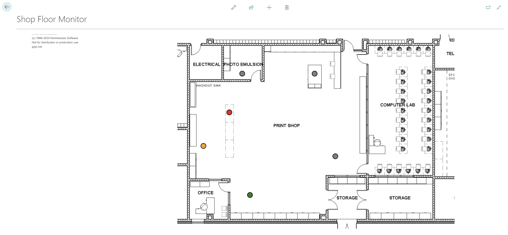
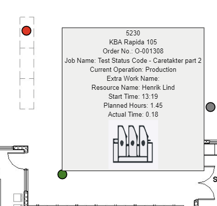
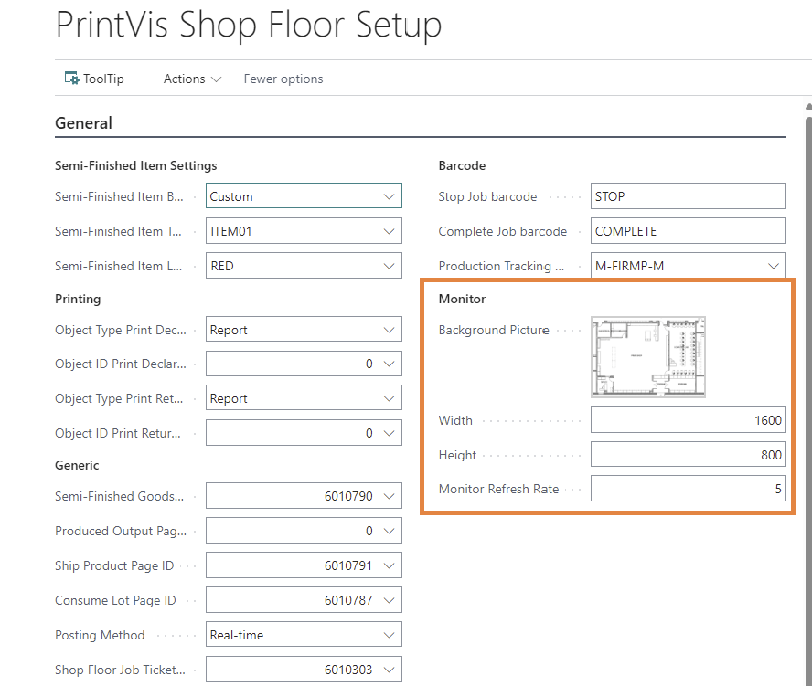
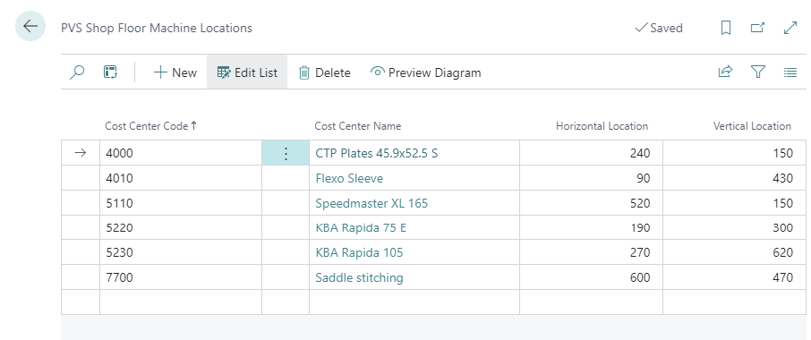
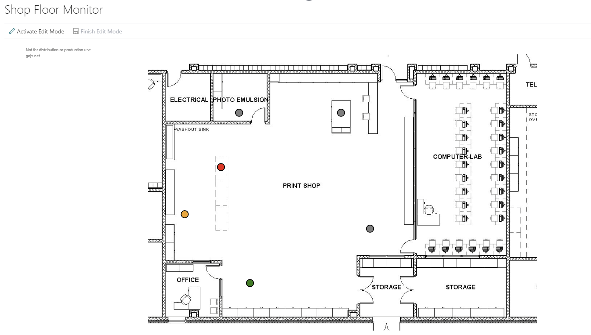

# Shop Floor Monitor

## Shop Floor Monitor

The Shop Floor Monitor provides a visual overview of all cost centers and their current production status.

## Colors and Usability
This section will describe the colors and usability

| **Field**    | **Description**                                                                 |
|--------------|----------------------------------------------------------------------------------|
| Green Dot    | Indicates a cost center running an **active job**.                              |
| Yellow Dot   | Indicates a cost center running **indirect time**.                              |
| Red Dot      | Indicates a cost center running an active job with **extra work or waste codes**. |
| Gray Dot     | Indicates an **inactive** cost center.                                          |

The Shop Floor Monitor list is fairly straight-forward to use. If you want to see more information about a cost center you can hover over one of the cost center dots to see information such as cost center code/name, order number, job name, current operation, extra work codes, resource name, start time, planned time, actual time running (all if applicable).

## Setup
The shop floor monitor list requires some setup to function properly.

On the Shop Floor Setup page, it is required for the Monitor section to be completed.

| **Field**             | **Description**                                                                                 |
|------------------------|-------------------------------------------------------------------------------------------------|
| Background Picture     | Upload a background picture to be used by the **Shop Floor Monitor** page.                     |
| Width                  | Enter the **width (in pixels)** of the uploaded background image.                              |
| Height                 | Enter the **height (in pixels)** of the uploaded background image.                             |
| Monitor Refresh Rate   | How often the **Shop Floor Monitor** and **Cost Center Monitor** list refresh (in seconds).    |

To setup the machine locations you can search for PrintVis Shop Floor Machine Locations or select the Machine Locations action on the shop floor setup page.

| **Field**           | **Description**                                                                                  |
|----------------------|--------------------------------------------------------------------------------------------------|
| Cost Center Code     | Enter the **cost center** to be displayed on the Shop Floor Monitor page.                        |
| Name                 | Displays the **name** of the selected cost center.                                               |
| Horizontal Location  | The **horizontal position** (in pixels) of the machine on the background image.                 |
| Vertical Location    | The **vertical position** (in pixels) of the machine on the background image.                   |

It is not necessary to get the horizontal or vertical locations correct when entering this list. It is possible to click the Preview Diagram action in the menu and move the cost centers around on the image.

Click Activate Edit Mode in the menu. Click and drag the cost centers that need moved and then click Finish Edit Mode to complete the move. This will update the horizontal and vertical locations of the moved machines.
