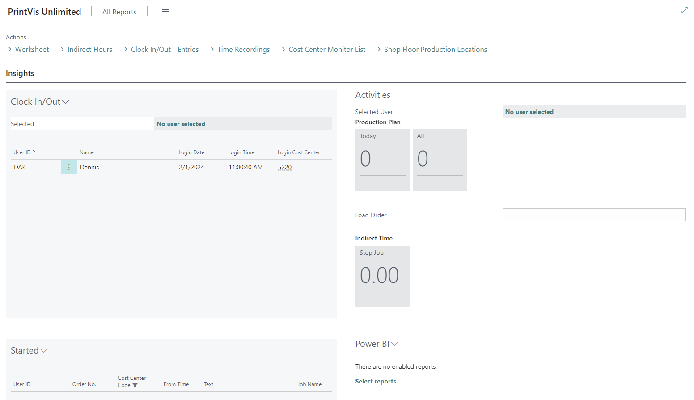

# Shop Floor Role Center

## Role Center

The shop floor role center is the primary starting point for all shop floor workers. This is where time can be recorded, materials consumed and released, and production semi-finished goods tracked.

Clock In/Out

The clock in/out area allows shop floor workers (registration or full PrintVis users) to clock into or out of a cost center to record time. Click the down arrow next to "Clock In/Out" for the options.

| \*\*Action\*\*            | \*\*Description\*\*                                                                                                                                      |

|-----------------------|------------------------------------------------------------------------------------------------------------------------------------------------------|

| Clock In              | Enter the user-ID, password (if applicable), and cost center. Click OK to clock in.                                                                 |

| Clock Out             | The selected user will be clocked out when the user clicks OK. (Password required when applicable).                                                 |

| Select this user      | The bold user is the active shop floor clocked in. If you select another user and click this option, it will switch that user to the active user.   |

| Change Cost Center    | A different cost center can be selected for the active user.                                                                                         |

### Activities

The activities area shows the active shop floor user and cost center, the number of planning units scheduled on the cost center, \*\*Load Order\*\* field to scan or type an order number, and \*\*Indirect time recording\*\* options for this cost center.

#### Tiles

The \*\*Today\*\* and \*\*All\*\* tiles will load the list of planning units in a planning status scheduled either today or all units in plan status for the cost center. By default, the opening page will be displayed as a list, but the user can switch to tiles using the standard list option in the upper right corner.

> The first 5 fields in the list are the fields shown in the tile view.

#### Load Order

When using the \*\*Load Order\*\* field, a barcode scanner set to \*tab\* or \*CR after entry\* can scan the order number on the top of our job ticket and load the electronic ticket for this order.

#### Indirect Tiles

Indirect time options are setup on the cost center. These are used for recording time on \*\*non-job related tasks\*\*.

The numbers in the tile show the amount of time that has been recorded for that indirect time for the day. The number in the \*\*Stop Job\*\* tile shows the amount of time spent on all indirect time for the day.

### Started

The \*\*Started\*\* area shows the currently started time recordings.

Clicking the down arrow next to \*\*Started\*\* allows you to switch between:

- User  

- Cost center  

- Department  

- Company  

This menu also allows you to load the selected Shop Floor electronic job ticket.  

> You are required to be clocked in as the same user and cost center to load the electronic ticket.

### Menu Actions

There are several actions from the \*\*Shop Floor Role Center\*\*.

#### Worksheet

The worksheet allows the user to review and post non-posted time recordings.  

Used when the \*\*Cost Center Shop Floor Posting\*\* setting is \*\*not\*\* set to Real-time.

#### Indirect Hours

Similar to the worksheet, the \*\*Indirect Hours\*\* page allows review and posting of non-posted indirect hours.

#### Time Recordings

This page allows users to review their \*\*posted time recordings\*\*.  

If the \*\*PrintVis User\*\* has the \*\*Allow Edit Time Recordings\*\* checkbox enabled, they can edit:

- Hours  

- Start date/time  

- Stop date/time  

Editing the \*\*hours\*\* field adjusts the end date/time.  

Editing \*\*start/stop date/time\*\* fields adjusts the hours.

#### Cost Center Monitor List

Allows users to see cost centers and their status, including:

- Active/Inactive  

- Current order  

- Operation  

- Error code  

- Operator  

More info: \*See the Cost Center Monitor List article\*.

#### Shop Floor Production Locations

Lets users see the current zone and storage location of all production labels and where they need to move next.  

More info: \*See the Production Tracking article\*.

### Electronic Job Ticket

Where the user sees details about a planning unit and records:

- Time  

- Material usage  

- Comments about a job

#### Menu Actions

All menu actions can be shown or hidden based on \*\*cost center setup\*\*.

#### Job Information

Shows the \*\*plan unit details\*\*.

#### Job Time Registration

Users record time against a plan unit.

- The \*\*Scan UOM Barcode\*\* field allows scanning/typing a PrintVis Unit of Measure code to start time recording.

- In \*\*Shop Floor setup\*\*, you can set a \*\*Stop Job\*\* and \*\*Job Complete\*\* code for this field.

- On the \*\*Cost Center\*\*, there's a menu action to print a barcode sheet of the UOM codes.

> Tiles are another way users can start/stop time registrations.

#### Case Description

Shows internal notes from the case card.

- Use the \*\*Department\*\* field to browse notes by department.

- Use \*\*Internal Summary\*\* to see all internal notes on one page (grouped by department).

- Use \*\*Shop Floor Summary\*\* to see all shop floor comments made for an order.

#### Quantities Factbox

Displays:

- Net quantity  

- Scrap quantity  

- Total quantity  

For a sheet/process.

#### Production Locations Factbox

Shows all \*\*non-consumed production label locations\*\* for a specific job item.

> If the label is not tied to a specific job item, this area will be blank.

The layout of this field is zone storage quantity / job item.

#### Details Factbox

The details factbox shows the tooltips from the Planning Board setup page that are not set as Hide Line on Shop Floor.
