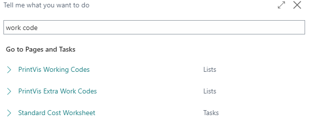
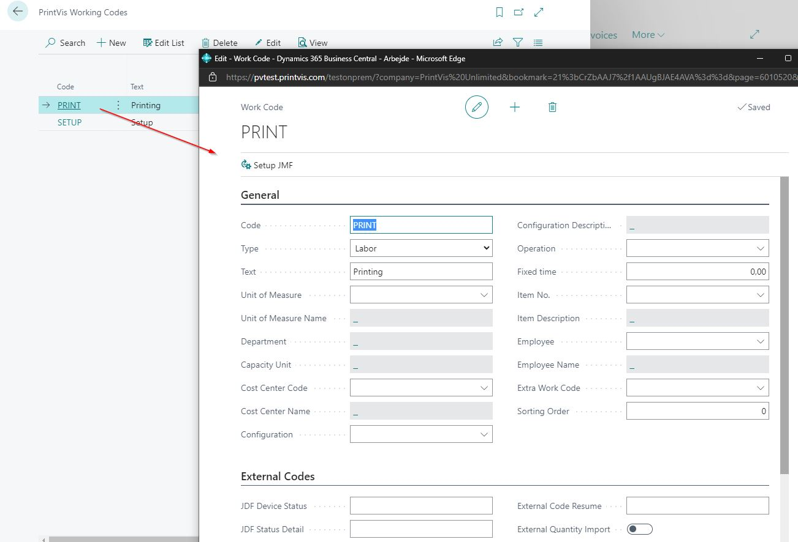
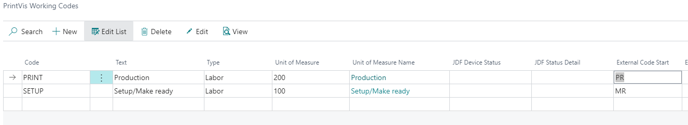

# Work Codes Setup

## Summary

By setting up \*\*Work Codes\*\*, you can save a lot of time otherwise spent manually entering data in the \*\*Job Costing Journal\*\*.  

A work code holds information such as:

- Unit of Measure  
- Cost Center  
- Configuration  
- Operation  
- Or Unit of Measure and Item Number  

All this information is gathered automatically when a \*\*Work Code\*\* is selected.

You can decide how detailed the structure of your work codes should be — this may vary by company.  

Generally, it's best to build a broad selection of work codes since they are used frequently.  

This helps reduce time spent on job costing entries.

Work codes can also include data on:

- \*\*Capacity Manning\*\*

- A linked \*\*Slack Code\*\*, if applicable

### Setup

- Search for \*\*PrintVis Working Codes\*\*

- Select the appropriate one

For more information, refer to the \*\*Job Costing\*\* setup documentation.

### External Code Setup

\*\*External Codes\*\* are necessary when integrating with \*\*production machines\*\*, such as through a \*\*JDF interface\*\*.

- The \*\*Work Code\*\* must be linked to the signal from the machine.

- For example, if the machine sends the signal `"MR"` for \*Make Ready\* time, this becomes the \*\*External Code Start\*\*.

- On the first tab of the setup, link this with your \*\*Unit of Measure\*\* for Make Ready time in PV Job Costing.

- If the signal changes to `"Print"`, this marks the \*\*end of Make Ready\*\* and \*\*start of Printing Time\*\*.

When a work code is stopped, the time between \*\*Start\*\* and \*\*Stop\*\* will be posted as \*\*time consumption\*\* on the job.
