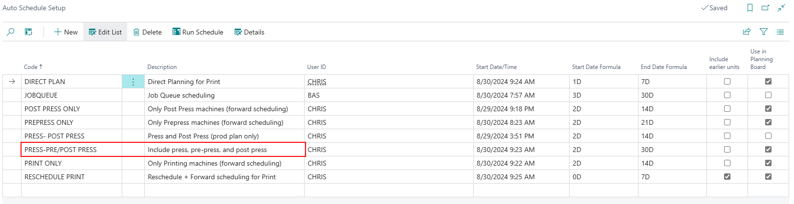

# Auto Scheduling Scenarios

## Auto Scheduling Scenarios

Auto Scheduling can be accomplished in various ways. You can auto schedule a single cost center, multiple cost centers, or all cost centers within the company. Additionally, you can determine the sequence of scheduling. It's important to complete all auto scheduling setups for any combinations of scenarios your company will utilize. This article briefly demonstrates the setup for these different scenarios. For more in-depth explanations, please visit the Auto Scheduling Setup article.

### 1.0 - Single Cost Center

#### Example 1.1 - Auto Schedule from Here

1. **Initiate Scheduling**: Right-click in the resource view (left column) on the Planning Board for the desired capacity unit. Select **"Auto Schedule from Here"**.
2. **Auto Scheduling Process**:
   - The system uses the workday/time to start auto scheduling for the selected capacity unit.
   - The ruleset assigned to the specific capacity unit (set up on the Capacity Group page) will be used.
   - The end date corresponds to the end date set up on the Planning Board.
   - Planning units scheduled in the past will not be moved. Any planning unit in the future that is marked as "locked" or started will be affected.

Example Details

Using the **Speedmaster XL 165 (5110)** capacity unit:

- **Assigned Ruleset**:
  1. First sorting level: Delivery Week (ascending)
  2. Second level: Custom sorting based on Paper Quality
  3. Last level: Final Format Code (descending)

- **Cursor Placement**: Placed during closed time on September 4th.

**Scheduling Outcome**: The first available capacity after the cursor was September 5th at 7 AM. 

- **Sorting and Prioritization**:
 

 - Planning units grouped by the same "Requested Delivery Date."
  

- Case ID 908 remained untouched since it was scheduled before the cursor.
  - Planning units marked with box 1 were grouped by the same Delivery Week.

- Sorting based on paper quality was Glossy -> Coated -> Uncoated.
  - Final sorting based on final format code was descending.

Once sorting/prioritization takes place, the system schedules in ascending priority based on the earliest start date.

#### Example 1.2 - Auto Schedule Unit

1. **Initiate Scheduling**: Right-click in the resource view on the Planning Board for the desired capacity unit. Select **"Auto Schedule Unit"**.
2. **Auto Scheduling Process**:
   - The system uses the workday/time to start auto scheduling for the selected capacity unit.
   - The assigned ruleset (from the Capacity Group page) is used.
   - The end date corresponds to the end date set up on the Planning Board.
   - Unlike "Auto Schedule from Here," this method ignores the earliest start date.
   - Planning units scheduled in the past will be moved, affecting any future units that are marked as "locked" or started.

 Example Details

Using the **Speedmaster XL 165 (5110)** capacity unit:

- **Assigned Ruleset**: Same as above.

- **Cursor Placement**: Also placed during closed time on September 4th.

**Scheduling Outcome**: The system rescheduled planning units that were initially scheduled (not locked or started) before the date/time of the cursor.

- **Sorting and Prioritization**: Similar grouping and sorting logic as in Example 1.1, with the system looking into scheduling in order of ascending priority.

You can also use "Auto Schedule Unit" by right-clicking on the Planning Board, starting the scheduling where the right-click occurs.

 Additional Notes on Auto Scheduling Behavior

> **Note:** Unlike "Auto Schedule from Here", **"Auto Schedule Unit"** reschedules the planning unit that was initially scheduled (and not locked or started) **before** the date/time of the cursor.

 Sorting Logic in Scheduling

 First-Level Sorting: Delivery Week
- **Planning Units in Box 1** were grouped together because they shared the **same Delivery Week**.

- **Planning Unit in Box 2** was sorted afterwards, as it belonged to a **different Delivery Week**.
- Sorting was **ascending**, meaning Box 1 had a lower Delivery Week number than Box 2.

 Second-Level Sorting: Paper Quality (Custom Sorting)
- Sorting order: `Glossy` → `Coated` → `Uncoated`
- **Box 1**: Glossy
- **Box 2**: Coated
- **Box 3**: Uncoated  
_All belonged to the same delivery week._

 Third-Level Sorting: Final Format Code (Descending)
- When Delivery Week and Paper Quality are the same:
  - Sorting falls back to **Final Format Code**, sorted **descending**.
- **Boxes 1 and 3**:
  - Same Delivery Week, Quality Code, and Final Format Code
  - Sorted by **Case ID** in **ascending** order
- **Boxes 2 and 3**:
  - Same Delivery Week and Quality Code
  - Box 2 received a lower priority due to its **higher final format code** (descending sort)

After sorting and prioritization:
- The system schedules the planning units based on **ascending priority numbers**.

Additionally:
- Users can invoke **"Auto Schedule Unit"** by right-clicking on the **Planning Board**.
  - The scheduling will **start from the position of the right-click**.

### 2.0 - Multiple Cost Centers

Examples of auto scheduling multiple cost centers can vary widely. Below are some common scenarios, such as scheduling only printing machines, scheduling prepress and finishing machines, or scheduling a combination of prepress, printing, and finishing machines.

#### Example 2.1 - Forward Scheduling

**Forward Scheduling** involves scheduling only the printing machines. This approach is beneficial for companies where printing is the bottleneck in production. By focusing solely on printing machines, users can evaluate the schedule and make necessary adjustments before auto scheduling prepress and finishing.

 Ruleset for Printing

- The ruleset can be customized based on company-specific sorting/prioritization.
- In this example, we use the same ruleset as previously described.

 Auto Scheduling Setup

- Ensure **"Include Earlier Units"** is unchecked for the "Print Only" line, meaning previous planning units that haven't started or are locked will not be rescheduled.
- The **Start Date Formula** and **End Date Formula** determine which planning units are considered for scheduling. For instance, a Start Date Formula of `2D` and an End Date Formula of `14D` will schedule units between 2 days and 14 days from the current work date/time.

 Auto Scheduling Details Setup

- All capacity units in the print department are set up with sorting order.
- The **Direction of Planning** is set to "From Start" to begin planning as soon as possible.
- **Direct Planning** is unchecked, meaning the earliest start date will not be ignored.

**From the Planning Board**: The "Print Only" auto scheduling was initiated, focusing on the print department within the specified date filter.

Now that the bottleneck has been addressed, it's time to schedule the remaining units for prepress and post press capacity units using backward and forward scheduling techniques.

#### Example 2.2 - Backward Scheduling

Backward scheduling focuses on scheduling prepress capacity units closely to the presses to minimize idle time for plates.

 Ruleset for Prepress

- The ruleset is designed to sort planning units based on "Requested Delivery Date" in ascending order.

 Auto Schedule Setup

- Similar to the printing example, **"Include Earlier Units"** is unchecked for the "Prepress Only" routine, meaning earlier scheduled units will not be moved.

Auto Scheduling Details Setup

- The **Direction of Planning** is set to "From End," scheduling prepress units as close as possible to the start date/time of the presses.

**From the Planning Board**: After scheduling printing, prepress is scheduled backward to align closely with press start times.

First, the system will sort and prioritize the planning units. For Prepress, the only sorting was based on "Requested Delivery Date." The priority is assigned based on ascending Requested Delivery Date. For planning units with the same "Requested Delivery Date", they received a priority value based on Case ID ascending. 

The next step, the system will try to plan in order of priority and as close to "Finished no later than" for each planning unit. In this example, there was no buffer or time conflicts, so each planning unit was able to get an ending date/time that correlates with the "Finished no later than" value.

#### Example 2.3 - All Capacities

This example demonstrates scheduling all capacities in a single routine without breaking it into specific scenarios.

 Ruleset Setup

- The rulesets for Printing and Prepress remain the same as in previous examples.
- The **Finishing Ruleset** includes:

  

- First sorting level: "Requested Delivery Date" (ascending)
  - Second sorting level: ascending based on the number of pages for the job.

- **"Include Earlier Units"** is unchecked for the "Press-Pre/Post Press" routine.

**Planning Board Overview**: All three departments were scheduled in sequence based on individual rulesets.

### 3.0 - Rescheduling/Re-prioritizing

This section covers scheduling with **"Include Earlier Units"** checked on. This allows for the inclusion of planning units scheduled before the start date formula that are not started or locked.

#### 3.1 Rescheduling

The example below demonstrates rescheduling for only the print department, but the reschedule could take place for other capacity units/departments or include multiple capacity units/departments.

 Ruleset
Printing rulesets remain the same as in previous examples.

 Auto Schedule Setup
This setup remains similar to the auto schedule setup for the "Print Only", with the following differences:
- **Include Earlier Units**: Checked on
- **Start Date Formula**: `0D`
- **End Date Formula**: `2D`

This type of scheduling is generally for a more immediate result and not for dates in the distant future.

 Auto Schedule Details
Remain the same as the example above, but it is also possible to check on **Direct Planning** to ensure that the earliest start date is ignored and jobs are scheduled as soon as possible based on priority level.

 Planning Board Visualization
- **Before**: Planning units running late are marked in a red box.

- **After**: Using the "Reschedule" auto scheduling scenario:
  - All previously late planning units are "added to the list", prioritized again, and rescheduled.
  - Units scheduled/unscheduled in the future are also adjusted.
  - _Note_: Units marked as **started** or **locked** will not be changed.

#### 3.2 Re-prioritizing

There are two ways that priority can impact the schedule:

1. **Case Priority**:  
   A priority level can be applied to a specific case. Once planning units are created, they inherit this value.

2. **Rearranging Priority on Individual Planning Units**:  
   Users can run the Auto Schedule scenarios and rearrange the priority numbers as needed by evaluating them on the **Production Plan** page.

##### 3.2.1 Case Priority Setup

To enable case priority:
- Open the **Capacity Unit Card** for each unit you want to inherit the case-level priority.
- In the **Scheduling** fast tab, set the **Auto Priority** field to `"Order"`.

_Not all units require case priority inheritance—configure only those needed._

##### 3.2.2 Case Priority Usage

Steps:
1. Open the **Case List**.
2. Click **Edit List** to enter a value in the **Priority** field.
3. If the field is not visible, personalize the page to add it.

- When a value is entered, any **newly created planning units** will inherit it.
- **Existing planning units** will also be updated.
- Only units with proper setup will inherit the value.

 **Note**:  
Be aware of the **Start Priority** set on the PrintVis Scheduling Rulesets. If the case/planning unit priority is greater than the ruleset’s Start Priority, then the unit’s priority will be overwritten with the ruleset's value.

##### 3.2.3 Reprioritize

Users can:
- Run the auto schedule scenario.
- Reprioritize or group jobs afterward.

For example:
- Priority `106` and `107` can be changed to `10` and `20`.

Then, when running the auto schedule scenario again:
- These updated priority numbers will persist.
- Scheduling will be adjusted accordingly.

 **Important Notes**:
- Case/Planning Unit priority greater than **Start Priority** will be overwritten by the ruleset.

- Priority numbers can be applied or changed **at any time**.
- Rescheduling only occurs if:
  - The planning unit’s date falls within the auto schedule scenario’s date range.
  - Or the **Earliest Start** date falls within the range.

### 4.0 - Direct Planning

Direct Planning allows scheduling based solely on priority level, ignoring the earliest start date. This is useful for filling gaps in the schedule in the short term.

 Example Setup

- The ruleset for printing remains the same.

- The auto schedule setup is similar to "Print Only," with **Start Date Formula** set to `1D` and **End Date Formula** set to `3D`.

**Before and After Planning Board**: The before image shows gaps due to respecting the earliest start date. 

After initiating the "Direct Plan," the Planning Board fills those gaps and adds any new jobs within the specified date filter.

