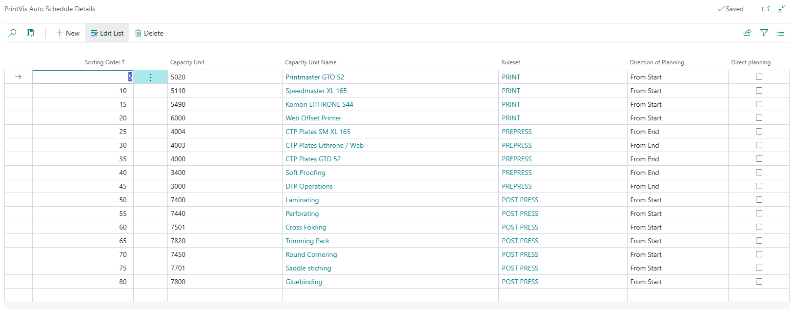

# Auto Scheduling Setup

## Auto Scheduling

Scheduling can be a time-consuming task unless approached strategically. PrintVis offers various methods for scheduling, including single cost center scheduling, planning multiple cost centers, or scheduling all cost centers simultaneously. Auto scheduling enables users to plan efficiently without the need for manual job planning. The possibilities for auto scheduling are extensive and can be configured in multiple ways.

Auto Scheduling Overview

In PrintVis, auto scheduling consists of two stages:
1. **Prioritization (or sorting)** of planning units.
2. **Auto scheduling** of the planning units based on the assigned priority on specified capacity units.

This article will guide you through setup and explore various avenues for more efficient scheduling.

**Note**: Ensure the ruleset setup is completed before proceeding with this article.

### Auto Schedule Setup

Auto scheduling can be initiated from the Planning Board, Production Plan page, or Job Queue. To set up auto scheduling, scenarios must be created on the Auto Schedule Setup page. The Auto Schedule page is non-editable, except for the Run Schedule function. To make changes, users must access the Auto Schedule Setup page.

 

| Field                  | Description                                                                                                                   |
|------------------------|-------------------------------------------------------------------------------------------------------------------------------|
| **Code**               | Enter a code for the auto schedule scenario.                                                                                 |
| **Description**        | Provide a description for the scenario, offering clarity on its intentions.                                                  |
| **User ID**            | Displays the User Name ID of the last person who activated the scenario.                                                      |
| **Start Date/Time**    | Shows the date/time when the scenario was last activated, auto populated from the last run.                                   |
| **Start Date Formula** | Enter a date formula (e.g., `1D`, `CW`) for the start of auto scheduling.                                                    |
| **End Date Formula**   | Enter a date formula (e.g., `14D`, `CM`) for the end of auto scheduling.                                                    |
| **Include Earlier Units** | When checked, includes non-started and non-locked planning units scheduled before the start date formula.                  |
| **Use in Planning Board** | When checked, the auto schedule is available in the scheduling board or planning pages. Leave unchecked for job queue use only. |

**Run Schedule**: Select an auto schedule scenario to run from the setup page. Changes will take effect after closing the setup page.

#### PrintVis Auto Schedule Details

Details Setup

To create or edit a specific auto scheduling scenario, select it and click "Details." This page allows users to define which Capacity Units are involved in the auto scheduling scenario and set the order of scheduling.

| Field                  | Description                                                                                                                      |
|------------------------|------------------------------------------------------------------------------------------------------------------------------|
| **Sorting Order**      | Determines the sequence of scheduling; lower numbers are scheduled first. Leave gaps to add lines later without renumbering. |
| **Capacity Unit**      | Select the capacity unit for auto scheduling.                                                                                 |
| **Capacity Unit Name** | The corresponding name (description) of the selected capacity unit.                                                             |
| **Ruleset**            | The assigned ruleset for the capacity unit (via the capacity group setup).                                                      |
| **Direction of Planning** | Sets the scheduling direction (From Start or From End). "From End" places units closer to the press run.                       |
| **Direct Planning**    | When checked, plans the capacity unit ignoring the earliest start date/time and places units in priority order.                 |

After configuring the Auto Scheduling Detail page, the auto scheduling scenarios can be utilized on the Planning Board or Production Plan page.
