# Bottleneck Planning

## Introduction to PrintVis Bottleneck Planning

If individual machines or departments are operating at their maximum capacity, their planning must be aligned. These machines should be defined and set up as bottlenecks in PrintVis and assigned the highest priority, with all other tasks scheduled accordingly. It is possible to designate multiple machines as bottlenecks within a production order. Other machines can be configured to be planned with or without regard for opening hours.

Users must ensure there is available capacity in the involved capacity units. PrintVis can only support the functionality if there is a slot to plan the full job. If certain planning units cannot be scheduled within the specified range, the user will receive a notification indicating that planning is not possible.

 Goals of PV Bottleneck Planning:
- Simplicity in planning
- Single-user planning
- Quick moves of entire jobs
- Focus on major capacity units on daily lists

## Setup

Different setup configurations are required to utilize bottleneck planning. The following setups must be in place for all machines:

- Cost Center / Configuration
- Calculation Units
- Capacity Units
- Planning Units
- Opening Hours Setup

### Capacity Unit

A recommended setup of Capacity Units is essential, which benefits not just bottleneck planning:

- If PrintVis should not respect opening hours for non-bottleneck machines, activate “No Capacity Check.”

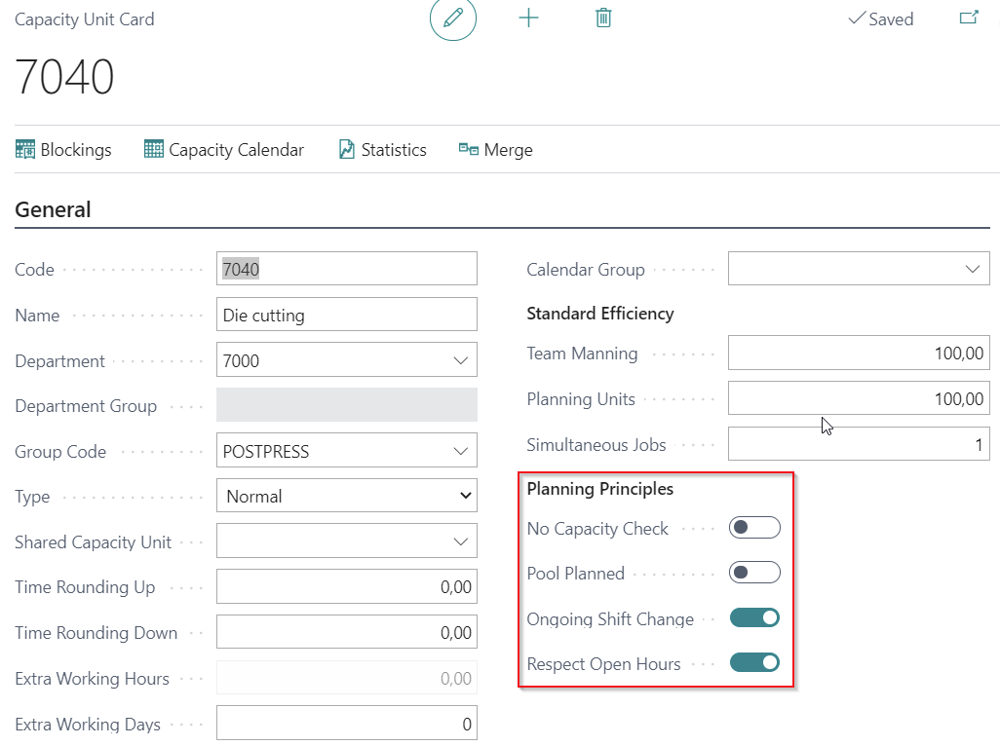

- The minimum split time may be extended if the typical runtime on the selected capacity is hours or days.

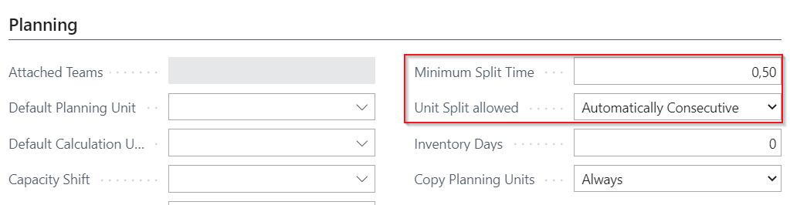

- Shop Floor P-Plan should be sorted based on Planning Unit.

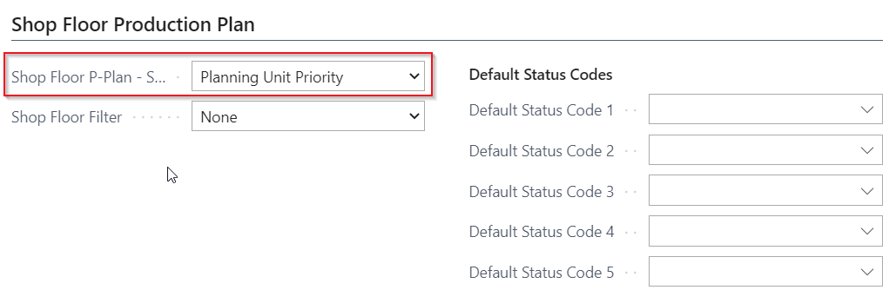

### Planning Unit

The "Bottleneck Planning" field has the following options:

- **Blank**: Not included in any automation.
- **Passive Trigger**: Setting for a bottleneck machine that does not trigger automatic replanning of planning units with the "Autoplan" setting. Replanning occurs only when the "Order Plan for Bottlenecks" action is run.
- **Active Trigger**: Bottleneck machine that triggers immediate replanning of planning units with the "Autoplan" setting.
- **Autoplan**: This planning unit will auto-plan and follow bottleneck machines in the planning sequence.

Consideration should also be given to the fields for Transport, Buffer Time, and Overlapping within the bottleneck function.

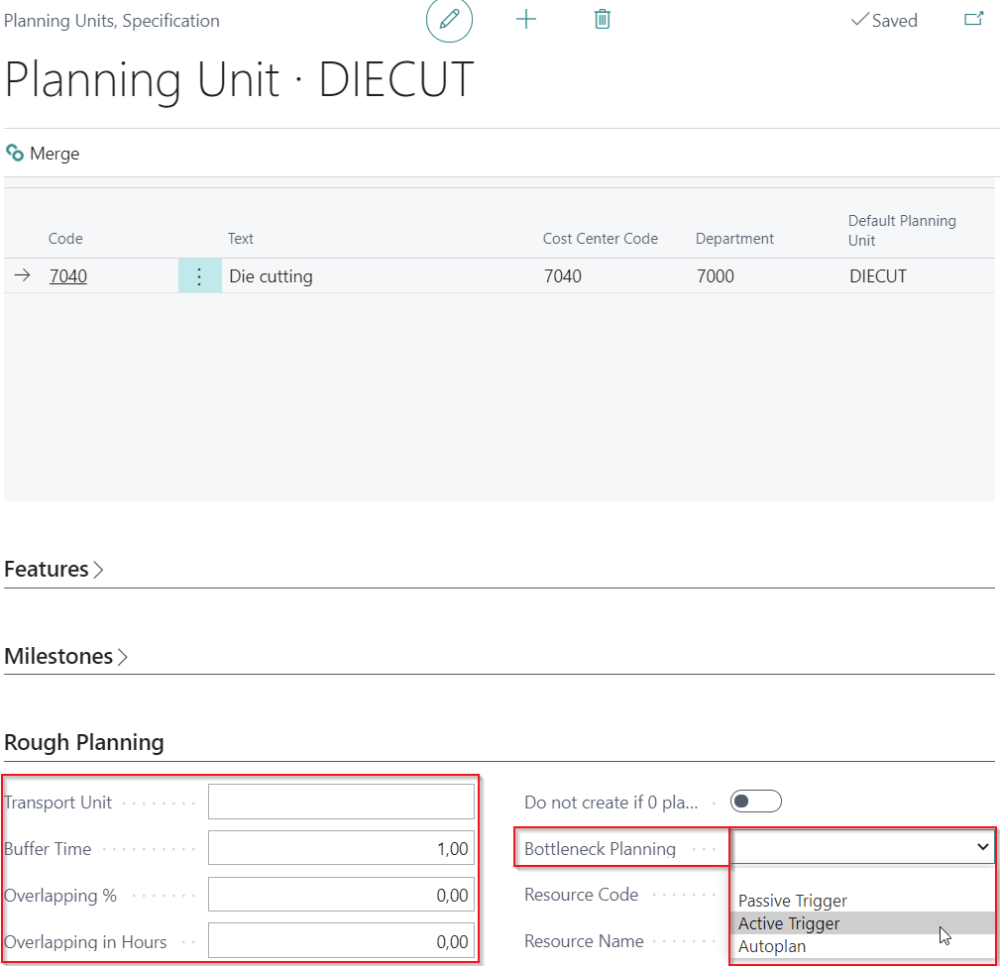

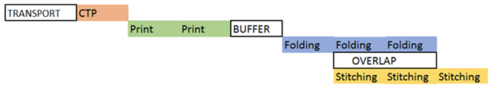

## How to Use Bottleneck Planning

 Example Setup

- **Planning Unit “Die Cutting”**: Bottleneck Planning = Active Trigger
- **Other Planning Units (Prepress, Plate Production, Finishing, and Shipping)**: Bottleneck Planning = Autoplan

This configuration allows for the utilization of functions such as Plan Line from Start and Plan Line from End, now working automatically for all planned-ahead and following machines based on the bottleneck machine.

### Planning from Case Card - Job Planning

#### Example planning based on start date and then re-plan bottleneck

When planning based on the start date and then replanning the bottleneck, customer service often seeks to determine if a requested shipment is realistic. By selecting a status that creates planning lines and using the "Order Plan on Start Date" action, users can check if all planning units can be scheduled within the desired timeframe.

Without specifying a delivery date, PrintVis will indicate the earliest possible end of production in the "Ending" field of the last planning unit.

When opening the planning window, the functions:

- **Order Plan on Start Date**
- **Order Plan on Delivery Date**

are available and can be utilized if some planning units are set to active or passive triggers.

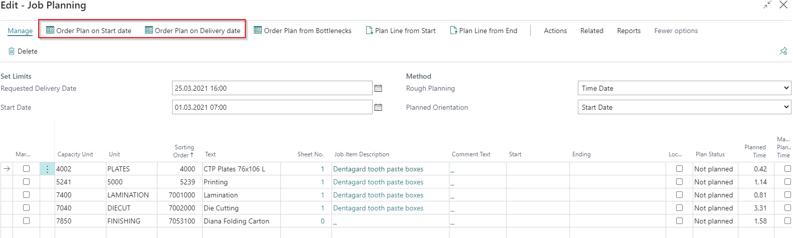

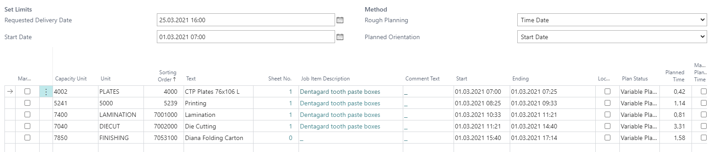

If the bottleneck (e.g., Die Cutting) is set to a specific start date (e.g., "03.03.2021 08:15"), all units prior to that time will remain as is, while those after will be replanned. Adjusting the bottleneck's start date to an earlier time will also trigger the replanning of preceding units.

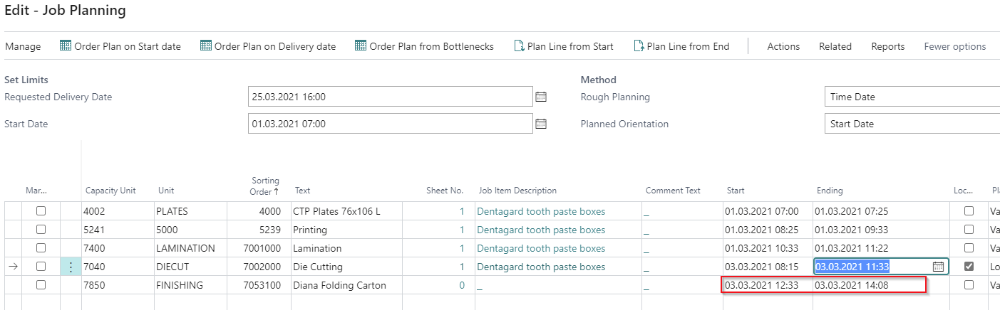

If the goal is to position all planning units as closely as possible around the bottleneck time, select the action "Order Plan from Bottlenecks."

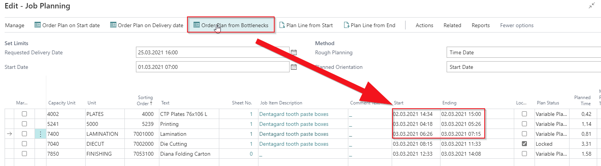

### Planning on Production Plan

Typically, planners focus on bottlenecks, while PrintVis will schedule other units based on the configured setup (in this case, Autoplan). The production plan below illustrates jobs scheduled for the week of March 1-March 5, filtered by the capacity "Die Cutting," which is our bottleneck machine.

The upper table shows jobs already planned for this week, while the lower table displays all die cutting planning units that are not yet scheduled.

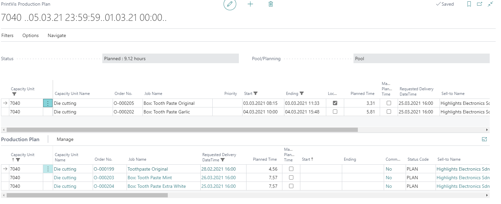

- Orders O-000203 and O-000204 are to be produced within the same week.
- The user sets the start date for both units to March 3.

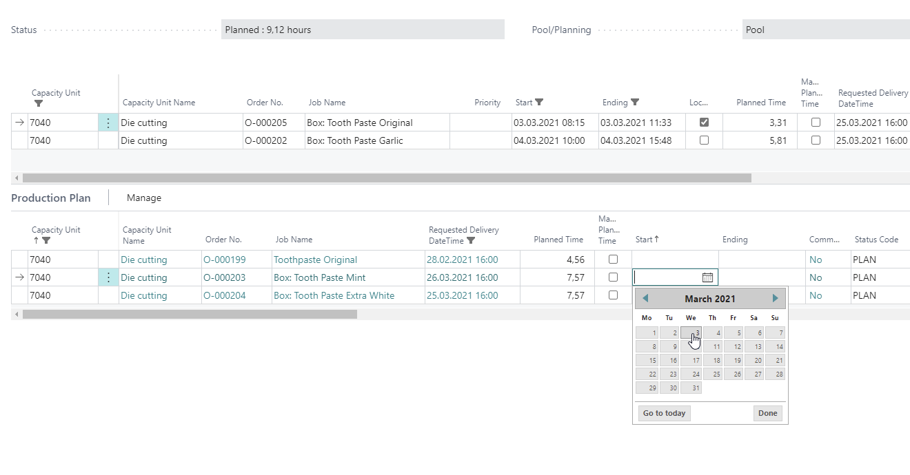

The planning units will now move to the upper table but may not align with an appropriate Start/Ending time.

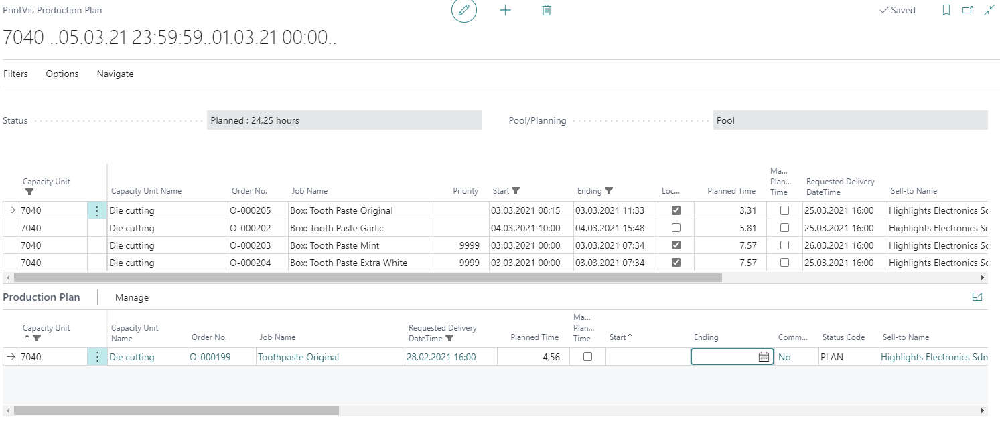

The planner then decides on the best planning priority and invokes the "Firm Planning" function. 

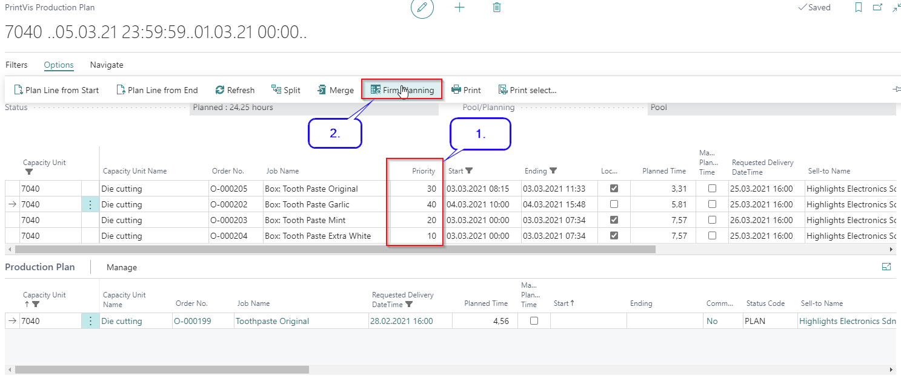

After entering the start date/time for the planning unit with the lowest priority, the user clicks "Ok."

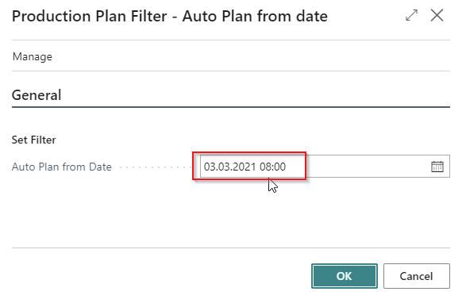

Now, the die cutting is replanned based on priority, and all related planning units for each job have been updated. The lower table is set to "Job" to display all planning units of the selected order in the upper table.

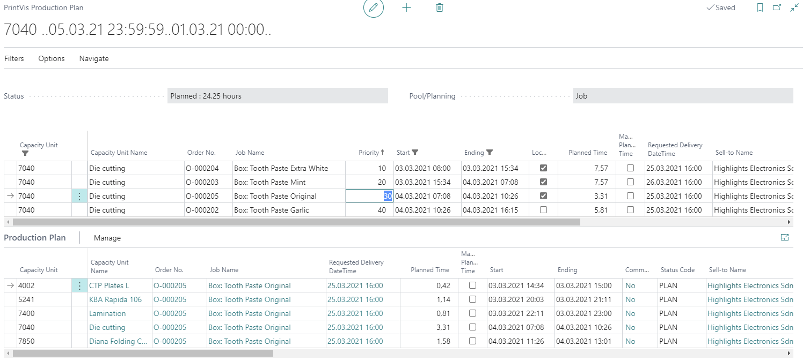

If it is not feasible to schedule all planning units within the given range, a message will appear, prompting the user to review related orders to determine the necessary actions, as it may not be possible to establish a Start/End date for one or more planning units.

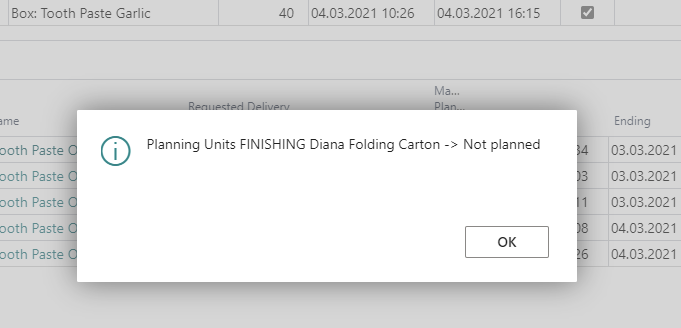

