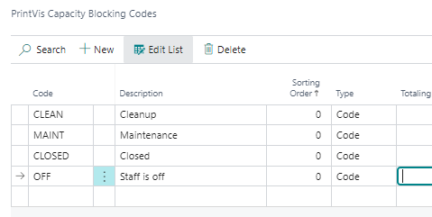
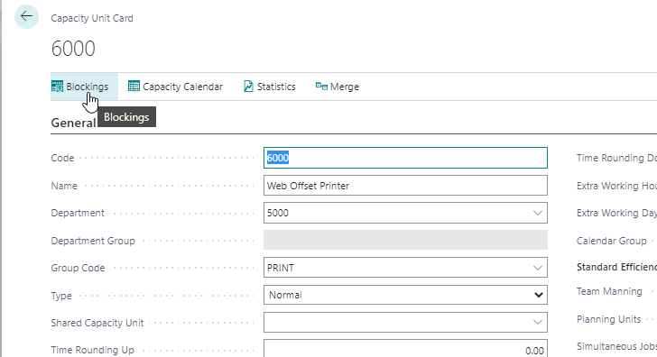
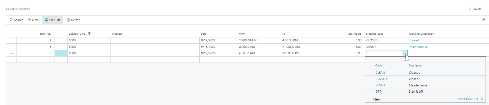

# Capacity Blockings and Blocking Codes

**Capacity Blockings** is a means of blocking time in the calendar while signaling to the planner what causes the blocking. This requires setup of actual blocking codes on the **Capacity Blocking Codes** page before they can be used to block anything.

## Capacity Blocking Codes

The **Blocking Codes** page is a simple setup page where the user is required to input a **Code** and a **Description**.

> Use **Sorting Order** if you have a lot of codes.  
> General good practice is to have a few easily understandable codes to begin with.

Once configured, the codes are ready to be used.

## Capacity Units - Capacity Blockings

From the **Capacity Unit** setup page, *Blockings* is one of the menu points.

From here, you can open the **Capacity Blockings**:

 How to Create a Blocking

1. Go to a new line  
2. Pick the date you want to block  
3. Select the start and stop time for the blocking  
4. Pick a Blocking Code  

Blockings created will impact the **Auto Planning** on this capacity and are visible as a **black box** with the description from the blocking code in the **PrintVis Planning Board**.

> It is not possible to use Capacity Blockings on capacities which are set with the value **"Yes"** in the field **"No Capacity Check."**  
> The system will throw an error if the user attempts to set a blocking in this case.
