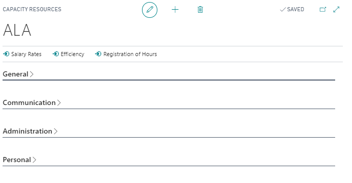
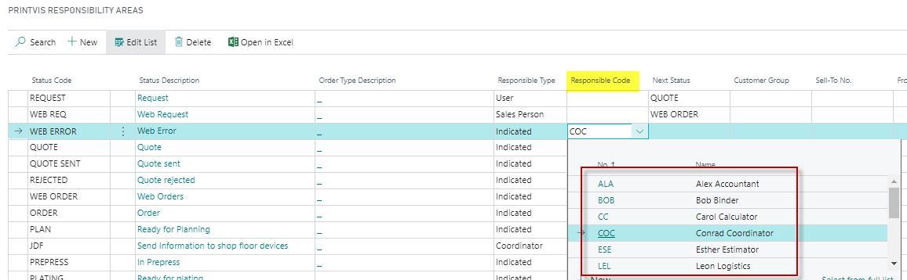
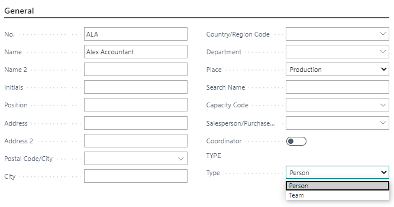
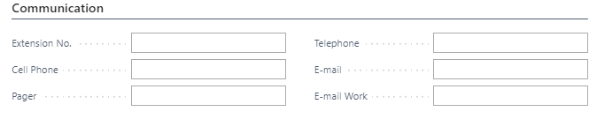
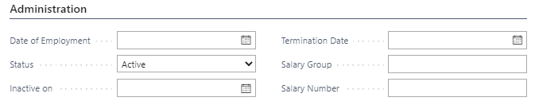
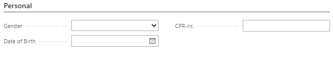
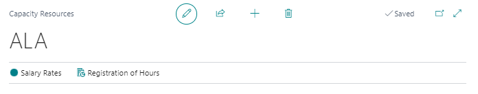

# Capacity Resources

---This setup allows you to create and maintain the company's capacity resources.

A **capacity resource** is an employee or a team of employees. These resources represent the total working capacity of the company — servicing its capacity units or production facilities/machinery.

Capacity resources are also used when assigning a responsible person or team to a PrintVis Case. To make an employee responsible for a case, they must first be created as a capacity resource.

## Status Codes - Workflow - Responsibility Area

Capacity resources are also used as a **Responsibility Code** in the **Responsibility Areas** setup when the **Responsibility Type** is set to *Indicated*.

## General

A resource consists of a **Code** and a **Name**.

- A capacity resource is often created directly in the **PrintVis User Setup**, inheriting the same code as the user's login.
- Automatically created resources will have: code, username, and a checkmark in the **Type** box next to the **Person** field.

> **Note:** A capacity resource does *not* need to be a user in the system.

Best practice:
- Use the same code for **Person/Employee** and **User Login** to ensure proper visibility of user cases in the **PrintVis Case List**.

After entering **Number** and **Name**, you can add:
- Private information (address, etc.)
- Department of employment

 Type Box

Choose whether the resource is a:
- **Person**
- **Team**

**Teams** represent groups (e.g., Day shift, Evening shift, Night shift). They are commonly used for:
- Production planning
- Cases requiring multiple responsible parties (via PrintVis User Setup)

 Place Field

Use this field to attach a resource to:
- Production
- Sales Department
- Administration

This is a general division, distinct from attaching a resource to a PrintVis department.

 Search Name

The system automatically generates a search name based on the person's name.

 Capacity Code

If you want to dedicate an employee to a specific capacity unit:
- Select the unit from the **Capacity Code** lookup.

> In most cases, avoid attaching a specific capacity code, as employees often work across multiple units.

Salesperson/Purchaser Code

Attach a **Salesperson** or **Purchaser** directly to the resource if applicable.

## Communication

The **Communication** tab includes fields for:
- Extension number
- Cell phone
- Email, etc.

> If an email address is entered, clicking the icon next to it opens the default email client with a new message to that address.

## Administration

The **Administration** tab records employment conditions.

> If using a Microsoft Dynamics NAV-based wage system:
- Fill in **Salary Group** and **Salary Number** fields for full integration.

## Personal

In the **Personal** tab, record:
- Gender
- Date of birth
- Social security number

You can also upload a picture:

- **Picture Button** allows:
  - Import
  - Export
  - Delete

> Supported file types: `bmp`, `txt`, and `all`.  
> Best supported format in Dynamics NAV: **bitmap (bmp)**.

## Function Keys

- **Salary Rates**: Opens the Salary Rates window where you can attach an hourly rate to the resource.
- **Registration of Hours**: Opens the posted **Labor Entries** for this resource.
