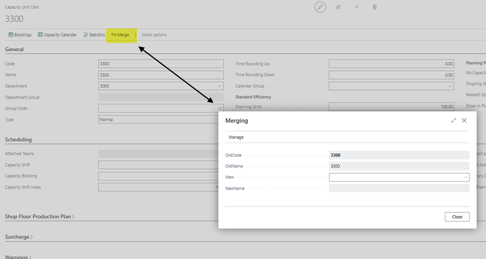
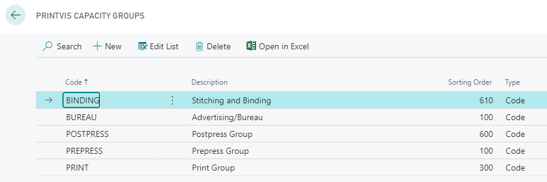

# Capacity Units / Groups

## Capacity Units

### Summary

The **Capacity Units** can be accessed by searching for **"Capacity Units"** in the system.

This card is used to manage information about machine capacities and guide how the planner interacts with each machine. Typically, there is a **1-to-1 relationship** between a **capacity unit** and a **cost center**. These two cards together are essential for accurate **estimation and scheduling** of printing jobs.

> You only need to create capacity units for the cost centers actively used in planning.

Flexibility in Setup

Capacity Units can also be configured for various purposes within PrintVis planning:

- **Multiple Cost Centers → One Capacity Unit**  
  Useful when several cost centers share the same physical machine.

- **Surcharge Configurations**  
  Cost centers for extra tools can each point to their own capacity unit.

> Best practice is to keep the structure as **simple as possible**, while allowing key bottlenecks to receive the necessary attention during planning.

Free Capacity

A **Free Capacity** refers to a tool or resource that:

- Is **not tied to a specific machine**
- Can be **used across multiple machines** in a department

This allows for more flexible planning across departments and shared resources.

> See more about Free Capacity in the detailed planning documentation.

## General

| **Field**               | **Description** |
|------------------------|-----------------|
| **Code**               | Unique ID for the Capacity Unit (max 20 characters). Used as the main identifier. |
| **Name**               | Description of the capacity unit. |
| **Department**         | The department this capacity unit is associated with. |
| **Department Group**   | Displays the group associated with the selected department, if applicable. |
| **Group Code**         | Assigns the unit to a Capacity Group. Enables filtering in the Gantt view by group. |
| **Type**               | Type of Capacity Unit:  • **Normal**: Linked to a machine/person. • **Surcharge**: Represents an extra tool (see Surcharge tab). |
| **Time Rounding Up**   | Rounds planning time **up** to nearest X minutes. E.g., 6.08h becomes 6.25h with 15-minute rounding. |
| **Time Rounding Down** | Rounds planning time **down** to nearest X minutes. E.g., 6.08h becomes 6.00h with 15-minute rounding. |
| **Extra Working Days** | Used only for **Surcharge** type units. Adds extra time to another capacity unit. |
| **Calendar Group**     | Assigns this unit to a specific calendar group. |
| **Team Manning**       | Efficiency factor (in %) for the **team** assigned via calendar hours. Impacts planned time (e.g., 90% efficiency → 1h becomes 1.11h). |
| **Planning Units**     | Efficiency factor (in %) for this **unit** specifically. Also affects planning duration. |
| **Simultaneous Jobs**  | Number of jobs/units this capacity can run simultaneously. Used for areas like tablework.  Note: If >1, users must manually stop jobs when switching units of measure unless automatic logic handles it. |
| **No Capacity Check**  | Bypasses system's idle time check. Useful for flexible setups (e.g., Bench/Table Work). |
| **Pool Planned**       | Uses the team's open hours as the production limit. Allows multiple jobs as long as total time stays within the pool. |
| **Ongoing Shift Change** | Allows planning across team shifts as if production doesn't stop. If not selected, planning avoids job transitions across shifts. |
| **Respect Open Hours** | Ensures **auto-planning** does not occur outside defined open hours. Manual planning outside is still allowed if not selected. |

The Merge function is used when trying to remove a capacity unit without breaking all its existing connections.

When clicking "Merge" a window will show up for the capacity unit that you have opened.

You can select what new capacity unit that should be used to override the old one.

The system will delete the "new" record and rename the "old" capacity unit with the "new" capacity unit.

### Planning

| **Field**                 | **Description** |
|--------------------------|-----------------|
| **Attached Teams**       | Read-only list of teams assigned to this capacity unit. |
| **Default Planning Unit**| Used to specify a default planning unit when this capacity is used, overriding estimation. Rarely used. |
| **Default Calculation Unit** | Links the capacity unit to a fixed calculation unit, if applicable. |
| **Capacity Shift**       | Enables job shifting between machines. Both units must reference each other here. Supports `|`-separated codes or range filters (e.g., `5000..5999`). |
| **Capacity Blocking**    | Blocks simultaneous use of capacity units. Useful for machines that can run independently or combined. |
| **Capacity Shift Index** | Adjusts planned time based on machine speed. One unit should be set to 100, the other as a relative index. |
| **Default Start Time**   | Suggested default start time for planning. |
| **Default End Time**     | Suggested default end time for planning. |
| **Assign Priority**      | Controls automatic priority level changes when scheduling:  • **None** – No change • **Daily Level** – Reprioritize within day • **Weekly Level** – Reprioritize within week • **Monthly Level** – Reprioritize within month |
| **Auto Priority**        | Automatically sets job priority based on order. Options: **None** or **Order**. |
| **Minimum Split Time**   | Minimum duration required to allow splitting of planning units. Must be > 0 for auto-split. |
| **Unit Split Allowed**   | Defines how jobs can be split:  • **None** – No split • **Manual Consecutive** – Manually assign consecutive parts • **Manual Concurrent** – Manual, synchronous with shift • **Automatically Consecutive** – Auto split if capacity allows and duration > min split time |
| **Repeat Setup for Split** | If enabled, setup time repeats for each split unit. |
| **Inventory Days**       | Reserves inventory (e.g., paper) this many days before scheduled production. |
| **Copy Planning Units**  | Controls behavior when duplicating production orders: • **Always** – Copy units • **Never** – Require reactivation from estimation |
| **Auto Plan Start**      | Start date filter for auto planning. Use date formulas like `+7D`, `+1M`. |
| **Auto Plan End**        | End date filter for auto planning. Same formatting as Start. |
| **Auto Plan Iteration**  | Groups machines and defines planning sequence based on job queue settings. |
| **Auto Plan Sorting Order** | How jobs are sorted for planning on this unit: • **Priority** – By assigned priority • **Earliest Start** – By earliest possible start date |
| **Auto Plan Respect Opening Hours** | If checked, jobs are planned only within defined opening hours. Otherwise, planning is 24/7. |

### Shop Floor Production Plan

| **Field**                    | **Description** |
|-----------------------------|-----------------|
| **Shop Floor P-Plan - Sorting** | Determines how the Production Plan page is sorted for this Capacity Unit. Options include:  • **Planning Unit Priority** – Sorts by the "Priority" field, often used for PrePress or Finishing jobs. • **Planning Unit Start** – Sorts by start time of the unit, commonly used for printing jobs for detailed optimization. |
| **Shop Floor Filter**       | Controls filtering of the production plan on the shop floor. Ensures workers only see relevant cases.  Options: • **None** – No filter applied. • **Manning Code** – Filters based on the employee’s manning code. |

### Surcharge

| **Field** | **Description** |
|-----------|-----------------|
| **Surcharge for** | If this is a surcharge capacity, use this field to indicate which basic capacity unit it is associated with. This relates to the `Code` field in the Capacity Unit table. |
| **Default Surcharge Group** | If this surcharge capacity can be used for multiple machines, use this field to point to a group of capacities. This relates to the `Code` field in the Additional Rates Group table. |
| **Surcharge start** | Defines how the system calculates the start time for the surcharge unit in auto-planning.  Options: • **Attached Unit** – Starts when the attached capacity unit starts. • **Job** – Starts when the job starts. • **Spec. Unit** – Starts when a specific unit starts, selectable via a new field. |
| **Surcharge end** | Defines how the system calculates the end time for the surcharge unit in auto-planning.  Options: • **Attached Unit** – Ends when the attached capacity unit ends. • **Job** – Ends when the job ends. • **Spec. Unit** – Ends when a specific unit ends, selectable via a new field. |
| **Surcharge start, Cap. Unit** | When planning the selected capacity unit, the surcharge unit starts simultaneously. |
| **Surcharge end, Cap. Unit** | When planning the selected capacity unit, the surcharge unit ends simultaneously. |

### Warnings

| **Field** | **Description** |
|-----------|-----------------|
| **Manual Over-booking** | Sets the warning behavior when planning outside of available capacity (e.g., during closed hours or double-booking time slots).  Options: • **Selected as Planned** – Allows planning during closed hours and permits overlapping planning units. • **Message** – Shows a warning error but still permits the action. • **Error Message** – Displays an error and **blocks** the planning action. |

### Gantt

| **Field** | **Description** |
|-----------|-----------------|
| **Show in Gantt Board** | If selected, the Capacity Unit will be shown in the Gantt Board. It appears in the left-hand panel using the Capacity Unit name. |
| **Show unplanned jobs in Pool** | Determines which planning units appear in the job pool (the green line) in the Gantt table, based on the selected time interval. Options:  • **Earliest start and latest end in time interval** – Only shows jobs where the start and end fall within the selected timeframe. • **Latest end in/after time interval** – Shows jobs that are ending within or after the selected timeframe. • **Earliest start in/before time interval** – Shows jobs that start within or before the selected timeframe. • **All** – Displays all planning units where start and finish are defined. |
| **Gantt Color Code** | For EQ Plan users, this sets the color used to display the Capacity Unit in the Gantt Board for easier visual identification. |

### Info

| **Field** | **Description** |
|-----------|-----------------|
| **Sorting Order** | Defines how this Capacity Unit is sorted in the Gantt table and lookup forms. Lower numbers appear first. If not defined, default sorting is based on the primary key. |
| **Blocked** | When checked, the Capacity Unit is blocked from use (e.g., if a machine is decommissioned). Blocked units can't be used in calculations or shown in capacity lists. |
| **Date of Creation** | Automatically populated with the date and time the record was created. |
| **Created by User** | Automatically populated with the user ID of the person who created the record. |
| **Last Date Modified** | Automatically populated with the date and time the record was last modified. |
| **Modified by User** | Automatically populated with the user ID of the person who last modified the record. |

## Capacity Groups

Capacity Groups constitute a small area of PrintVis aimed at grouping capacities for presentation and statistics.

The Capacity Groups can be found by searching: “PrintVis Capacity Groups”.

In this page, you can create groupings of capacities. A capacity does not need to have a Capacity Group unless there is a desire to use them.

## Uses of Capacity Groups

- **Planning Board**: Used as a filter on capacities shown.
- **Production Plan**: Used as a grouping for capacities.
- **Production Plan Report**: Used as a filter for printouts.
- **More Planning Reports**: Used as filters linking to production planning.

In many screens, the Department Code is also used instead of Capacity Group. However, Capacity Groups can be a subset of machines in a department or across several departments.
