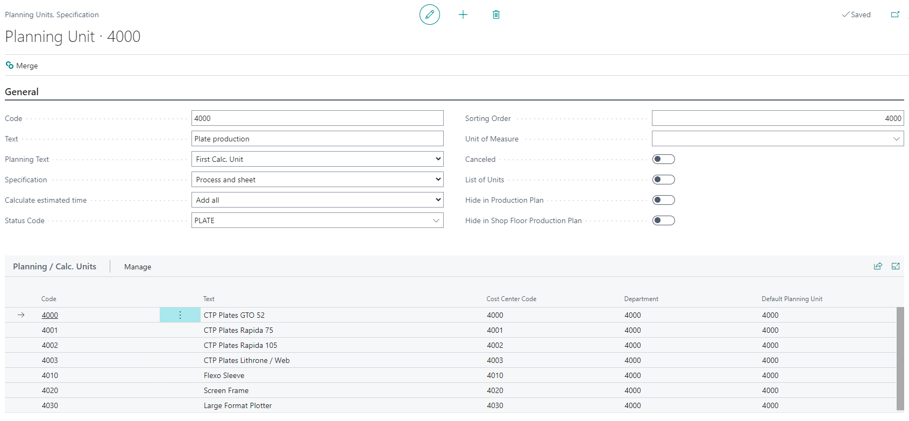
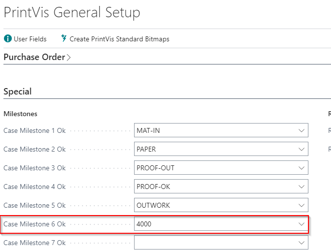
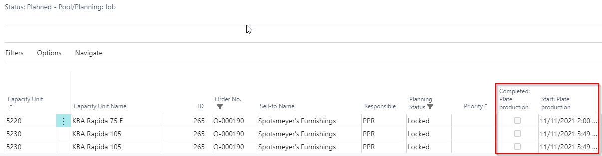
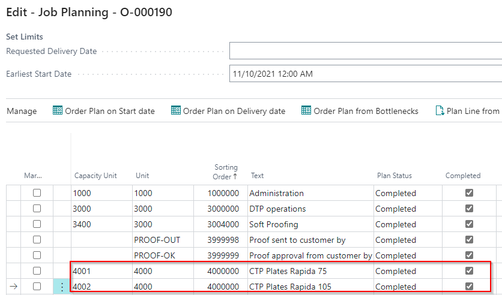
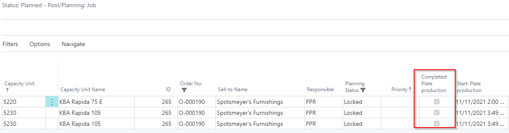

# Using Case Milestones on Production Plan

## Introduction

Setting up Planning Units to use on the Production Plan as columns helps show if they have been completed or not. For example, this can indicate when the scheduled start time for CTP plate production occurs and whether the plate production is completed. This information is helpful when scheduling for printing presses.

## Setting up Planning Units

There is no extra setup required for Planning Units to be used in Case Milestones. Below is an example of how the setup can look, which will be used throughout the rest of the example.

## Setting up PrintVis General Setup

On the PrintVis General Setup page under the FastTab **"Special"**, you will find Case Milestones 1-10. Select the planning units/milestones you want to be used. This example focuses on **4000 (Plate Production planning unit)**:

## Setting up Production Plan Page

1. Go to the **Production Plan** and personalize the page.
2. Select the corresponding **PVSAPIPlanningGetMilestone** field. They are numbered 1-10, so ensure you select the one that corresponds to the Case Milestone number you would like to see. 
3. There are two fields for each number: a Boolean to show if completed and a DateTime field. This example uses **PVSAPIPlanningGetMilestoneCompletedRec6** for the Boolean and **PVSAPIPlanningGetMilestoneStartRec6** for the DateTime field.
4. Drag and drop the Boolean field and/or the DateTime field onto the Production Plan page.
5. Exit the page and then re-enter the Production Plan Page to get the caption header used from the description field of the Planning Unit group that was selected. For this example, the headers will read **Completed: Plate Production** and **Start: Plate Production** after re-entering the page.

## Usage

The completed field is unchecked because the plates have not been marked as completed yet. Once the Planning Unit for CTP plate production for the KBA Rapida 75 E and KBA Rapida 105 has been marked as completed, this field will be checked. The start time for that plate production is displayed in the **Start: Plate Production** field.

After marking the CTP plate production for KBA Rapida 75 E and KBA Rapida 105:

The field is now marked as completed on the Production Plan page:

