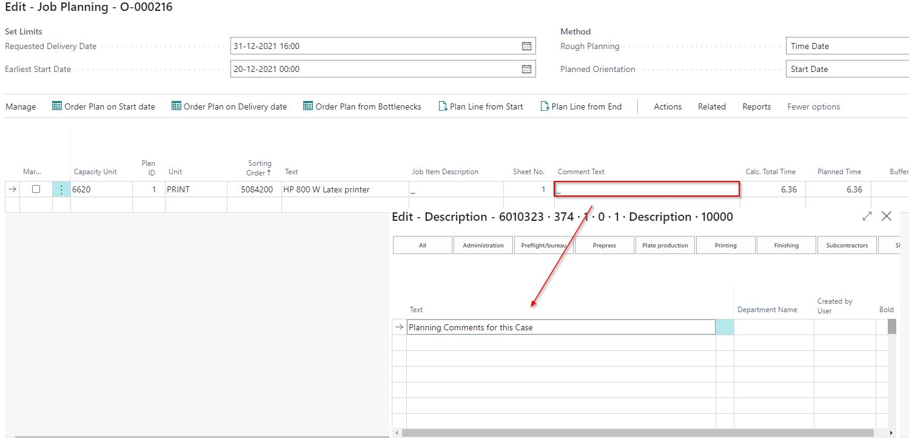
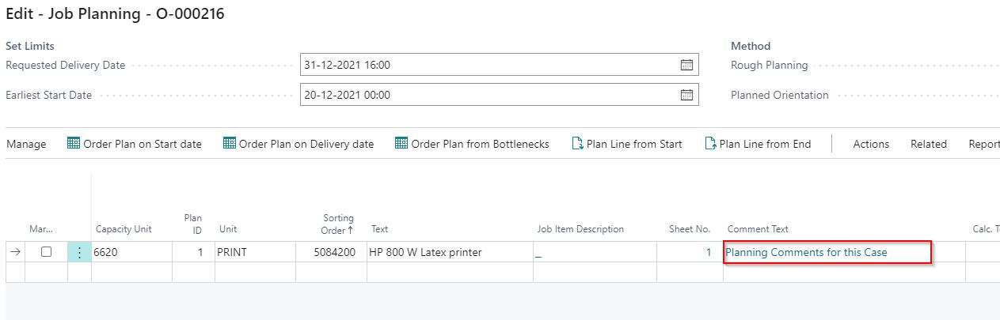
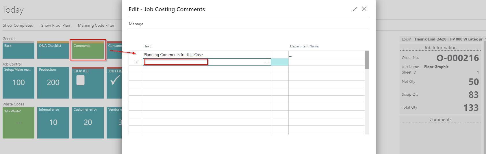

# Comment Text Field in the Job Planning

Comment Text Field

In the Job Planning, there is a field called **Comment Text**, which has a drill-down to a Description table.

- This field can be used to send information to the shop floor, or the shop floor user can send information back to the planner.
- The **Comment Text** field is also displayed in the Production Planning.

Planning Card

On the Planning case card, you will need to reopen the planning card after entering any comments.

 When Reopening the Planning Card

- Users can add extra comments in the section titled **Information on Shop Floor**.

