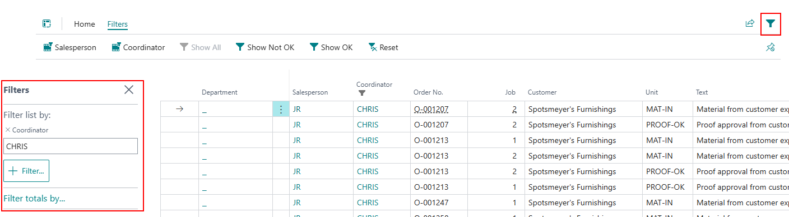

# PrintVis Customer Follow-Up Overview

## Introduction

Milestones are used for allowing indications of important dates that are used to enhance the scheduling capabilities of a company. Examples of these milestones are dates for paper to be in house, sub-contracting work, proof approval for customers, etc. These dates can be setup to affect other planning units, or just be used for indicators/date placeholders.

**PrintVis Customer Follow-Up Overview** is a page that is used to gather milestones from across multiple orders and provides a larger picture where filtering can be done. This ensures that customer service representatives, or any user working with customers, can remain on top of dates to follow up with said customer.

## Setup

> **Note:** Basic milestone setup will not be covered in this article. Please visit the *Planning Unit* article to review milestones before continuing.

In order to use **PrintVis Customer Follow-Up Overview**, there are 2 important fields to fill out on the **Planning Unit** card:

1. Make sure the `Milestone` boolean is checked.
2. Fill out the **Follow-up Date Formula** (e.g. `-2D`).  
   This formula provides a suggested follow-up date before the scheduled completion date.

**Example:**  
If the milestone "Material In" has a Follow-up Date Formula of `-2D`, it will suggest a follow-up date 2 days prior to the completion date.

A list of units for a group of milestones will need to be set up, or alternatively, you can connect the milestone to calculation units. This setup can be reviewed in the *Milestone Setup/Usage* article.

## Navigating the Page

Assuming the setup from above is complete and milestones have been assigned to cases:

- Once cases are created and placed in a status where **"Can be Planned"** is set to `true`, milestones will be created automatically.
- These milestone lines will start to populate the **Customer Follow-Up Overview** page.

When opening the page, the **only filter** initially applied is **Coordinator**, which defaults to the current user.

Each line on the page represents a planning unit that is:
- Marked as a milestone, and
- Assigned to an order with a matching coordinator.

### Applied Filters

 Filters on Open:
- **Coordinator**: Defaulted to the current logged-in user.

## Home Tab

Selecting a line and clicking:

- **Order** – Opens the Case Card.
- **Planning** – Opens the Case Planning page.
- **Customer** – Opens the Customer Card assigned to the order.

### Filters Tab

- **Salesperson**: Narrows down the milestone lines.
- **Coordinator**: Allows manual adjustment of the coordinator filter.
- **Show All**: Displays all planning units marked as milestones.
- **Show Not OK**: Shows milestone lines where "OK Ready" is not checked.
- **Show OK**: Shows milestone lines where "OK Ready" is checked.
- **Reset**: Clears the salesperson filter and resets the coordinator to the logged-in user.

You can also apply filters on specific columns by hovering over the field and using the drop-down arrow (standard filtering).

 Filter Pane
Another way to apply filters is through the **Filter Pane**, using standard filtering techniques.

## Importance

Following up with customers and/or vendors is critical to ensuring the production schedule runs smoothly.

 Examples:

- **Material**: Ensure materials supplied by customers or ordered items arrive on time.
- **Proofs**: Must be approved by the customer before plate production.
- **Sub-Contracting**: External work must return before the rest of the job can proceed.

Lack of timely follow-ups may delay job progress. The **Customer Follow-Up Overview** provides a high-level view of all relevant milestones to prevent such delays.

These five fields help track the status of follow-up procedures:

| Field            | Description |
|------------------|-------------|
| **OK Ready**     | Check this box once the planning unit is accomplished (e.g. material received). |
| **Follow-up Date** | Auto-calculated using the planning unit's start date/time and the Follow-up Date Formula. Can be adjusted manually. |
| **Reminded the** | Date of the most recent follow-up. |
| **Reminded by**  | Automatically filled with the user code of the person who completed the follow-up. |
| **Comment**      | User-entered notes from the follow-up. If empty, value shown as "No". When filled, changes to "Yes". Clicking the field opens the **Job Description** page to display comments. |
