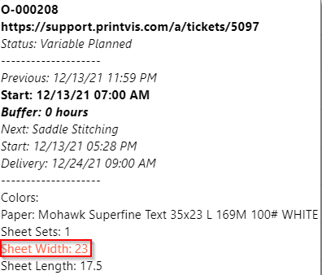
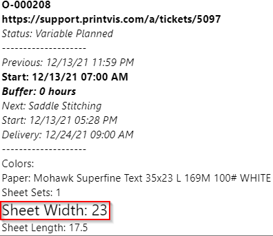
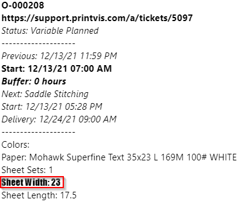
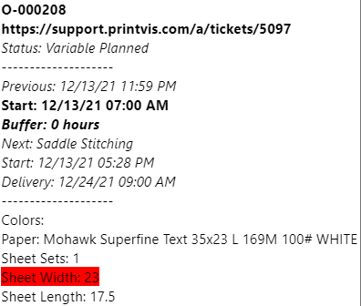
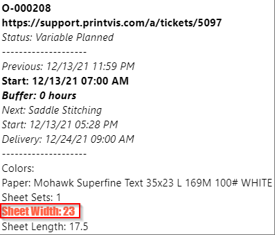

# HTML Tag for Tooltip

## Introduction to HTML

HTML stands for **Hypertext Markup Language**. There are different components of HTML that make up a web page. The HTML element is the main structural unit of the web page. HTML tags are used to define the elements and provide structure to the content of the website. HTML attributes provide additional information about the elements. This article will focus on HTML tags, specifically those that can be used for Tooltips on the PrintVis Planning Board and Shop Floor Job.

## HTML Tags

| **HTML Tag** | **Functionality** | **End Tag** | **Example** | **Comments** |
|--------------|-------------------|-------------|-------------|--------------|
| `<b>` | Bold | `</b>` | `<b>Bold Text</b>` |  |
| `<i>` | Italic | `</i>` | `<i>Italic Text</i>` |  |
| ` ` | Line Break | N/A | ` ` | Adds extra line space between tooltip lines. |
| `<u>` | Underline | `</u>` | `<u>Underlined Text</u>` |  |
| `<small>` | Smaller text | `</small>` | `<small>Smaller Text</small>` |  |
| `<big>` | Bigger text | `</big>` | `<big>Bigger Text</big>` |  |
| `` | Changes font color | `` | `Colored Text` or `` | Use color name or hex value. |
| `` | Changes font size | `` | `Sized Text` | Type desired font size in pixels. |
| `` | Changes font type | `` | `Font Text` | Use common font family names. |
| `` | Highlights text | `` | `Highlighted Text` | Choose any valid color. |
| `` | Combine styles | `` | `Styled Text` | Separate multiple styles with semicolons. |

 Links for Reference
- [HTML Color Names (w3schools.com)](https://www.w3schools.com/colors/colors_names.asp)
- [HTML Color Values (w3schools.com)](https://www.w3schools.com/colors/colors_picker.asp)
- [Common Font Families](https://www.hostinger.com/tutorials/best-html-web-fonts)

## Example of Tooltips

Below are examples of the text setup for the Tooltip and how the Tooltip appears after designing the line of text. Note: All examples will have the same setup for the line text. The only information that is changing is the Text field.

**Table No:** 6010318  
**Table Name:** Sheet  
**Field No:** 21  

### Text Colors

**Text field:**
- Using text value for color: ` Sheet Width: %1 `
- Using hex value for color: ` Sheet Width: %1 `

### Text Size

**Text field:** ` Sheet Width: %1 `

### Text Style (Family)

**Text field:** ` Sheet Width: %1 `

### Text Highlighting

**Text field:**
- Using text value for color: ` Sheet Width: %1 `
- Using hex value for color: ` Sheet Width: %1 `

### Combining Multiple HTML Tags

**Note:** This is an example of combining multiple text modifications that would require span style to make changes. Bold, italic, underline, etc., can simply have `<i><b>` or any combination next to each other.

**Text field:** ` Sheet Width %1 `

