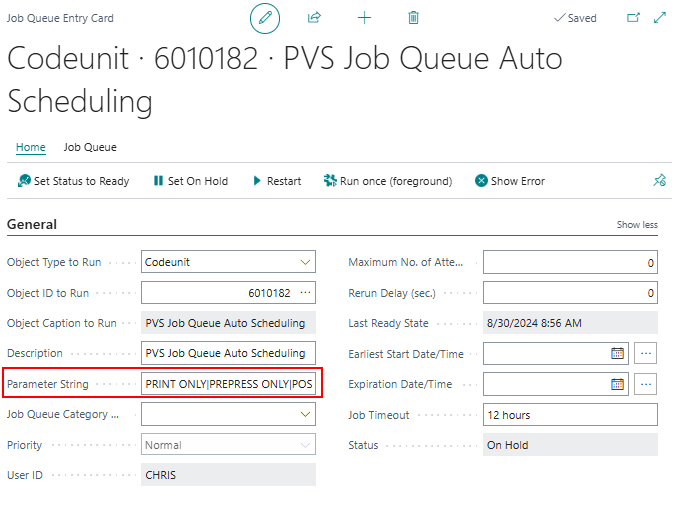
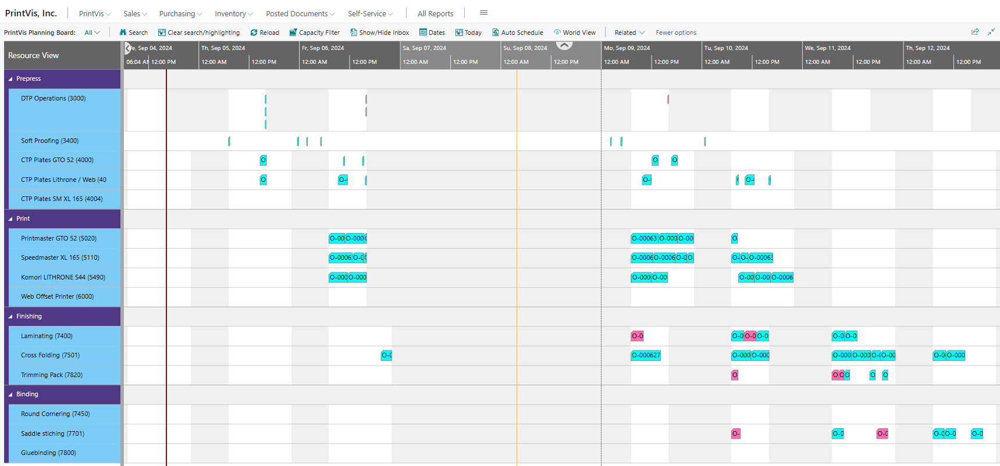

# Job Queue Scheduling

## Job Queue Scheduling

Job Queue Scheduling allows for automatic scheduling by the system at set dates and times, tailored to a company's needs. Some companies might schedule jobs once a week for the following Tuesday through Friday, while others might do so daily at 4 AM for the next day. For a general setup of a job queue (including recurrence, next run date formula, etc.), refer to the job queue article. For assistance with setting up Auto Scheduling, please check that article first. This article focuses on running job queues with auto-scheduling scenarios.

## Setup

1. **Navigate to Job Queue Entries**: Create a Job Queue Entry Card using the Codeunit **6010182**. 
   

2. **Parameter String Field**: This field will utilize the Auto Scheduling code. You can create a specific auto scheduling scenario for job queue scheduling, or combine multiple auto scheduling codes.

   - **Combining Codes**: Use a pipeline (`|`) to separate each code. The sequence of auto scheduling runs from left to right. The leftmost auto scheduling scenario executes first, followed by the next, and so on.

### Example

For instance, if the sequence is set up such that:
- All printing machines are scheduled first,
- Prepress is auto-scheduled next,
- Lastly, post-press machines are scheduled.

The final result can be observed on the Planning Board, demonstrating the use of the auto scheduling routine integrated into a job queue that operates as frequently as the company requires.
