# Milestone Setup / Usage

## Table of Contest

1. [Introduction](#introduction)
2. [Setup](#setup)
	- [List of Unit for Milestone](#list-of-unit-for-milestone)	
	- [Product Group Setup](#product-group-setup)
	- [Calculation Unit Setup](#calculation-unit-setup)
	- [Case Management Setup](#case-management-setup)
3. [Usage](#usage)
	- [Product Group (non-sheet specific) example](#product-group-(non-sheet-specific)-example)
	- [Calculation Unit (sheet specific) example:](#calculation-unit-(sheet-specific)-example:)
	- [Milestone page](#milestone-page)

## Introduction

Milestones are used for allowing indications of important dates that are used to enhance the scheduling capabilities of a company. Examples of these milestones are dates for paper to be in-house, sub-contracting work, proof approval for customers, etc.

## Setup

Initial milestone setup is completed on the planning unit card. Create a new planning unit that will be used specifically for milestones. In the **General** fast tab, the important fields are as follows:

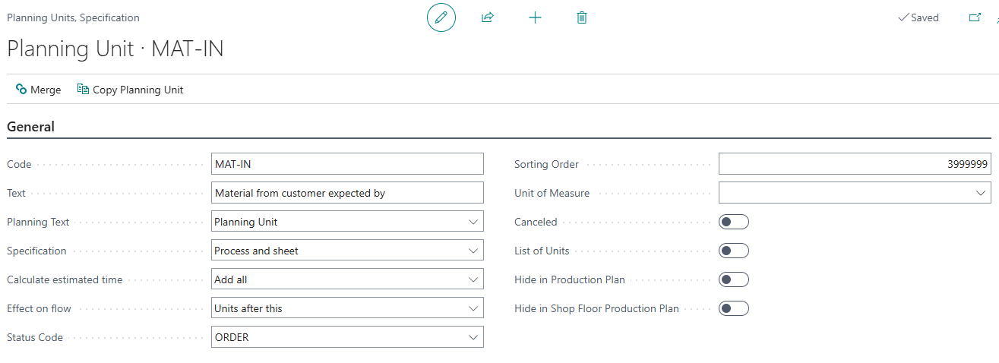

| Field           | Description |
|-----------------|-------------|
| Code            | Milestone Code. |
| Text            | Milestone text (description) that provides further information not captured in the code field. |
| Status Code     | This field assists with automatically progressing status codes, driven from production. It helps generate the "Next Status" field on the case card.  **Important Notes:** - There must be a status code for each production step. - All planning units must have a status code. - The status code must describe the current stage (e.g., planning unit PRINT gets status code PRINT). - This must be set before system go-live. - Changes must be manually updated on all planning units on orders and templates. **See separate article**: *Status Code field at Planning Unit Setup.*  **Special Note for Auto Material Posting:** - A Time Registration user cannot change the status via "Completed" button in Shop Floor if automatic material booking is triggered. - An extra status should be added, e.g., "Ready for production" (if booking starts at production) or "Confirmation of production is finished" (if booking happens at end). - Only users authorized for material booking can change these status codes. |
| Effect on flow  | **Available options:** - &lt;BLANK Option&gt; - Units after this - Units before this - No Impact  **Effects Explained:** - **Blank option**: Milestone impacts both predecessor and successor units. Visualized with links in process flow diagram. - **Units after this**: Successor must wait for this milestone. - **Units before this**: This milestone waits for a predecessor. - **No Impact**: Milestone is isolated, no links to other planning units. |
| Sorting Order   | Allows entry of an alternative sorting order. If none is defined, lists are ordered by the default primary key.  This field lets you manually place milestones between planning units generated by the calculation unit. |

Some optional setup changes can be completed on the following fields (related to the general fast tab):

| Field                        | Description |
|-------------------------------|-------------|
| Code                          | Milestone Code. |
| Text                          | Milestone text (description) that provides further information not captured in the code field. |
| Status Code                   | This field assists with automatically progressing status codes, driven from production. It helps generate the "Next Status" field on the case card.  **Important Notes:** - There must be a status code for each production step. - All planning units must have a status code. - The status code must describe the current stage (e.g., planning unit PRINT gets status code PRINT). - This must be set before system go-live. - Changes must be manually updated on all planning units on orders and templates. **See separate article**: *Status Code field at Planning Unit Setup.*  **Special Note for Auto Material Posting:** - A Time Registration user cannot change the status via "Completed" button in Shop Floor if automatic material booking is triggered. - An extra status should be added, e.g., "Ready for production" (if booking starts at production) or "Confirmation of production is finished" (if booking happens at end). - Only users authorized for material booking can change these status codes. |
| Effect on flow                | **Available options:** - &lt;BLANK Option&gt; - Units after this - Units before this - No Impact  **Effects Explained:** - **Blank option**: Milestone impacts both predecessor and successor units. Visualized with links in process flow diagram. - **Units after this**: Successor must wait for this milestone. - **Units before this**: This milestone waits for a predecessor. - **No Impact**: Milestone is isolated, no links to other planning units. |
| Sorting Order                 | Allows entry of an alternative sorting order. If none is defined, lists are ordered by the default primary key.  This field lets you manually place milestones between planning units generated by the calculation unit. |
| Planning Text                 | Defines the text shown for the planning unit.  **Options:** - **Default**: Takes the Planning Unit text value. - **First Calc. Unit**: Takes the text from the first calculation unit included in this planning unit. - **First Sub Contracting Line**: Takes the text from the first line with *Sub Contracting = Yes* among the calculation units included in this planning unit. - **Capacity Unit**: Takes the Capacity Unit name from the Capacity Unit used on the planning line. |
| Hide in Production Plan       | Tick this field if you do not want this unit to appear in the actual production plans as something that needs planning or monitoring.  Commonly used for milestones or less important planning units, especially when planned time = 0.  This setting is recommended for milestones. |
| Hide in Shop Floor Production Plan | Tick this field if you do not want this unit to appear in the Shop Floor Production Plans.  Commonly used for milestones or less important planning units, especially when planned time = 0.  This setting is recommended for milestones. |

For setting up planning units that are specifically milestones, there is a fast tab called "Milestones" that contain fields specifically for setup:

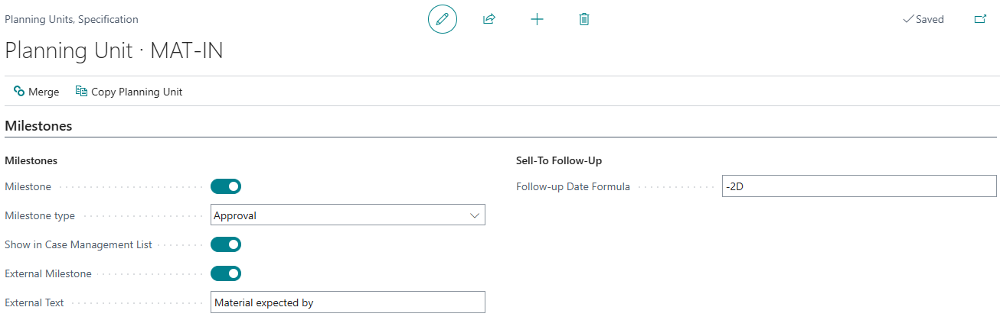

| Field                     | Description |
|----------------------------|-------------|
| Milestone                  | Mark this unit as a milestone.  **Notes:** - Not always from estimation. - Marked with bold in the fine plan. - Important production steps (e.g., paper in house). - Can be displayed as a column in the Production Plan. - Can be marked and included in printed production plan to the customer. |
| Milestone Type             | Used in JDF/JMF communication. If a workflow partner sends a milestone update via JMF, the related planning unit with the given type could be set to `started=true` or `completed=true`.  **Possible Milestone Types:** - Approval - Paper - Plates Print - PostPress - Shipment Accepted - BindingCompleted - BindingInProgress - Delivered - DeviceStopped - DigitalArtArrived - JobCompletedSuccessfully - JobCompletedWithErrors - JobCompletedWithWarnings - JobInProgress - PageApproved - PageCompleted - PageDeleted - PagePlanned - PagePreliminary - PageProofed - PDLProduced - PostPressCompleted - PostPressInProgress - PrePressCompleted - PrePressInProgress - PressCompleted - PressInProgress - ProofSent - ShippingCompleted - ShippingInProgress - SurfaceApproved - SurfaceAssigned - SurfaceCompleted - SurfaceProofed - PreflightError - PreflightOK |
| Show in Case Management List | Creates a column in the Case Management view for this planning unit.  **Notes:** - Must also be a milestone. - Shows when the filter setting on Case Management view is set to Milestone. |
| External Milestone         | Marks the milestone as an external milestone.  Displays the name to be presented to the customer if the unit is marked as both Milestone and External Milestone.  This field is used for special reports (not used in standard reports). |
| Follow-up Date Formula     | Displays the calculated Follow-Up date based on settings on the Capacity Unit.  Example: A follow-up date might be set to contact the customer one day before files are supposed to be delivered. |

Optional field to setup regarding the milestone can be accomplished in the rough planning:

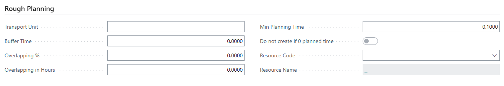

| Field             | Description |
|-------------------|-------------|
| Min Planning Time | Minimum planning time can be set (e.g., 0.100 or another default value) to ensure that the planning time is always greater than 0.  This guarantees that the planning unit will show up on the Planning Board / Production Plan page.  **Suggestion:** - Always fill in the start date and end date to capture the actual time. - The minimum planning time serves as a fail-safe for milestones. |

### List of Unit for Milestone

Once individual milestones are created, you can set up a **list of units** to group milestones together.  
This allows the list to be assigned to a **Product Group**, so anytime the Product Group is used on a case, the milestones will be generated automatically.

> **Note:**  
> Milestones are only created when a case reaches a status where **"Can be Planned"** is set to **true**.

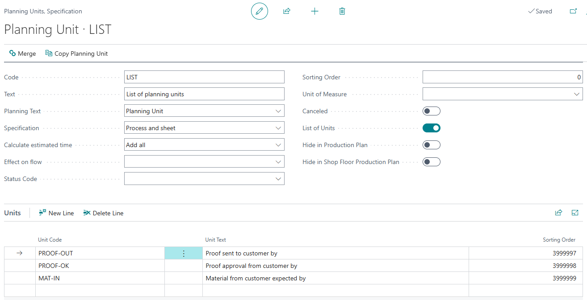

### Setup Fields for the List of Units

| Field | Description |
|------|-------------|
| Code | Code for the list of units. |
| Text | Description of the list of units. |
| List of Units (Boolean) | Must be checked `True`. |
| Units Line | Add all the milestones that should be associated with this list. |

---

### Product Group Setup

Every Product Group that will require milestones must have the **List of Units** assigned.  
This setup is done in the **Estimating** fast tab of the Product Group.

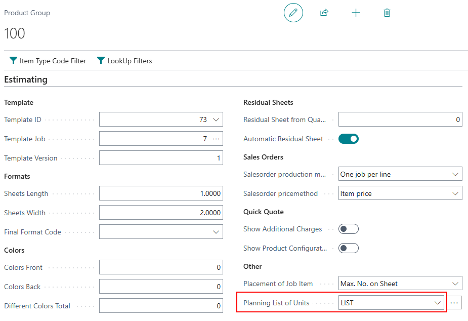

### Calculation Unit Setup 

If milestones are **sheet-specific**, setup differs:

- Instead of creating a list of units and assigning it to the Product Group:
  - Assign the planning unit directly to the **specific Calculation Unit detail line**.
  - In the details section of the Calculation Unit, add the planning units (you may need to add or locate the Planning Unit field).
  - Add **both** milestone units **and** the main planning unit for the calculation.

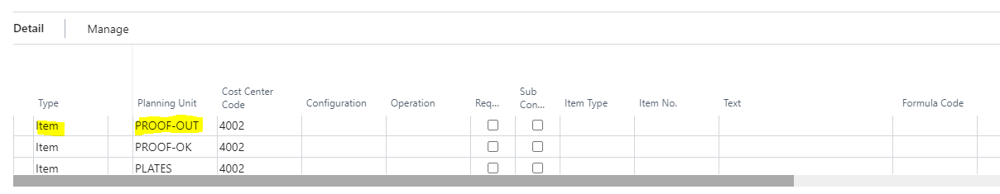

> **Result:**  
> This ensures milestones stay tied to the correct calculation and associated sheet, and planning happens as expected.

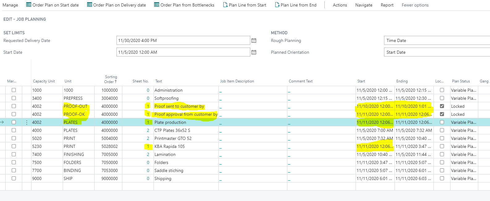

### Case Management Setup

To display milestone fields in the **Case Management** list:

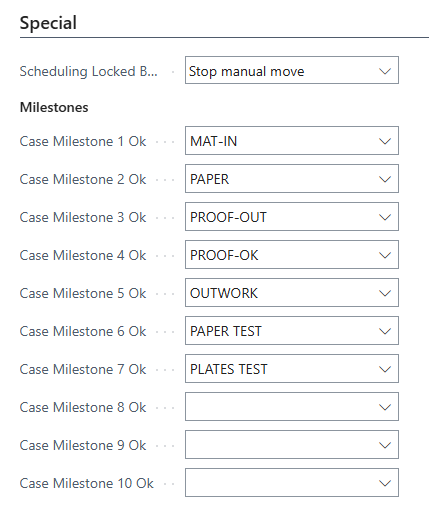

1. Go to **PrintVis General Setup**.
2. In the **Special** fast tab:
    - Assign up to **10 milestones** for presentation in:
      - Production Plan
      - Case Management Overview

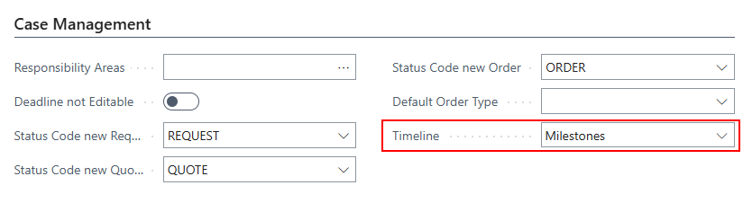

3. After setting milestones:
    - Go to the **PrintVis User** card.
    - Set the **Timeline** field to **"Milestones"** (found under the **Case Management** fast tab).

> **Result:**  
> In the Case List, users can see milestone status at a glance:  
> - Scheduled  
> - Not Scheduled  
> - Blank (not associated with a case)  
> - Locked  
> - Completed

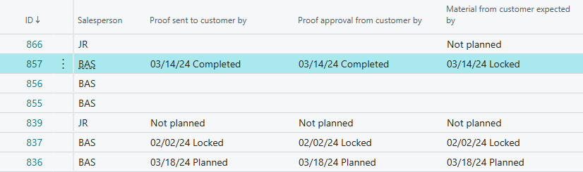

## Usage

### Product Group (Non-Sheet Specific) example

Following the **Product Group setup**:

- Planning units for milestones are created.
- Planning units are **non-sheet specific**.
- They are organized based on the **Sorting Order** set up in each milestone.

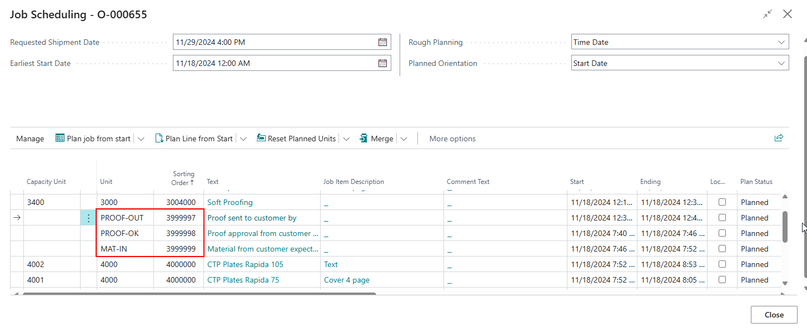

### Calculation Unit (Sheet Specific) Example

Following the setup described in the **Calculation Unit setup** section.

This will keep these milestones attached to the appropriate calculation and its associated sheet. This will then plan according to how you would expect. Opening the Job Scheduling page will provide you with this example:

### Milestone Page

It is possible to filter on planning units only created as a milestone by clicking the "Milestones" function (in the Jobs section on the Case Card).

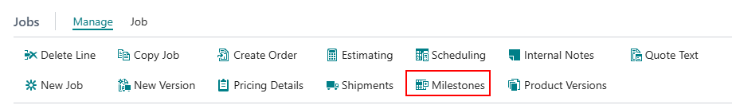

Here, only the milestones that are created for this specific case are displayed:

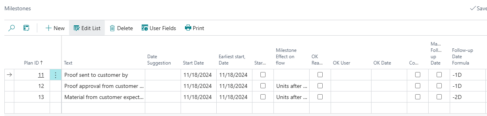

On this page, it is possible to review data associated with the milestones, but also make appropriate changes such as:

- **Date Suggestion**: When it is suggested that this milestone should be scheduled.
- **Start Date**: When the date is scheduled to start.
- **Started**: Marked if the milestone process has been started.
- **Completed**: Marked if the milestone process has been completed.
- **Milestone Effect on Flow**: Field is populated from the planning unit setup of this milestone but can be changed for this specific job.
- **Ok Ready**: An alternative for the "completed" field that will also record and display the user that marked the milestone as "OK" and will also record and display the date that milestone was marked as "OK".
- **Follow-up Date Formula**: Date formula is populated from the planning unit setup of this milestone, but can be adjusted for this specific job. (Also visit the "PrintVis Customer Follow-up Overview" article to obtain knowledge on how this information can be further used).

