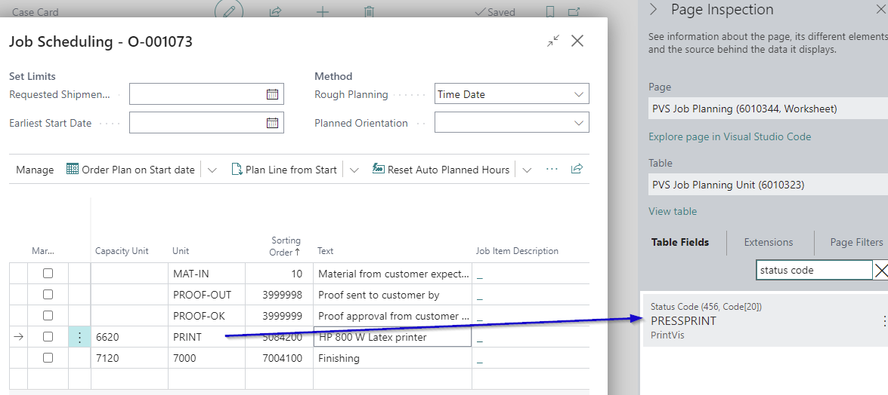

# How does PrintVis find the next status? Can it change automatically?

There are three places PrintVis checks to determine the next status, which is displayed in the case fact box:

1. **Job Planning Lines**: PrintVis checks if there are job planning lines and whether they have a status code set up.
2. **Planning Unit Status Code**: This status code is configured on the planning unit.
3. **First Incomplete Line**: PrintVis will find the next status code on the first line that is not completed. You can inspect the PVS job planning page to see the related status code.

In the example above, the status will change automatically to **PRESSPRINT** as soon as all the planning lines above are completed.

- If the first check does not apply, PrintVis checks if there is a setup in responsibility areas to find the next status code.
- If the second check does not apply, PrintVis checks the status codes setup to find the next status code.

By using the setup on the planning units, the status will be changed automatically.

In cases where you hit "next status" on the case and the same status code as the current one is suggested (which would not change anything), this typically occurs because the planning units have not been completed. Therefore, it must remain on the current status until the related planning units are completed.
