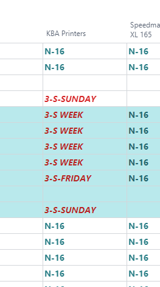

# Opening Hours - Calendar Maintenance setup

## Introduction

This article summarizes the required setup for PrintVis Opening Hours / Calendars for the Capacity Units and explains the options of the setup.

The Calendar Maintenance setup provides a broader scope for creating the opening hours on PrintVis Capacity Units.

 Sequence of the Setup

<ol>
  <li>
    PrintVis Calendars
    <ul>
      <li>By using Capacity or Calendar Groups</li>
    </ul>
  </li>
  <li>Opening Hours Profiles</li>
  <li>Opening Hours Setup</li>
</ol>

## PrintVis Calendars

In this setup, you can define different calendars. Each calendar can be set up with different opening hours schemas/shifts.

Standard calendars can be created based on:

- Departments
- Capacity Groups
- Capacity Units
- Custom-Defined Calendar Groups

 Available Fields:

| Field Name      | Description                                                                                           |
|-----------------|-------------------------------------------------------------------------------------------------------|
| Code            | Enter a code for this calendar.                                                                       |
| Description     | Description for the code above. These descriptions will be displayed as column captions in the PrintVis Opening Hours Setup. |
| Department      | Select a department if the calendar code should be assigned to all Capacity Units of the selected department. This means all machines working with the same opening hours profile. |
| Capacity Group  | Select/Create a Capacity Group if the calendar code should be assigned to all Capacity Units with Capacity Group attached. All machines working with the same opening hours profile. |
| Capacity Unit   | Select a Capacity Unit if this machine is working a unique opening hours profile.                    |
| Calendar Group  | Select/Create a Calendar Group if the calendar code should be assigned to all Capacity Units with Calendar Group attached. All machines working with the same opening hours profile. |
| Sorting Order   | The sorting order gives the sequence of columns in the PrintVis Opening Hours Setup.                 |
                 

## PrintVis Capacity Groups

Set up your own Capacity Groups if you require such grouping. Capacity Groups are also used to decide which capacity to display on the PrintVis Production Plan or Planning Board.

### Capacity Group Selection on Capacity Unit Setup

On each capacity unit, you can set up if this capacity should be a member of a Capacity Group.

## PrintVis Calendar Groups

Set up your own Calendar Groups if you require such grouping.

### Calendar Group Selection on Capacity Unit Setup

On each capacity unit, you can set up if this capacity should be a member of a Calendar Group.

## Opening Hours Profiles

This is the setup for the Opening Hour profiles. Each profile has specific opening hours. The opening hours are defined with a start and end time per day.

### Opening Hours Profile Example for a Week of 3 Shifts

Let's take a look into the setup of a week with 2 shifts that starts on Sunday nights at 10 p.m. (22:00) and ends on Friday nights at 10 p.m. (22:00).

- **Sunday:** Only night shift from 10:00 p.m. to 6:00 a.m. the next morning (Monday).

- **Monday-Thursday:** 3 shifts from 6:00 a.m. to 6:00 a.m. the next morning.

- **Friday:** Only 2 shifts from 6:00 a.m. to 10:00 p.m. in the night.

## PrintVis Opening Hours Setup

The Opening Hours setup always displays a full month with a line for each day, including information about:

- The week number
- The weekday
- The date

The columns to the right are descriptions from the PrintVis Calendar setup.

Opening hours profiles that have been applied will be displayed in the style format selected in the Opening Hours Profile Card.

New entries that are not applied yet are displayed in a red-bold-italic font. This indicates that the changes are not saved and have not been created as daily calendar entries for the capacities of this calendar. This is an additional step because it takes a moment depending on how many capacity units are involved in the calendar.

### Typical Steps for the PrintVis Opening Hours Setup

1. Find the week that a setup/change should be made. The earliest date for a setup/change is today's date.
2. Select/Enter the Opening Hours Profiles and ensure one full week of work is properly set up.
3. Highlight all lines with changes.
4. Hit the Action "Apply Changes." This function creates a calendar entry for each day or period (in this example, 1 entry for Sunday-Friday) if "Ongoing Shift Change" is set up on the Capacity Unit for all Capacities of the given Calendar.
5. Hit "Copy to Period" and select the week.

The setup below shows the selected 3 weeks shift from Sunday, October 4th - Friday, October 9th, as not applied.

#### Copy Periods

With the functions “Copy to” and “Copy from,” it is possible to copy a defined week to one or several other weeks.

The easiest way is to enter week numbers, for example, from week 42 to the end of the year (week 52/53), and the "To Date" field will be filled.

If you prefer to enter the "To Date," please make sure:

- The upper field is the first Monday you want to copy to.
- The lower field is the last Sunday you want to copy to.

Do not forget to enable "Apply Changes" and press "OK" to copy the setup of the selected 'from' period to the entered 'to' period. The Copy From function works with the same logic.

It’s also possible to copy only the default calendar, which is defined at the Opening Hours Setup column “Default Calendar,” and copy an existing calendar to another one.

If you mark the fields “Apply Changes” and “OK,” the system starts the defined copy function.

**Patience** - this may take a few attempts to properly master (remember to fill out all relevant fields).

### How to Set Up Holidays and Other Days Without Opening Hours?

There are 2 options:

#### Create and select an Hour Profile that has no time setup.

#### Edit the calendar

When opening the Calendar in "Edit" mode, you can modify specific calendar entries at the table for this calendar for holidays, for example.

### Result Capacity Calendar

#### On Capacity Unit

The result for the selected capacity will be displayed here:

- Open a capacity unit and hit "Capacity Calendar."

result

#### On Opening Hours Setup

Scroll down to see all affected Capacity Units.

