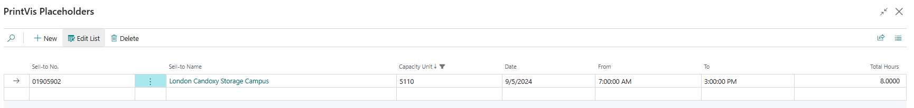
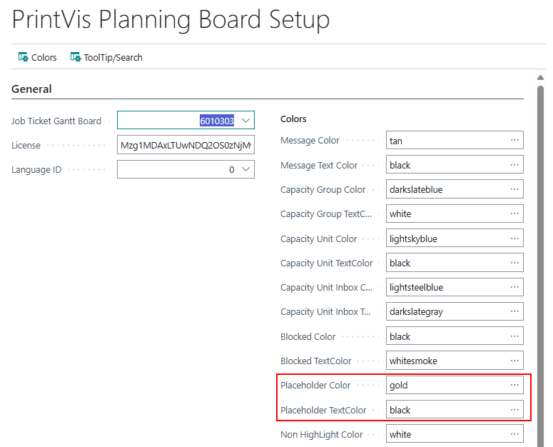
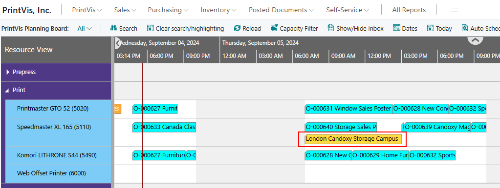
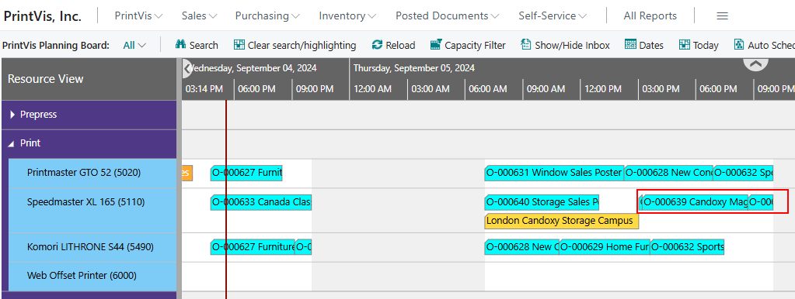

# Placeholder

## Placeholder

Companies can reserve press time for specific customers using "Placeholders." When auto-scheduling, the system respects these placeholders for the designated customer. No other planning units will be scheduled during the reserved time if they belong to a different customer. However, if a planning unit is assigned to the designated customer and can be scheduled during the reserved time, the system will accommodate it.

### Setup

The Placeholder setup page can be accessed from the Production Plan page, Planning Board, or through a system search.

| **Field**       | **Description**                                                                                   |
|----------------|---------------------------------------------------------------------------------------------------|
| Sell-to No.    | This is the customer for which the placeholder is created.                                        |
| Sell-to Name   | Based on the selected Sell-To No., the corresponding Sell-To Name will be placed automatically.   |
| Capacity Unit  | Select the specific Capacity Unit for the placeholder.                                            |
| Date           | Enter the date for the placeholder.                                                               |
| From           | Start time for the placeholder.                                                                   |
| To             | End time for the placeholder.                                                                     |
| Total Hours    | Total hours for the placeholder.                                                                  |
                                 

On the Planning Board Setup page, two fields represent the placeholder visually:

- **Placeholder Color:** The color of the placeholder bar.
- **Placeholder Text Color:** The color of the text in the placeholder.

 Note

If you are on the Planning Board while setting up a placeholder, refresh the Planning Board after completing the setup or exit and re-enter to display the placeholder bar.

### Example

Customer **London Candoxy Storage Campus** has requested to reserve press time for a rush job. A placeholder has been set on the press for **September 5th from 7 AM to 3 PM**.

 Planning Board View

- The placeholder can be seen on the Planning Board.

- The job scheduled during the placeholder is for **London Candoxy Storage Campus**.
- Other jobs were scheduled around the placeholder since they belong to different customers.
