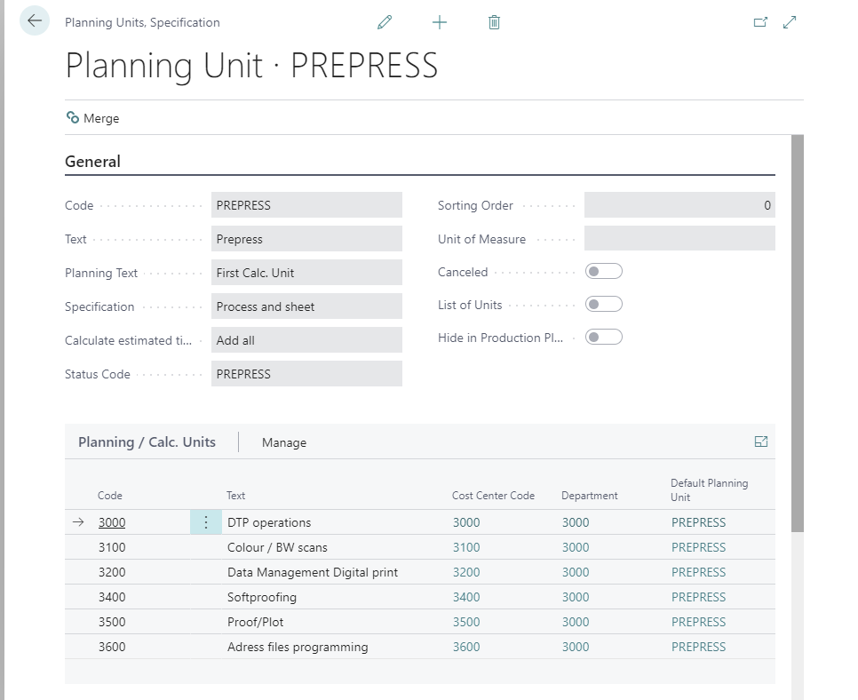
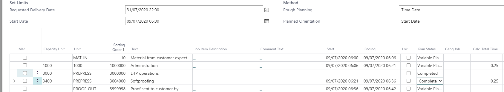

# Introduction

It is possible to change the status code automatically based on Planning Unit setup. This means that when a machine operator completes a planning unit, the status code changes to the next status as defined by the scheduling/planning.

## Example

When a CTP employee finalizes the Planning Unit "CTP plate production," the status changes to **PROD**.

You can use the **Status Code** field to change the status if all Calculation Units at this Planning Unit are marked as "Completed" from the Shop Floor, Production Plan, or Job Costing Journal. The next status will be determined in the following sequence:

1. A planning unit line with a status code assigned that has a higher sorting order than the current one.

   The next status to change to is taken from that planning unit.
2. If no more planning units exist, PrintVis attempts to find the next status code by filtering on:

   Sorting must be higher than the actual status code
   Status code is set to "Production Ended = True"
   If no status code can be found, proceed to step 3.

3. The next status code is taken from the "Responsibility Areas" setup.
4. If no next status is set up in the Responsibility Areas

   The next status code is taken from the "Status Code" setup.

## Planning Unit Setup

### Planning

If Capacity Units 3000 or 3400 are marked as completed, the status code changes to **PLATE PRODUCTION**. The status will change after the first planning line is completed.

PrintVis does not wait until all tasks from this unit are finished. For example, if the plates are ready, printing can already begin, even if not all plates for all sheets are completed.

**Note:** If you want to use this function, the setup of the next Status Code field at the Status Code setup and Responsibility Areas will be overridden if planning is existing! See the sequence description above!
