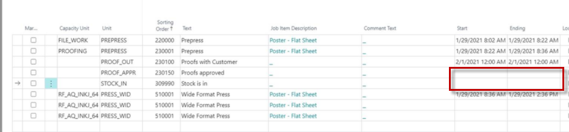
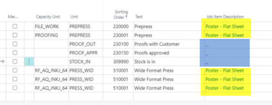
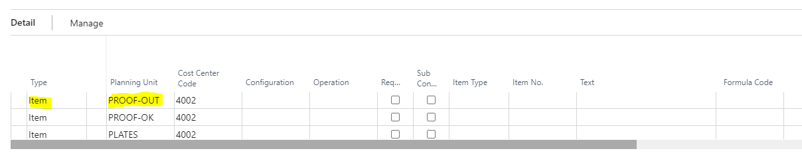
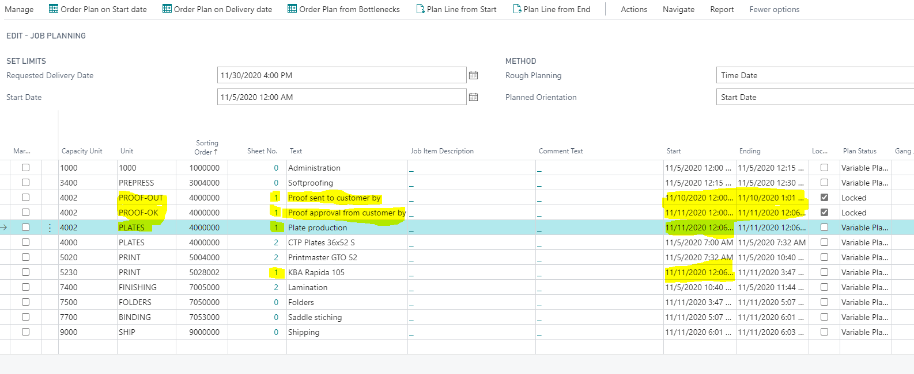

# Planning Around Milestones

## Summary

If you want to plan some work around milestones like:

1. Prepress work
2. Milestone: "Proof work with customer"
3. Printing
4. ...

and you get this as a result:

## Solution

Then the following must be observed:

- It is not possible to mix sheet-related work with work that is not sheet-related.

Color Coding:

- **Yellow area:** sheet-related
- **Blue area:** not sheet-related

The not sheet-related work must be scheduled before or after the sheet-related work.

**Note:** This must also be taken into account when sorting the cost centers in the job calculation.

OR 

Alternatively, can you set the milestones up using the calculation unit rather than as a product group list of milestones? See below:

In this example, we would probably not use the Product Group Milestone List for these sheet-specific milestones but instead add the milestone planning units to your appropriate calculation unit.

In the details section of the calculation unit, you can add planning units (you might need to add or find the planning unit field). You can add all the milestone units but will also need to include the planning unit for the calculation unit as well, so they all show up. See example below:

This will keep these milestones attached to the appropriate calculation and its associated sheet, allowing planning according to your expectations.

