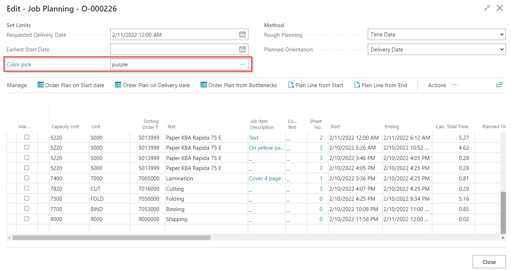
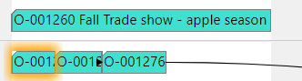

# Planning Board

## Introduction
Similar in concept and function to a traditional Gantt chart, the PrintVis Planning Board provides a graphical interface for plotting and adjusting your production schedule, with helpful color codes and groupings for printing presses and other Cost Centers.

## PrintVis Planning Board User Settings
For every user, Planning Board access needs to be set on the PrintVis User:

1. Search for "PrintVis User List."
2. Select the desired user.
3. Under the Production fast tab, find the Planning Board Group. The access/permission is set on the "Planning Board" field.

 Options:
- **None**  
  User cannot open the planning board at all.
  
- **View Only**  
  User can open the planning board and view it but cannot edit the plan.
  
- **Full Access**  
  User can open the planning board with full editing access.

For the user-specific Capacity Groups they would like to see, and in what order, can be selected. If no capacity groups are selected, all capacities will be displayed on the planning board.

Search for “Planning Board Setup” to also enter the license for the Planning Board. In order to get the license for the Planning Board, contact support@printvis.com for more information.

## Planning Board Setup
Search for “PrintVis Planning Board Setup.” This will help set up colors and Tool Tips.

### Colors
Please note that the colors are all preset to a suggested standard, but each setting on the page and the ‘Colors’ subpage may be tailored to your personal preferences.

To access the color scheme setup, click on the **Colors** button in the top left corner of the page.

In addition to General (which means the Planning Unit status), you can now set up colors for:
- Customer Group
- Customer Number
- Order Type
- Product Group
- Status Code

It is not necessary to set up colors for each possible scheme, so just pick the ones which make sense in the current implementation.

The General Group is set up differently than the others, where you can choose the particular code you want to color.

Also, notice the setup methodology that points out a few codes for coloring, and for a blank code (all the other codes or numbers), a color for that group. This will highlight only a part of the Planning Board content.

This is especially relevant for customer numbers where there would be numerous different customers, and it could be difficult to allocate colors to each. Notably, as soon as you have pointed out a code or customer, open the Planning Board and reload, you will see the new color scheme applied.

Create your color setup and see the result on the Planning Board immediately after.

Color settings are a global decision for the company.

### Planning Board Text / Background Color
It is possible to pick specific colors per job. To do so:
1. Go to the **PVS Job Planning** page use the **Planning Board Text Color** and **Planning Board Background Color** fields.
2. This will allow the user to pick a color that is assigned to that specific job, which will color coordinate all planning units that are part of that job.

For example, the Order Number **O-000226** is now displayed on the Planning Board with the color purple.

To remove the color, go back to the Job Planning page and remove the color selection (set to blank) in the **Color Pick** field.

### ToolTips

The ToolTips settings are also available from the Ribbon of the Setup page and will allow you to set the description to pop up as the mouse hovers over a Planning Unit on the Planning Board. This can be set up exactly to your preferences and with as deep a detail level as you prefer.

You may even use different sets of information per Capacity Group, to ensure relevant information for each unit.

If no specific Capacity Group is selected, such lines are regarded as default for all other Capacity Groups, which are not mentioned in the setup.

At first, you select from which table you wish to display information. The following tables are available for selection:
- 6010084: User field Field Value
- 6010312: PrintVis Case
- 6010313: PrintVis Job
- 6010317: PrintVis Job Item Colors
- 6010318: PrintVis Sheet
- 6010323: PrintVis Planning Unit

When a table has been selected on a line, look up in the **Field No.** field to select which field from the table you wish to display. Field names will only be presented during the selection.

The second field named **Filter on Planning Unit** has three different options: **Current**, **Previous**, and **Next**, which allow you to present, for example, which unit, end date, and time are leading up to the current unit or which unit’s start date and time follow next.

In the **Text** column, you structure how the value from the field is presented, with leading texts, HTML formatting of the field, etc. **%1** will give the field value from the selected field. The HTML formatting displays the values in bold and italic.

To create a separator, just create a line without any reference to a table or field, and use the **Text** column to write the separator, such as a string of hyphens.

For other equipment than ‘BINDING,’ the display might look like:

If the Table selected is **UserField Field Value**, use the columns **UserField Table**, **-Subtype**, and **-No.** to point to the exact UserField value you wish to display. If you wish to display multiple UserField values, repeat the setup for each field.

If the Table selected is **Planning Units**, and you wish to display the date of a specific Unit/Milestone, set the **Filter on Planning Unit** column accordingly.

 Tooltips Formatting
Tooltips may be formatted using HTML expressions for formatting such as text color, bold, italic, etc. Examples of such formatting can be found in the provided link:  
[HTML Tag for Tooltip](https://support365.printvis.com/support/solutions/articles/17000121978-html-tag-for-tooltip).

Once opened, the Planning Board works directly in the database and is loaded according to the settings for the user. You may occasionally click the **Reload** action to ensure new tasks are being fed onto the

### Language
PrintVis Planning Board uses the language from the user’s settings ("My Settings") or a fixed setup in "Planning Board Setup" to determine the time/date format.

 My Settings:
 

Planning Board Setup:

 Results:
- **English (United States)**

- **German (Germany)**

### Logging

The PrintVis Gantt board is built from PrintVis by using a third-party toolbox that requires data communication. If there are technical or performance issues, it is possible to enable logging to check the data that is exchanged with the API.

 Available Fields

| Field               | Description |
|---------------------|-------------|
| **Logging Enabled** | Default = False / disabled If set to **True/enabled**, the user can activate the logging/recording by using the keyboard shortcut **Shift+Ctrl+Alt+L** on the planning board. The record symbol will appear, the current state of the widget is saved and from then on, all calls to the API are recorded. Pressing **Shift+Ctrl+Alt+L** again will stop the recording and download a file with the recorded actions. |
| **Logging Verbose Level** | **Options:**  **0** This level omits loggings of callback triggerings that occur often.  **10** If set to 10, then the callbacks for drag and Tooltips are logged additionally.  **30** If set to 30, also the callbacks `visibilityFilter` and `compareObjects` are logged. |

 Example

If logging is enabled and the user hits **Shift+Ctrl+Alt+L**, the record symbol appears and the recording of the log begins.

To stop the recording, hit **Shift+Ctrl+Alt+L** again and the log file will be downloaded.

> **Note:** When enabling/disabling the logging in the setup, the planning board page must be closed and re-opened to recognize the new setting.

## PrintVis Planning User Settings on Planning Board
On the Planning Board, there is a button labeled **Related** in the top menu. Next, click the **Settings** button that will appear. This will take you to the **PrintVis Planning User Settings** page.

### Using Color Schemes in the Planning Board
Color schemes can be changed in the menu ribbon of the Planning Board.

1. Pick a Color type.
2. Close the page.
3. Reload the Planning Board to view the new color scheme.

### Show Date Line
Checking the Boolean for **Show Date Line**:

In the screen below, you can see a yellow line originating from the cursor point. The date and precise time are shown near the cursor.

### Show Shipment Date
Checking the Boolean **Show Shipment Date**:

This will show the Requested Shipment Date from the active order of the Planning Unit you have clicked on. You will notice this as a red vertical line when you click on a unit.

### Show Locked Status
Check Boolean **Show Locked Status**:

‘Locked’ is a Planning Unit status that the system will automatically assign to a Planning Unit when it has been planned in a time slot where it will not be able to fit, such as being in a night period with no staffing and open hours.

With a color scheme of General, the Planning Unit with the status Locked will have its own color. Since there are more color schemes available, it is possible to show the Locked status on those as well. This is shown as a dot of the signal color on the planning unit:

In this case, a blue dot on the green planning unit.

### Show Production Status
Check Boolean **Show Production Status**:

Production Status shows if the job is started, completed, or paused. This allows the user to see the current status of the job on the shop floor. Production Status is a Planning Unit status set when a job is currently recording time, such as when someone has started time on the shop floor.

In the General color scheme, the Production Status is not shown as a bar in the top right corner, but the status is represented by the full bar color.

In this case, the white bar indicates the Planning Unit is completed, and the green bar shows the Planning Unit has been started.

### Show Progress
Check Boolean **Show Progress** (and also **Show Production Status**):

Time registered on the Shop Floor allows the Planning Board to display a smaller bar showing progress at the bottom of the Planning Unit (bar). The Planning Unit must be marked paused (stopped) or in progress on the Shop Floor for the progress bar to be displayed. Progress is reflected based on the recorded time after a planning unit is marked stopped on the Shop Floor and does not show continuous running time.

The pink bar represents a paused Planning Unit, and the green bar represents a Planning Unit in progress on the Shop Floor. The grey bar at the bottom is the progress bar. The color of the progress bar can be selected from the **PrintVis Planning Board Setup** page under the **Colors** column (on the right), and the field is called **Progress Color**.

### Show Setup Time
Check Boolean **Show Setup Time**:

Based on the correct setup of Calculation units (field **Start/Stop Type=START**), you can know how much of the estimated time comes from Makeready. With the setting **Show Setup Time**, this can also be displayed in the Planning Unit:

Required setup for this is:
- **Calculation Detail**, Start/Stop Type

Here, lines with the **Start** setting will count as Setup time, and all other types except Calculation will count as production time. The light blue/grey (left part of the bar) is shown for the setup time, and the darker blue (right part of the bar) represents production time.

### Start Timer/Timer Interval
**Timer Interval** is the amount of time (in seconds) used when refreshing the production status for every planning unit/job on the Planning Board. Note: This does not account for refreshing all changes made on the Planning Board, just changes to production status.

Checking the Boolean for **Start Timer** will activate the refreshing of the production status based on the value entered in **Timer Interval**.

### Edit Planned Time
Check Boolean **Edit Planned Time**:

When placing the cursor to the right or left of the Planning Unit, the cursor will change to this

 This will allow the Planning Unit to be dragged to edit for a longer or shorter amount of planned time.

 ### Merge split with move 
 Check Boolean **Merge split with move**:

If this option is enabled, each time a split planning unit is moved, all connected planning units are merged and the unit is placed/split again based on its position.   

Instead of enabling this field it is possible to use the keyboard shortcuts: 
- "Shift” key before dropping the unit. 
- "Shift & CTRL” before dropping the unit activates the "Merge split with move and split on opening hours only” functionality.

###Split on open hours only
Check Boolean **Split on open hours only**:

If this option is enabled, a planning unit will only split around opening hours. If other planning units are already planned during that time, this unit will be placed at the same time and overlap those and not split around already planned units. Overlapping processes can then be rescheduled manually. This means that long term processes can be scheduled one after the other without having to change setup for other orders in between.

Instead of enabling this field it is possible to use the keyboard shortcuts: 
- "CTRL” key before dropping the unit. 
- "Shift & CTRL" before dropping the unit will enable "Merge split with move and split on opening hours only” functionality.

### Dates

If you would like to change the dates that are appearing on the Planning Board, click on **Related** in the Ribbon bar and select **Dates**.

This will open a new page, where you may set Start and End dates – either by writing the date or using the calendar icon – as well as how many days you wish to see on the board.

Reselecting dates will return the view to default, which is useful to offset zoom functions or if you have jumped to dates far from the current ones.

There are buttons on the left and right of the dates to move to the next set of days (depending on how many are displayed). For example, if 7 days are shown, clicking the button will move to the next 7 days.

The arrow at the top of the dates allows you to zoom out to the next level.

You can also use the mouse wheel to zoom in or out when hovering over the date/time fields.

### World View
The **World View** feature is available for navigation and overview purposes.

To activate the World View, go to **Related** in the top menu and select **World View** from the dropdown menu.

A new grid will appear at the bottom of the page:

By gripping the little red square with your cursor, you can move around a larger area while seeing the portion you hover over in natural size on the planning board.

To deactivate the World View, just click the **World View** button again.

### Show/Hide Inbox
The **Show/Hide Inbox** action toggles the view to include or exclude Inboxes, regardless of the default user setting. This allows unplanned jobs to be dragged and dropped onto capacities on the Planning Board.

### Filter on Capacities
If there are many capacities on the board, you can filter to focus on certain capacities for fine-tuning.

Hold the **CTRL** button and left-click on the capacities you want to select, then click the **Capacity Filter** button:

To remove the **Capacity Filter**, click the **Undo Capacity Filter** in the top menu.

## Keyboard shortcuts
The following shortcuts are available on the Planning Board for the selected capacity unit:
| **Key / Key combination** | **Description** |
| --- | --- |
| **Shift + Click** | Lock / unlock capacity |
| **Ctrl + Click** | Clear message |
| **Shift + Drop** | Merge split with move functionality |
| **Ctrl + Drop** | Split on opening hours only functionality |
| **Shift + Ctrl & Drop** | Merge split with move AND split on opening hours only functionality |
| **DoubleClick** | Open case card |
| **Shift + DoubleClick** | Open case/job planning |
| **Ctrl + DoubleClick** | Open case/job milestones |
| **Shift + Ctrl & DoubleClick** | Open material requirements |
| **Alt + DoubleClick** | View job ticket |

## PrintVis Planning Board Simulation

An option is available on the PrintVis Planning Board to perform scheduling simulations, allowing you to move around scheduled tasks. After making changes, you can either apply the simulation or discard it and reload the original schedule.

### Color Setup for Simulation

Go to **PrintVis Planning Board Setup** to set up the colors of the bars and text for simulation mode.

Ensure that the **Enable Simulation** Boolean is checked in the **PrintVis Planning User Settings**. To access this, click **Related** in the top menu ribbon on the Planning Board, then click **Settings** from the dropdown menu.

This ensures that the **Start Simulation** button is visible on the Planning Board, located in the top menu ribbon.

### Using Simulation Features

Once simulation mode is activated, the entire schedule is in simulation mode. Any moved unit will have the color settings applied. The **Start Simulation** action will change to **Apply Simulation**.

Before moving any units:

After moving a unit in simulation mode:

You can move as many units as desired, and they will turn yellow one by one as you move them. Once you are done with the simulation, you have two options:

- **Apply Simulation**: This updates the production schedule and reopens it in normal mode, ready for normal adjustment or another simulation.
- **Skip the Simulation**: Activate the **Reload** action to update the production schedule as it was before the simulation.

 Additional Notes:

- The logic built into PrintVis scheduling is bypassed in Simulation mode but re-applied once you apply the simulation. The system will insert the simulated units where they have been placed and perform the normal actions according to system settings.
- The system will still check whether moving to other machines is an allowed capacity change or not.

### Capacity Unit Menu

Right-click on a Capacity Unit (under Resource View on the right side of the Planning Board) or on the Planning Board in the same line of the desired Capacity Unit:

- **Capacity Statistic**: Opens the Capacity Statistic for the selected Capacity Unit, with information about used time, planned time, opening hours, etc.

- **Capacity Blocking**: Allows you to define a blocking time for the selected Capacity Unit. You can click or type the date, From (time), To (time), and Blocking Code.

The blocked time period will appear on the Planning Board, but you need to click the **Reload** button in the top menu to refresh the view.

- **Go To First**: This action scrolls the Planning Board window to the first scheduled planning unit for the selected Capacity Unit. The display is based on the date filter set for the Planning Board.
- **Capacity Calendar**: Opens the Capacity Calendar Entries page for the selected Capacity Unit. You can adjust **Time From** and **Time To** on the fly, such as starting earlier or ending later in shifts.

 Example:
If overtime is needed to finish a job, you can adjust Friday, Sept 13th, from 4 PM to 10 PM. The Planning Board will no longer show closed hours (dark grey) until 10 PM.

The adjustment was made only on the specific Capacity Calendar.

You can also adjust time from one day to another, such as adding overtime or another shift by setting the **To** field to the next day.

 Example:
Changing Friday, Sept 13th's **To** field to 9/14/2024, 10 PM, will update the **Hours** field correctly to 39 hours. The **Time To** field will also reflect this end time accurately.

- **Production Plan**: Opens the Production Plan directly from the Planning Board. 

The filter comes from the Department and Capacity Unit Code from the selected Capacity Unit. The From Date and To Date come from the PrintVis Planning View Setup page.

- **Placeholder**: Opens the Placeholder page, allowing you to edit, add, or delete placeholders for the selected Capacity Unit.
- **Auto Schedule from Here**: Auto-schedules the selected Capacity Unit, using the workday/time to start and the ruleset assigned to the Capacity Group. Planning units in the past will not be moved, and any locked or started units in the future will not be affected.
- **Auto Schedule Unit**: Similar to **Auto Schedule from Here**, but planning units scheduled in the past **will** be moved. For more information, visit the Auto Scheduling Scenarios article.

## Basic Functions

 Move the Planning Unit
- Left-click on a Planning Unit to move it. You can move it to another time slot by dragging it left or right.
- You can also move it to another Capacity Unit (if Capacity Shift is set up between the two Capacity Units) by dragging the Planning Unit into the same row as the desired Capacity Unit.
- To reduce the effort of dragging and dropping when moving a Planning Unit to another Capacity Unit and another time slot, hold the **Shift** key and left-click the Planning Unit.

 Viewing Related Planning Units
- Click on a Planning Unit to see all related Planning Units of the job:

 Functions Window (Right-Click)
By right-clicking on a Planning Unit, a functions window will appear with the following options:

| **Field**             | **Description**                                                                         |
|-----------------------|-----------------------------------------------------------------------------------------|
| **Case Card**          | Opens the case card for this job.                                                       |
| **Case Planning**      | Opens the case planning card for this job.                                              |
| **Case Milestones**    | Opens the Milestone card for this job.                                                  |
| **View Job Ticket**    | Opens/downloads the Job ticket PDF.                                                     |
| **Material Requirement**| Opens the Material Requirement card for this job.                                      |
| **Highlight**          | Highlights the job of the selected Planning Unit (details below).                       |
| **Filter Job Capacities**| Filters the Planning Board to show only the capacities used by the selected job.       |
| **Lock/Unlock**        | Locks or unlocks this Planning Unit.                                                    |
| **Split**              | Splits the Planning Unit at the cursor's position (details below).                      |
| **Merge**              | Merges selected Planning Units from the same job and Capacity Unit (details below).     |
| **Squeeze |<-**        | Moves selected Planning Units left, removing excess time between them (details below).  |
| **Squeeze ->|**        | Moves selected Planning Units right, removing excess time between them (details below). |
| **Auto Schedule |<-**  | Moves the Planning Unit to the earliest possible time based on the "Earliest Start".    |
| **Auto Schedule ->|**  | Moves the Planning Unit to the latest possible time based on "Completed no later than". |

### Highlight
- To highlight a job, right-click a Planning Unit and select the **Highlight** function.

- The highlighted job will be colored, while other jobs will appear white (based on your Planning Board Setup).

 To undo the highlight:
- Click the **Reload** button or **Clear Search/Highlighting** button in the top menu to return to the original view and color scheme.

### Split on Screen
- You can split a Planning Unit by right-clicking on it where the timeline cursor is positioned and selecting the **Split** function.

- The Planning Unit will be divided into two parts.

### Merge on Screen
- To merge Planning Units, select two or more Planning Units by clicking and dragging over them, then right-click and choose **Merge**.

- This can only be done for Planning Units of the same job and Capacity Unit.

### Filter on Job Capacities

- Right-click on a Planning Unit and select **Filter Capacities** to filter the Planning Board, showing only capacities used by the selected job.

- To remove the filter, click the **Undo Capacity Filter** button.

### Squeeze to First / Squeeze to Last
- Use the **Squeeze** functions to remove gaps between Planning Units.

- Select multiple Planning Units by left-clicking and dragging across them, then right-click to choose either:
 

 - **Squeeze |<-**: Compresses the units to the left.
  - **Squeeze ->|**: Compresses the units to the right.

- The first marked unit (left or right) will stay in place, while the others are placed neck-to-neck with it. Use cautiously, as it disregards other jobs' Planning Units.

### General Moving of Planning Units
- You can move multiple Planning Units to other time slots (e.g., a different day).

- To do this, select the Planning Units by left-clicking and dragging the cursor over them, then drag the selected units to the desired time slot.

 Auto-planning with Planned Orientation

- If a Planning Unit is moved before or after another unit, the system will attempt to auto-plan based on the **Planned Orientation** (found on the Case Planning page):
 

 - If set to **Start Date**, the system will plan units as early as possible.

 

 - If set to **Delivery Date**, the system will plan units as late as possible.

### Open Window Curtains
- A new feature displays **curtains** where it is not possible to plan a unit. The open window (where you can plan) is lighter in color than the curtain.

### Capacity Shift
- If Capacity Shift is set up, alternative capacities will light up when you start moving a Planning Unit. They will highlight as soon as the Planning Unit is dragged away from its original capacity or inbox.

 Example:
- The **Speedmaster XL 165** unit was planned, and now alternative capacities (e.g., Printmaster GTO 52, Komori Lithrone S44, Web Offset Printer) light up when the unit is moved.

### Planning Message
- Each Planning Unit can have a message and specific color set to indicate important topics.
 

 
 To add a message:
- Right-click a Planning Unit and select the **Message** option. You can also set the message color (this color will override other color settings).

 To clear a message:

- Right-click the Planning Unit and choose **Clear Message**.

- After confirmation, the message will be deleted, and the color will revert to normal.

