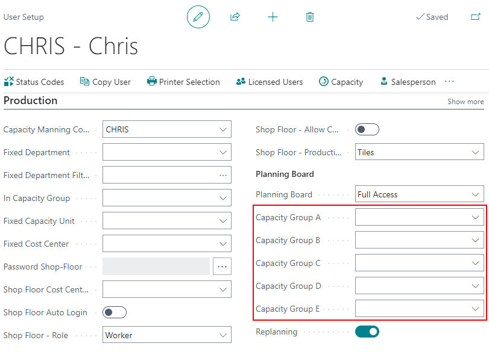
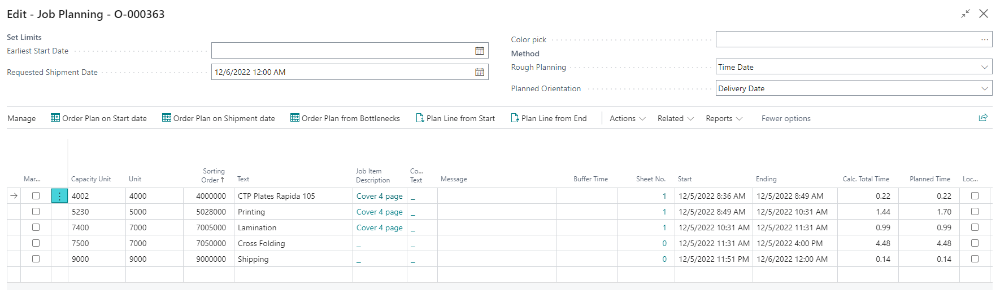
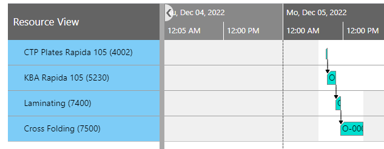
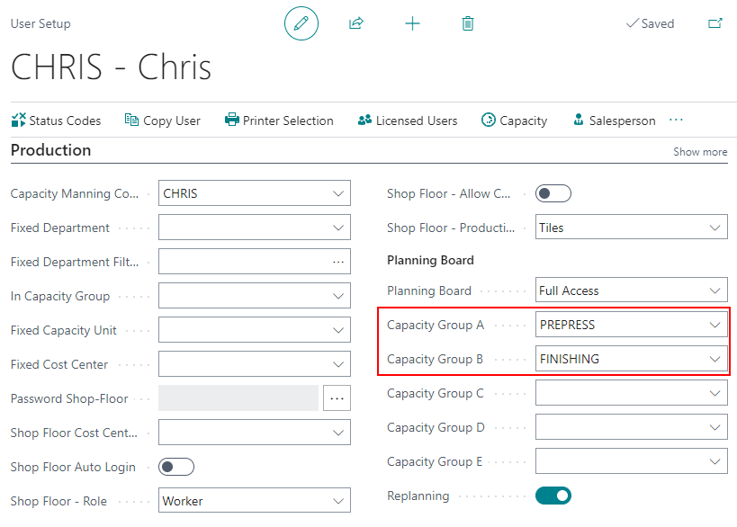
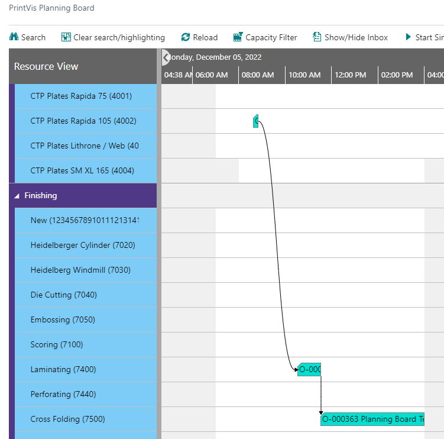

# Planning Link

## Introduction

The **Planning Link** is the line that shows the connection between Capacity Units in the same job. When a user would like to see specific Capacity Groups they are working in or interested in, the PrintVis User's setting can be used to filter the viewable Capacity Groups.

Even if there are missing Capacity Units on the Planning Board, the connection still flows between Capacity Units.

## Original Planning

The original PrintVis User Setup is configured with blank Capacity Groups:

Job planning is set up with the flow starting with **Plate Production -> Printing -> Lamination -> Cross Folding**.

The Planning Board for the job is displayed below:

## Adjusted Planning Link

Capacity Groups can be set up in the PrintVis User Setup to focus only on specific groups. In this example, **Prepress** and **Finishing** are the only two groups shown on the Planning Board.

Below displays the PV User Setup:

The same Job Planning was used. Printing isn’t shown on the Planning Board, but the link/flow of the Capacity Units that are part of the job are still connected. Now, the flow shows **Plate Production -> Lamination -> Cross Folding**.

