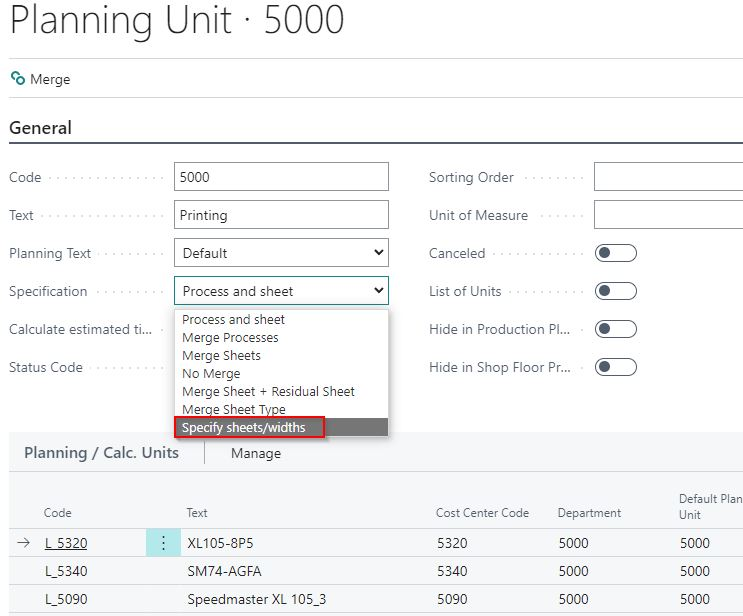

# Planning Per Signature

## Summary

The purpose of this feature is to allow a breakdown of planning per printing sheet/signature within a sheet ID (book block). This means the content pages of a book may be broken down to each sheet/width and planned individually.

### Planning Unit Card

On the planning unit card, the Specifications field now has a new option:

When this choice on the planning unit is selected, during planning, a price unit for a book block will spread out and form a number of individual planning units.

### No Further Action Needed

No further action is needed in daily operations.

### Note for Setup

This means that if the user wants to choose how the planning should be released, that choice must be made on several planning units, each linked to their respective price unit and List of Units to choose from as selected in calculation. 

For example, to choose a printing machine: one list of units should clearly state it will be one planning unit for the book block, while another list should indicate that the signatures will be split. Each list should have a unique price unit that connects to a planning unit with or without splitting.

It is possible to assign signatures to other machines or plan the production individually. The split function will also work, allowing for mixing the planning for the sheets in very large productions.
