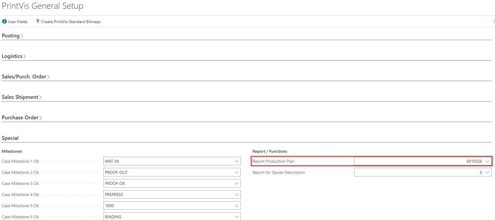
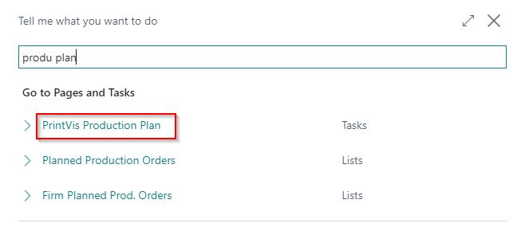
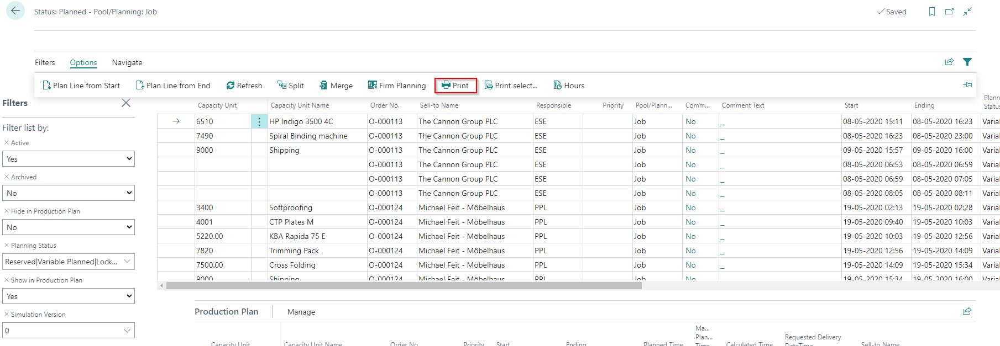
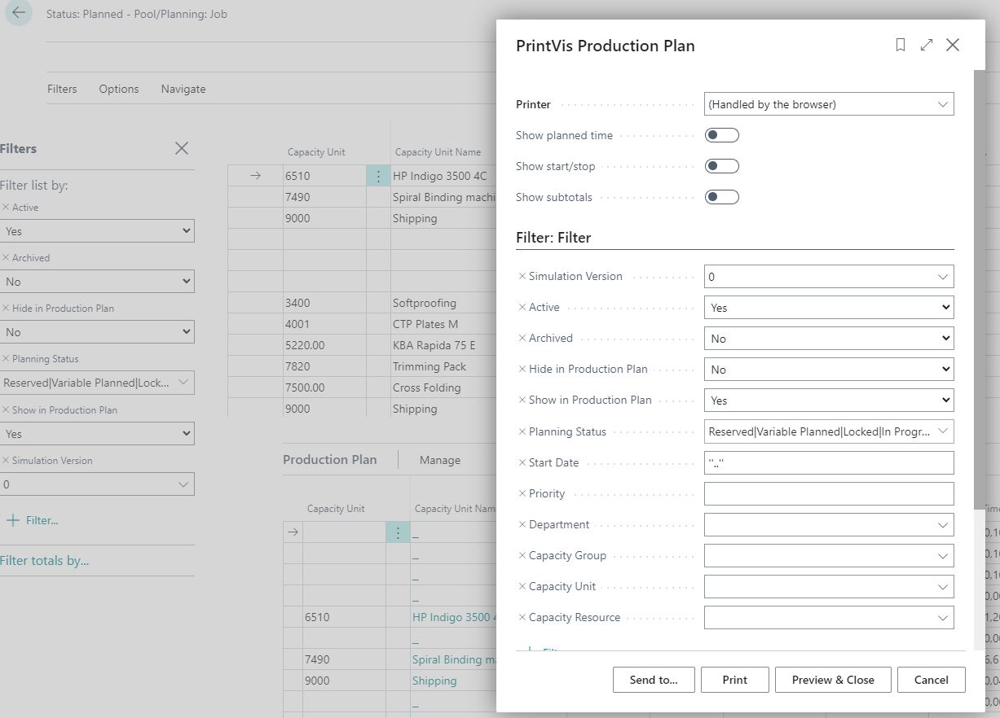
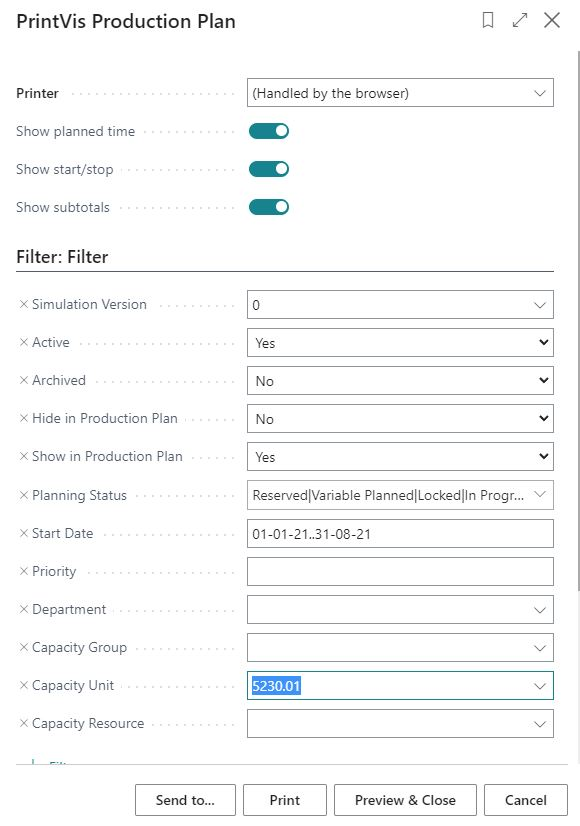
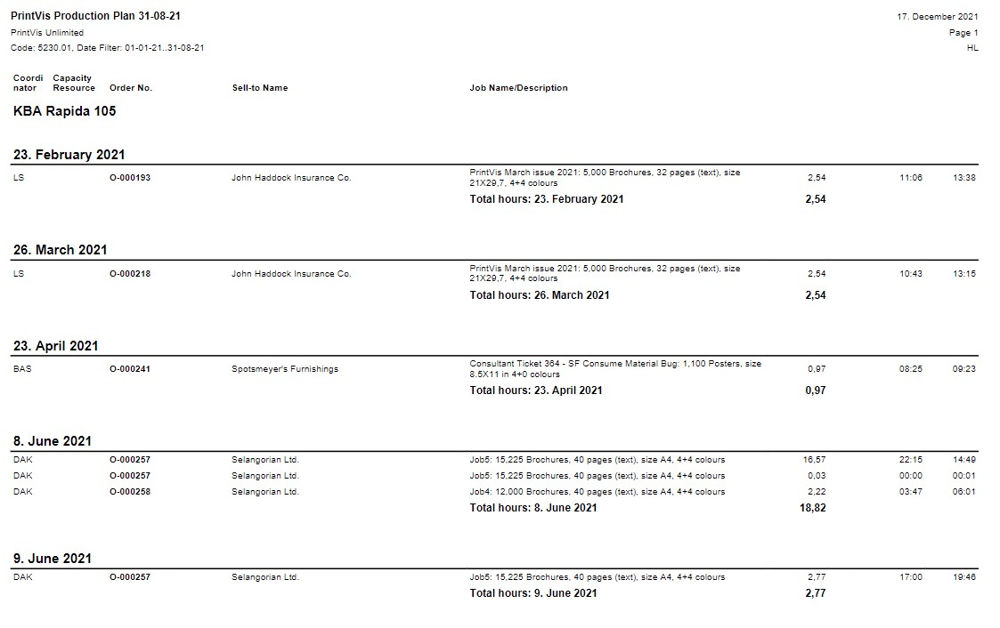

# Planning Report

## Summary

This page describes the evaluation possibilities of the planning report in combination with the planning.

### Planning Report Overview

From the Production Plan page, you have the option to print the Planning Report.

 Accessing the Planning Report

The Planning Report can be found in the planning section and directly under reports (ensure the filter is added).

#### Setup

1. Go to **PrintVis General Setup**.
2. The setup of the Planning Report is made in the General Setup under the FastTab “Special”:

#### Planning Report

The Planning Report can be accessed on the Production Plan Page:

#### Filters

You can access the Planning Report from the Production Page with prefilters:

 Manually Filter:

 Result:

