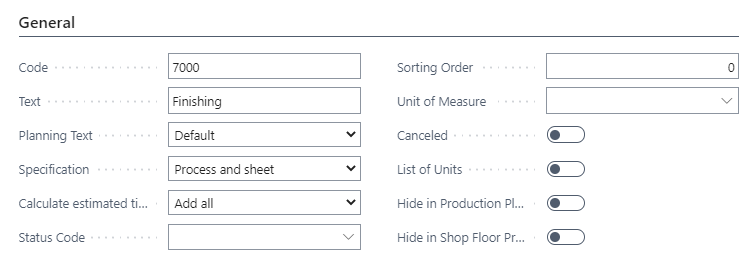
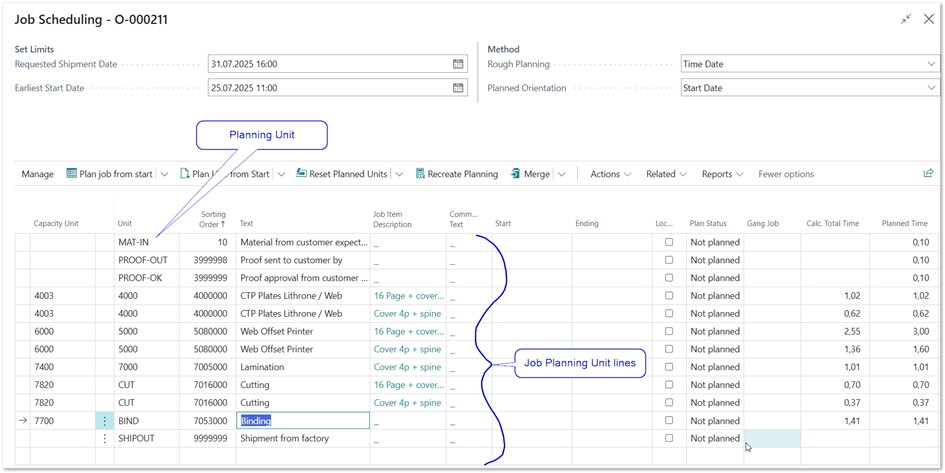
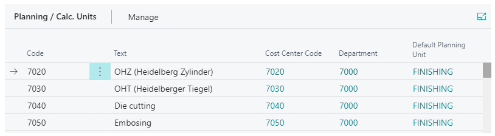
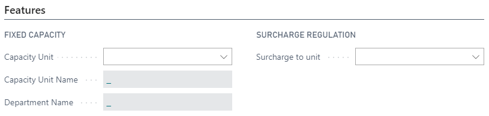
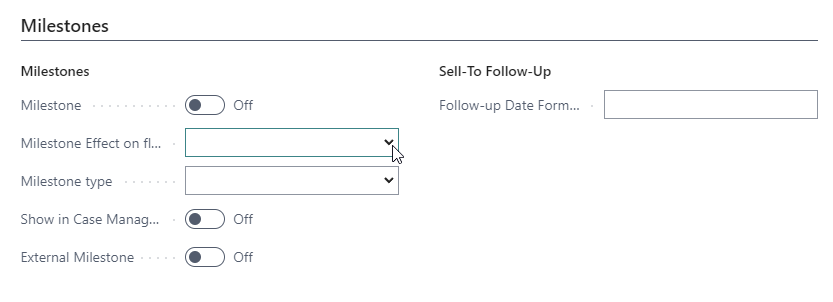
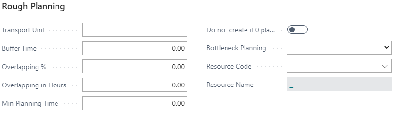
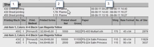
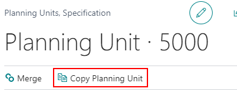
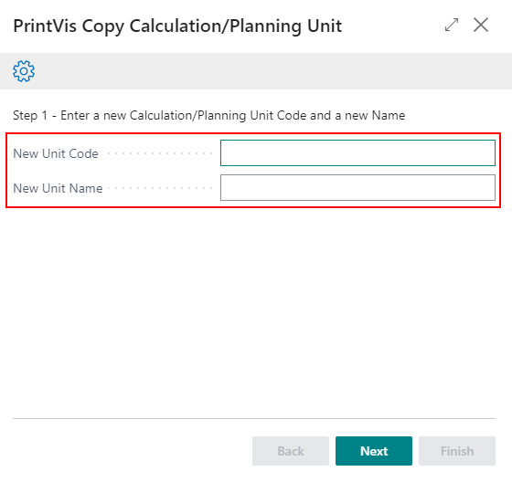
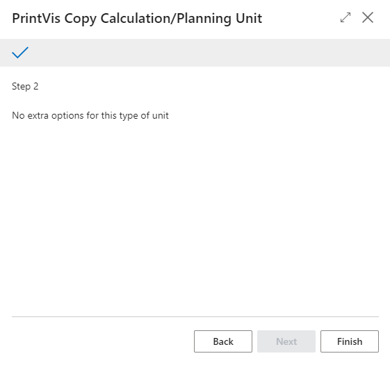

# Planning Units

## Capacity Unit vs. Planning Unit

The difference between a **capacity unit** and a **planning unit** can be confusing at first. When adjusting setup or behavior, it’s important to understand **where a parameter belongs**—some settings apply to the physical capacity, while others control how work is scheduled. Although there can be some overlap, the sections below describe the core responsibility of each unit.

### Capacity Unit

A **capacity unit** represents a **physical resource** —such as a machine, workplace, or production line—and defines **when and how that resource is available** for scheduling.

It controls:

- **Availability and opening hours** via the capacity calendar  
- **Planned downtime**, such as maintenance or non-production periods  
- **Blocked or reserved capacity**, including placeholders for future work  

Placeholders can automatically reserve time based on order attributes, such as:
- Customer  
- Product group  
- Order parameters  
- Any combination of the above  

A capacity unit typically has a **1:1 relationship with a cost center**, but in some cases multiple cost centers may share the same physical capacity.

In short, the capacity unit answers the question:  
**“When is this machine or workplace available to do work?”**

### Planning Unit

A **planning unit** represents a **scheduled piece of work** —a task that needs to be placed on a capacity unit’s calendar.

A planning unit:

- Is linked to a **calculation unit or calculation detail line**  
- Receives the **calculated time** from the calculation  
- Applies **efficiency factors** from the capacity to determine the **planned time**  
- Is scheduled with:
  - A start and end time  
  - Predecessors and successors (process sequence)  
  - Optional buffer time or overlap rules  

Planning units also define **task behavior**, such as:
- Whether a waiting period (buffer) is required between tasks  
- Whether tasks are allowed to overlap (e.g., a successor can start before the predecessor is fully completed)

There is **no strict 1:1 relationship** between planning units and calculation units. In theory, a company could operate with a single planning unit. However, in practice it is recommended to have:

- At least **one planning unit per department**, especially when task completion should trigger status changes (for example, Printing → Finishing)  
- Additional planning units when different cost centers require distinct scheduling or status behavior  

In short, the planning unit answers the question:  
**“What work needs to be scheduled, and how does it relate to other tasks?”**

### Conclusion

A simple way to visualize the relationship is:

- The **planning unit** is the **piece of work time** derived from calculations.  
- The **capacity unit** provides the **available calendar space** where that work can be scheduled.  

Planning units carry dependencies (for example, plates must be completed before printing can start), and those dependencies determine **where and when** the required time can be placed within the capacity unit’s available hours.

Together, they ensure that calculated work is scheduled realistically on the physical resources that perform it.

## General

| Field                        | Description                                                                                                                   |
|------------------------------|-------------------------------------------------------------------------------------------------------------------------------|
| Code                         | Planning Unit Code                                                                                                            |
| Text                         | Planning Unit text (description)                                                                                               |
| Planning Text                | Default: Takes the Planning Unit text value.  First Calc. Unit: Takes the text from the first calculation unit which is included in this planning unit.  First Sub Contracting Line: Takes the text from the first line with Sub Contracting = Yes in the calculation units included in this planning unit.  Capacity Unit: Takes the Capacity Unit name from the Capacity Unit used on the planning line. |
| Specification                | How the planning unit should react to the calculation units which are placed in the setup and found in the estimation for which to make planning. Options are:  Process and sheet  Merge Processes  Merge Sheets  No Merge  Merge Sheet + Residual Sheet  Merge Sheet Type  Specify sheet/widths  Calculate estimated time |
|                              | This field is mainly aimed at the complex estimation/planning in Newspaper print or bindery machines where several processes on the same machine must be calculated/priced individually but take place at the same time.  Normal setting under all other circumstances would be Add all, meaning that several calculation units with individual time makes a total of planned time. |
|                              | Options are:  Add all  Longest Price Unit  Longest Process                                                             |
| Status Code                  | This field is used to assist the automatically progress of status codes, driven from production. The value helps generate the field Next Status on the case card.  Remember:  If this function is used, there should be a status code for production steps you want to differentiate.  All planning units should have a status code.  The status code must be describing the current stage (planning unit PRINT gets status code PRINT)  This must be set before system go-live  Changes in the setup must be manually changed on all planning units on orders and all templates.  See separate article: “Planning Unit Status Code” |
|                              | Note: If the status changes have included auto material posting  A Time Registration user cannot change the status in Shop Floor via button "Completed" if this change makes the automatic material booking.  An extra status should be added, e.g.  Ready for production - if the booking is made at the start of production or  Confirmation of production is finished - when the booking is made at the end.  This status code change can only be made by a user authorized for material booking. |
| Sorting Order                | With this field, an alternative Sorting Order can be entered. If no sorting order is defined, the lists will be ordered by the default primary key order.  With this field, you can place milestones in between calculation unit generated planning units. |
| Unit of Measure              | This field is used if (in rare cases) we want to track and monitor the progress on planning unit.  i.e., printing planning unit: We insert a unit of measure called PROD (for active production time). This unit is one which the shop floor people can post time on.  This setting will allow the system to monitor how much total time was posted so far on PROD. |
| Canceled                     | Mark a unit canceled because it can’t be deleted once it is in the data set. When canceled, this unit will still appear in copies which include planning.  A planning unit will typically replace this one on the calculation units so as new orders get the new planning unit.  If the machine is taken out of production, one must also cancel the use of the calculation units, etc. Alternatively, use the Merge function to merge this unit into a newer or different planning unit. |
| List of Units                | List of units is a list of planning units which are typically marked as milestones.  This list is referred to on each Product Group setup card and determines which milestones should come on the plan for this Product Group (in many cases, the same list).  Milestones appear at the stage of Planning = Yes on the case card. |
| Hide in production Plan      | Tick this field if you do not want this unit to appear in the actual production plans as something which needs to be planned or monitored.  This is often the case for Milestones or less important planning units which may be OK on the case fine planning, but not to be present in the Production Plan window.  This setting is also recommended for planning units that are milestones and planned time = 0. |
| Hide in Shop Floor Production Plan | Tick this field if you do not want this unit to appear in the actual Shop Floor Production Plans as something which needs to be planned or monitored.  This is often the case for Milestones or less important planning units which may be OK on the case fine planning, but not to be present in the Shop Floor Production Plan window.  This setting is also recommended for planning units that are milestones and planned time = 0. |

### Details about the "Specification" options

The setting in the Specification field will affect in which way job planning unit lines will be created from calculation units in the estimation. Depending on the machine type or department, different settings could be useful to display separate or merge calculation unit lines for the scheduling.

A “job planning unit line” is an individual line on the job scheduling page for a PrintVis job.

Prerequisites for creating a job planning unit line is that the calculation unit is assigned to a planning unit and the related cost center/configuration is connected to a capacity unit.

It is very common to setup individual planning units per department or machine group. Also individual planning units per capacity could be necessary depending on the scheduling requirements.

**Process and sheet**

Job planning unit lines will be created per capacity and sheet id. 

For example, a press with several surcharges that has the same capacity and process as the press would create one job planning unit line, if surcharges are setup to get the same process no. as the press.

This is the default setting for the specification field and useful for most print and finishing processes.

**Merge Processes**

Calculated time will be merged into one job planning unit line per Sheet ID and capacity. 

For example, if the same calculation unit in the finishing department is used more than once in the estimation for the same sheet, only one job planning unit line will be created for total time.

**Merge Sheets**

Calculated time will be merged for all sheets into one job planning unit line per capacity. 

For example, if in the finishing department on a machine only one job planning unit line for all sheets should be displayed.

**No Merge**

For each line of calculation units in the estimation a planning is created.

For example in the admin or prepress department, a calculation unit like “Customer meeting” is used more than once, because more than one customer meeting is expected, then a job planning unit line for each customer meeting is created and can be scheduled individually.

**Merge Sheet + Residual Sheet**

The total calculated time for a “main” and its “residual” sheets will be merged into one planning unit line only for the first capacity. This also happens if the sheets are produced with different machines/capacities.

This option is for special use and it is important to use an individual planning unit for the calculation units that must the grouped/merged, because this option is merging over capacities.

**Merge Sheet Type**

The total calculated time is merged in one job planning unit line per capacity and component type. 

Example: All sheets with Component type TEXT with be merged.

**Specify sheets/widths**

Same logic as the “Process and sheet” option, but if a sheet is No. of sheet sets>1, a job planning unit line is created for each set of the sheet and the total time is divided by the number of sheet sets for each line.

Example: A sheet has a 16pages imposition and the pages for this PrintVis sheet has 48 pages, PrintVis calculates sheet sets=3 for this (3x 16p pages on 1 PrintVis sheet). In this case 3 job planning unit lines are created.

## Planning / Calc. Units

Displays selected Calculation Units/milestones for this Planning Unit.

| Button              | Description                |
|---------------------|----------------------------|
| + Calculation Unit  | Add a Calculation Unit     |
| - Calculation Unit  | Remove a Calculation Unit  |

## Features

| Field               | Description                                                                 |
|---------------------|-----------------------------------------------------------------------------|
| Capacity Unit       | Link for a planning unit which is NOT from estimation to a certain capacity. Used very rarely, i.e., for service on machines. |
| Capacity Unit Name  | Derived from Capacity Unit                                                  |
| Department Name     | Derived from Capacity Unit                                                  |
| Surcharge to unit   | If this planning unit is a surcharge to another unit, the base unit is pointed out here. Used if surcharge units should have separate planning. Normally the calculation unit setting will ensure 1 planning unit. |

## Milestones

| Field                     | Description                                                                                                                                                        |
|---------------------------|--------------------------------------------------------------------------------------------------------------------------------------------------------------------|
| Milestone                 | Mark this Unit as a milestone.  Not always from estimation  Marked with bold in the fine plan  Important production steps (like paper in house)  Can be displayed as column in Production plan  Can be marked and included in printed production plan to customer |
| Milestone Effect on flow  | Available options:  <b><i><BLANK Option></i></b>  Units after this  Units before this  No Impact   If the blank option is chosen, the Milestone has impact on units before and units after this milestone, meaning this milestone has to wait until a predecessor is finished and a successor needs to wait for this milestone. This will also be visualized in the process flow diagram with links to the predecessor and successor.   Units after this:  This Milestone has impact on a successor which needs to wait for this milestone. This will be visualized in the process flow diagram with links to the successor only.   Units before this:  This Milestone has impact on a predecessor and this milestone waits for the predecessor. This will be visualized in the process flow diagram with links to the predecessor only.   No Impact:  This Milestone has no impact on other planning units. This will be visualized in the process flow diagram that this milestone is not linked to any other planning unit. |
| Milestone type            | This is used in JDF/JMF communication. If a workflow partner is sending a milestone update via JMF, the related planning unit with the given type could be set to started=true or completed=true.  Set the Milestone type as:  Approval  Paper  Plates Print  PostPress  Shipment Accepted  BindingCompleted  BindingInProgress  Delivered  DeviceStopped  DigitalArtArrived  JobCompletedSuccessfully  JobCompletedWithErrors  JobCompletedWithWarnings  JobInProgress  PageApproved  PageCompleted  PageDeleted  PagePlanned  PagePreliminary  PageProofed  PDLProduced  PostPressCompleted  PostPressInProgress  PrePressCompleted  PrePressInProgress  PressCompleted  PressInProgress  ProofSent  ShippingCompleted  ShippingInProgress  SurfaceApproved  SurfaceAssigned  SurfaceCompleted  SurfaceProofed  PreflightError  PreflightOK |
| Show in Case Management List | Creates a column in the case management view with this planning unit.  Must also be a milestone.  Shows when filter setting on case mgmt. view is set to Milestone. |
| External Milestone        | Mark the milestone as an external milestone.  Displays the naming to be presented to the customer, if the unit is marked not only as Milestone, but also as External Milestone.  This field is used for special reports (no standard reports use this). |
| Follow-up Date Formula    | Displays the calculated Follow-Up date from the settings on the Capacity Unit.  A follow-up date can be to follow up with the customer one day prior to when the files are supposed to be delivered, to ensure this actually happens. |

## Rough Planning

| Field                | Description                                                                                                                                                         |
|----------------------|---------------------------------------------------------------------------------------------------------------------------------------------------------------------|
| Transport Unit       | If a Transport code is entered for a Unit, the Code is displayed to indicate that Transport time must be accounted for.  Transport time could be to allow drying prior to Finishing operations, or, when using a Sub-Contractor, it could be the physical transport from your plant to the sub-contractor. |
| Buffer Time          | Buffer Time indicates some 'stand still' time between one unit and the next, i.e. drying time after printing.  Buffer time will often be set to allow drying of inks and varnish, or drying and hardening of Hotmelt Glue before you can finalize the product.  Please note: If Buffer Time is set, the next planning unit will not start earlier than the actual planning unit. --> Actual "Ending" time + Buffer Time. |
| Overlapping %        | If the Capacity Unit is set with an allowed Overlapping %, this percentage is displayed.  Overlapping will often be allowed on large Print-Runs, where you may start the finishing processes when X% of the prints are done, as you will then finish the print before the finishing 'needs' the remaining %.  Please note: If Overlapping is set, the actual planning unit will start earlier than "Ending" time of the planning unit before! |
| Overlapping in Hours | If the Capacity Unit is set with allowed Overlapping Hours, this No. of Hours is displayed.  Overlapping will often be allowed on large Print-Runs, where you may start the finishing processes when the allowed No. of Hours is left on the Press, to still allow the final prints to be finished when needed on the following process.  Please note: If Overlapping is set, the actual planning unit will start earlier than "Ending" time of the planning unit before! |
| Min. Planning Time   | If the system must split some planned time, related to the opening hours, this is the minimum planning time for the parts.                                           |
| Do not create if 0 planned time | If the calculated time (planning time) = 0, this unit will not be shown in the planning list.                                                        |
| Bottleneck Planning  | See separate article at this portal                                                                                                                                 |
| Resource Code        | Points the planning unit on orders to a specific employee or resource.  Example: specific prepress work  Used for production planning for people instead of machines. |
| Resource Name        | Show the name of the selected Resource                                                                                                                                 |

## Print Control

| Field                   | Description                                                                                      |
|-------------------------|--------------------------------------------------------------------------------------------------|
| Show Unit on Job Ticket | Used in our standard job ticket report.                                                         |
| Show Time on Job Ticket | Used in our standard job ticket report.                                                         |
| Show start/stop on Job Ticket | Used in our standard job ticket report.                                                     |
| Show Unit               | For use on special reports – no current standard reports link here, see picture below.                             |
| Show Time               | For use on special reports – no current standard reports link here.                             |
| Show start/stop         | For use on special reports – no current standard reports link here.                             |
| Show in Quote           | For use on special reports – no current standard reports link here.                             |
                                                                                            |

## Copy Planning Unit/List of Planning Units

It is possible to copy a Planning Unit or List of Planning Units instead of setting one up from scratch. 

1. Enter a new unit code and unit name for the Planning Unit or List of Units, then click next.

2. A page with no extra options will appear; just click Finish to create the new unit(s).
3. All settings will be copied from the original Planning Unit/List of Units, and you just need to add the Calculation Units and make any changes necessary.

