# Production Planning

## Introduction

Planning units are generated by the system once a job reaches a status that allows scheduling. These planning units translate calculation units and relate to specific machines, referred to as Capacities. In the estimating section, machines (and other units) are termed Cost Centers. Planning units are created according to the rules defined in the setup, specifically on the Capacity Unit card.

There are numerous preferences for planning, and PrintVis provides a series of tools that planners should familiarize themselves with. These tools form the basis for choosing methods that suit the organization, machine park, and specific situations.

The **Production Plan** page is a scheduling tool within PrintVis that offers a detailed overview of each planning unit. The **Planning Board** is another useful tool, providing a visual representation of the same planning units. Both tools share functionality, such as Auto Scheduling, Inbox view, scheduled view, filtering of days, etc. This allows the scheduler or planner to choose either page (or switch between them) without losing functionality.

## Page Filter

The entire Production Plan page can be filtered based on:

- Date filter
- Capacity unit
- Department
- Capacity group

To access this filter, click "Filter" in the top menu. 

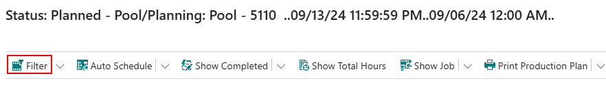

This action opens the Production Plan Setup (or filtering) window, which is user-specific. Other users will not be affected by these settings and can customize their own filtering options.

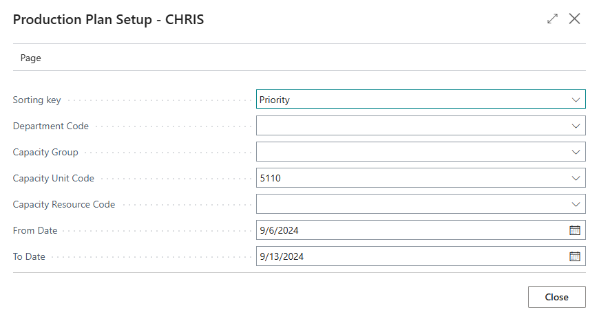

| Field                   | Description                                                                                         |
|-------------------------|-----------------------------------------------------------------------------------------------------|
| **Sorting Key**         | Determines the sorting of planning units in the top section. Options: Optional, Priority, Manning, ID, Start Date, Order No. |
| **Department Code**     | Filters visible capacity units based on the entered department. Leave blank to show all departments. |
| **Capacity Group**      | Filters visible capacity units based on the entered capacity group. Leave blank to show all groups. |
| **Capacity Unit Code**  | Filters visible capacity units based on the entered capacity unit. Leave blank to show all units.  |
| **Capacity Resource Code** | Filters visible capacity units based on the entered capacity resource code. Leave blank to show all. |
| **From Date**           | Starting date for visible planning units on the page.                                              |
| **To Date**             | Ending date for visible planning units on the page.                                                |

It is recommended to enter either a department, capacity group, or capacity unit for filtering. Leaving all three fields blank will show all capacity units, making it difficult to visualize the schedule.

## Planning Windows

The Production Plan page is divided into two sections:

1. **Top Section**: This section includes filtering options such as Show Completed, Show Planned, Show Completed and Planned, and Show Not Planned. This section is marked in purple in the accompanying screenshot.
   
2. **Bottom Section**: This section features additional filtering capabilities, such as Show Job and Show Inbox, and is marked in blue.

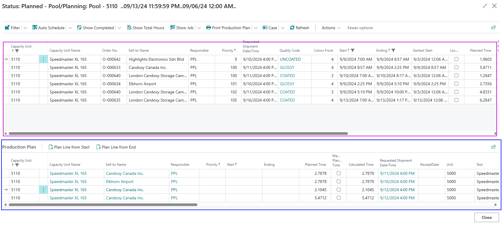

### Top Section

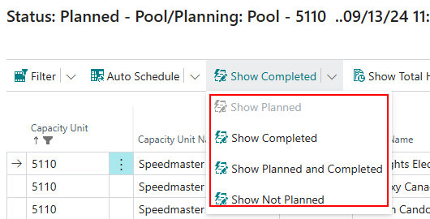

- **Show Planned**: Filters to show only planning units that have been planned.
- **Show Completed**: Filters to show only planning units that have been completed.
- **Show Planned and Completed**: Filters to show planning units based on them being planned or completed.
- **Show Not Planned**: Filters to show only planning units that have not been completed.

The selected filter will appear grayed out. 

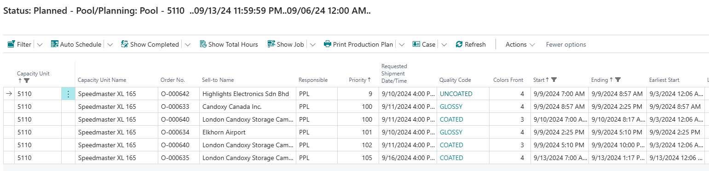

### Bottom Section

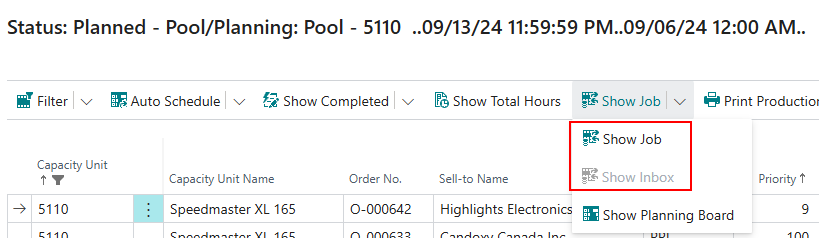

- **Show Job**: Displays the rest of the job based on the selected planning unit in the top section.
- **Show Inbox**: Displays the inbox (not planned planning units).

The selected filter will also appear grayed out in this section.

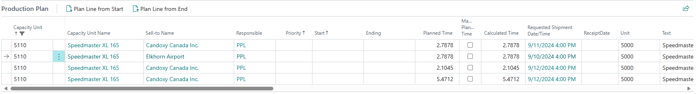

### Field Sorting/Filtering

Most fields on the Production Plan page can be sorted. To initiate sorting/filtering:

1. Locate the field you want to sort.
2. Click the down arrow next to the field caption to open sorting options.

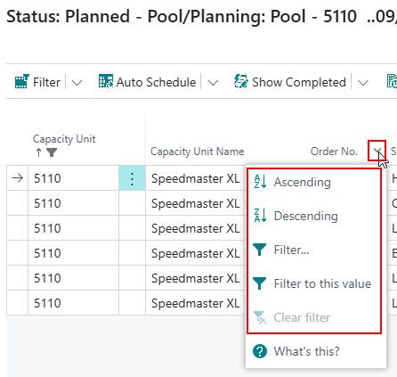

 Sorting Options

- **Ascending**: Sort planning units in increasing order (alphabetically or numerically).
- **Descending**: Sort planning units in decreasing order (alphabetically or numerically).
- **Filter...**: Opens a window to enter/select a value to filter.
- **Filter to this value**: Filters out planning units that do not match the selected value.
- **Clear Filter**: Clears any applied filters.

### View Filtering

In the top menu, there’s an option to view what filters are set on the page. 

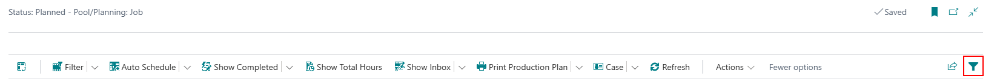

Selecting this function opens the "Filters" tab on the left side of the page, where you can:

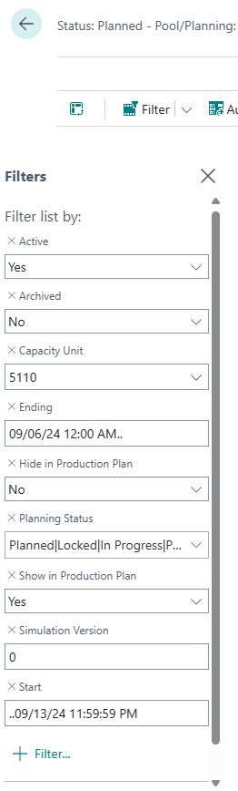

- View, edit, add, or delete filtering options.
- To edit, select the specific field and make changes.
- To add, click "+ Filter" and select the new filtering option and value.
- To delete, click the "x" next to the field name.

### Capacity Statistics

To access the Capacity Statistics page, select **Actions -> Capacity Statistics** from the top menu. 

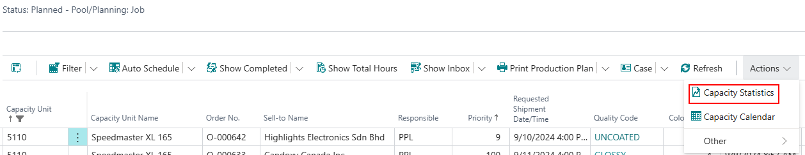

This page displays the relationship between capacity and planning for each machine on the shop floor, focusing on daily or weekly views. The filter allows concentration on specific capacity groups, providing an overview of planning, particularly useful for 3-4 weeks ahead.

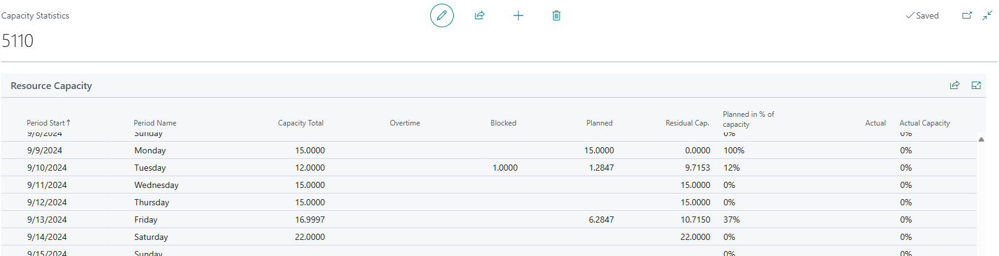

At the bottom of the Capacity Statistics page, options to show detail lines based on day, week, month, quarter, year, or accounting period are available, allowing for preferred viewing of detail lines.

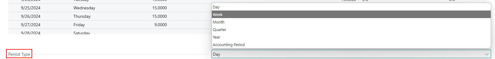

### Capacity Calendar

To view the Capacity Calendar for a specific capacity unit, select the unit on the Production Plan page and then go to **Actions -> Capacity Calendar**. 

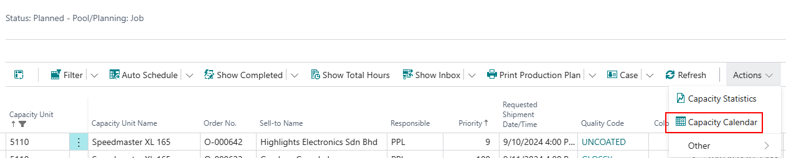

This will open the Capacity Calendar Entries page for the selected unit, where you can adjust the Time From and Time To.

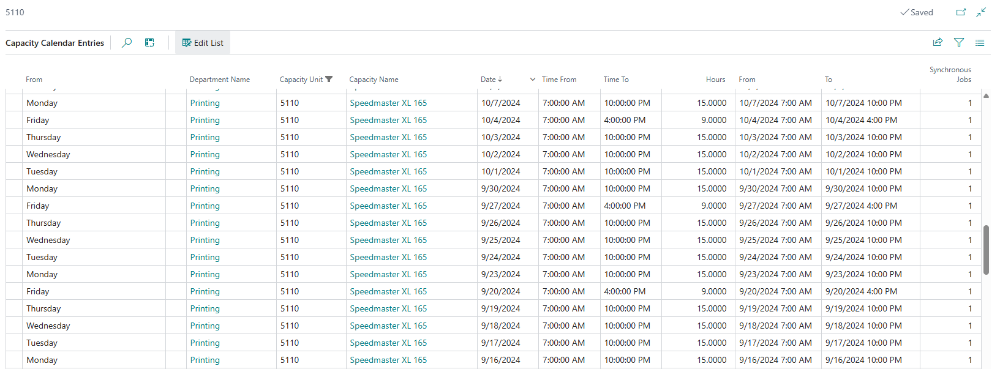

Example Adjustments

- If there is no second shift on Friday (ending at 2 PM), but a rush job requires extending to 10 PM, adjust the Time To to 10 PM.

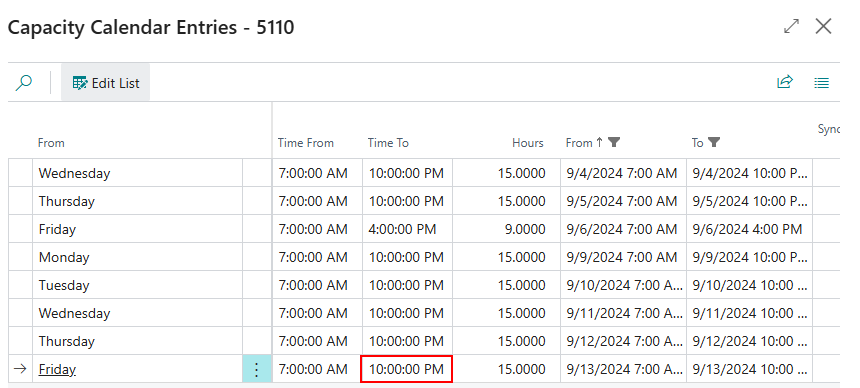

- It is also possible to change times that extend across days, such as adding overtime or an additional shift by adjusting the "To" field to the next day.

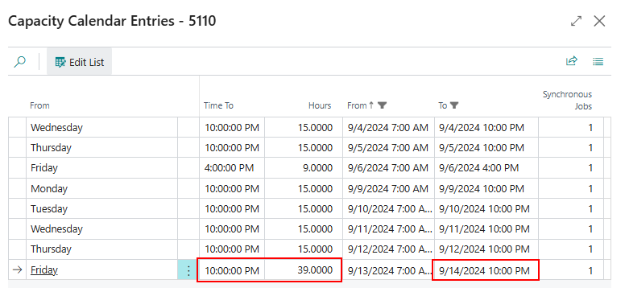

### Auto Schedule

Just like on the Planning Board, you can use Auto Scheduling on the Production Plan page. To do this, select the Auto Schedule function in the top menu.

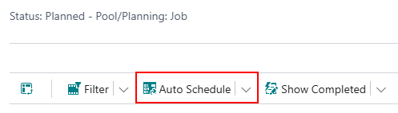

This opens the Auto Scheduling page, where you can select and run auto scheduling scenarios. The editable fields on this page are "Start Date Formula" and "End Date Formula," allowing you to determine which planning units the auto schedule applies to. For adjustments to other fields, visit the Auto Schedule Setup page.

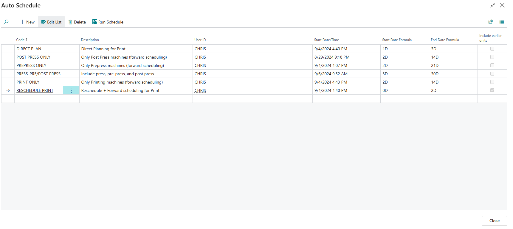

For more information on auto schedule setup or scenarios, please refer to the corresponding pages.
