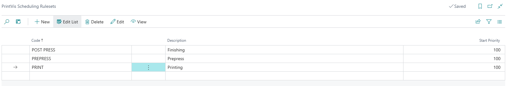
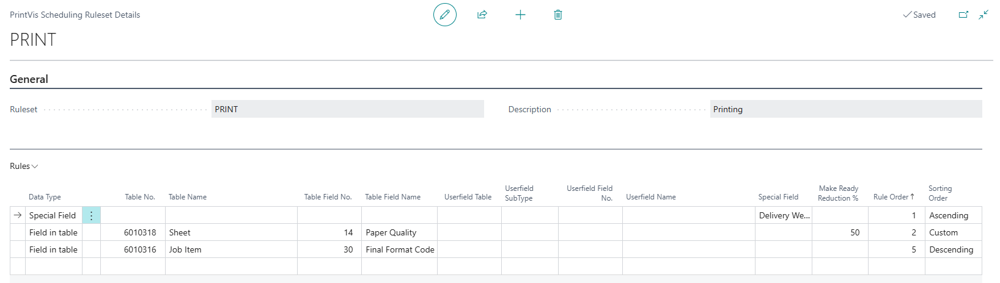
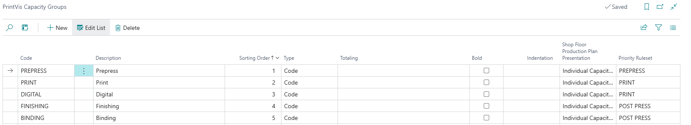

# Ruleset Setup

## Ruleset Setup

Rulesets can be set up for two primary reasons:
1. **Auto Scheduling for Specific Capacity Units**: This allows companies with few cost centers to utilize priority/sorting of planning units without a full auto-scheduling setup.
2. **Auto Scheduling for Multiple Capacity Units**: This enables scheduling multiple or all capacity units quickly.

### PrintVis Scheduling Ruleset

The initial step in setting up auto scheduling involves creating PrintVis Scheduling Rulesets. This page allows for different sorting configurations based on the needs of various cost center groups. Each line includes its own sorting details.

| Field               | Description                                                                                       |
|---------------------|---------------------------------------------------------------------------------------------------|
| **Code**            | Enter a code for scheduling rulesets.                                                             |
| **Description**     | Enter a description to clarify the purpose of the ruleset.                                       |
| **Start Priority**  | Enter a starting priority number for auto scheduling. A higher number (e.g., 50 or 100) allows for case-level priority while still using auto scheduling. |

 Next Step

Set up PrintVis Scheduling Ruleset Details.

#### PrintVis Scheduling Ruleset Details

Clicking "Edit" opens the PrintVis Scheduling Ruleset Details for the selected ruleset. Here, users can define sorting levels and determine which fields/information to group/prioritize.

 Example Sorting Levels

1. **Delivery Week (Rule Order 1)**: Primary sorting criterion.
2. **Paper Quality (Rule Order 2)**: Secondary sorting for planning lines with the same delivery week.
3. **Final Format Code (Rule Order 5)**: Tertiary sorting for lines with the same delivery week and paper quality.
4. **Case ID**: Final sorting level if all prior levels are identical.

| Field                      | Description                                                                                      |
|----------------------------|--------------------------------------------------------------------------------------------------|
| **Data Type**              | Select the type of table for the detail line (Field in table, Userfield, Special Field).        |
| **Table No.**              | Select the specific table to use when Data Type is "Field in table."                           |
| **Table Name**             | Auto-populated based on the selected table number.                                             |
| **Table Field No.**        | Select the field for the detail line from the displayed list based on the selected table.      |
| **Table Field Name**       | Auto-populated based on the selected field number.                                             |
| **Userfield Table**        | Select a specific table when Data Type is "Userfield."                                         |
| **Userfield SubType**      | Default is the first subtype; for jobs and calculation units, it can be 1 or 2.                |
| **Userfield No.**          | Select the userfield for the detail line.                                                       |
| **Userfield Name**         | Auto-populated based on the selected userfield number.                                         |
| **Special Field**          | Options for grouping rules based on earliest start or delivery dates.                           |
| **Make Ready Reduction %**  | A percentage used to reduce make ready when planning units are grouped by the rule.            |
| **Rule Order**             | The order of processing for grouping/sorting planning units (suggest multiples of 5 for easy expansion). |
| **Sorting Order**          | Sorting options: ascending, descending, or custom. For custom, specify order with the provided interface. |

 Assigning Rulesets to Capacity Groups

Now that the PrintVis Scheduling Rulesets are created, they need to be linked to a Capacity Group.

### PrintVis Capacity Group

This section discusses the PrintVis Capacity Group in relation to Auto Scheduling functionality. For detailed information on PrintVis Capacity Groups, refer to the Capacity Group article.

 Key Fields

- **Priority Ruleset**: Select the Scheduling Ruleset to assign to the Capacity Group. Capacity Units in this group will connect to the rulesets. Leave this field blank for groups that should not auto-schedule.

 Final Steps

Once the connection between Capacity Units and Scheduling Rulesets is established, you can use the "Auto Schedule Unit" and/or "Auto Schedule from Here" functions. For auto scheduling routines, refer to the Auto Schedule Setup article.
