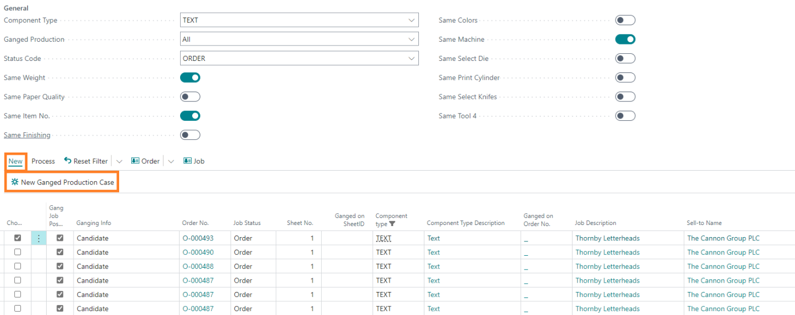
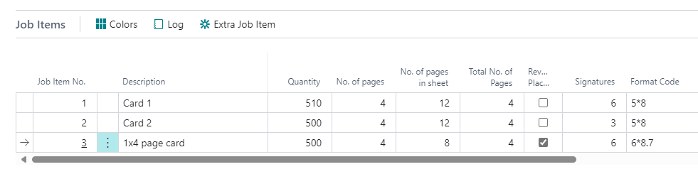

# Sheet Ganging in PrintVis

## Introduction

This article will summarize the sheet ganging functionality and replace all existing documentation about this topic.

For a long time, PrintVis has allowed for ganging customer orders, meaning different orders from one or more customers can be produced on combined sheet(s). This functionality has now been improved. The Sheet Ganging screen is designed for planners, allowing them to display confirmed customer orders ready for scheduling. Quotes are not displayed to the planner.

To optimize production, one or more job items from these individual orders can be merged into a new production order, if possible, based on their required specifications and print substrate quality and weight. This new production order will be regarded as an internal order; the customer will not be aware of it.

**Please note:**

The new combined production order will consider the scrap and minimum quantity needed for each single product on the combined sheet. Consequently, some items may have overproduction, but the number of printed sheets is calculated based on the quantities of each job item.

All costs of the production order will be split between the individual orders, ensuring that the total cost of the new production order is always zero. This approach guarantees it will never be invoiced, and job costing and profit must be controlled per individual order.

For scheduling, the planning units on the individual orders will be set to time = 0 for the tasks scheduled on the new combined production order.

For the setup of combined sheet templates, please refer to the article: “Enhanced Functionality to Split Sheets (Combined Sheets)” or its successor.

## Setup for Ganged Production

The main setup for ganging individual orders into combined production orders must be done in the PrintVis General Setup. Here is a typical setup as an example:

### Description of the Available Setup Fields

- **Gang Job Template:**  
  This is the case ID of the template for the header of the new combined order. When creating a new combined production order, PrintVis will copy all data from the case (not job, etc.).

  *Example of the template case:*

  The customer is not the real debtor, only an internal customer for this kind of production. The Order Type and Product Group will be copied to the new combined production order. The job name will be copied, and the order numbers of the individual orders will be added to the new combined order’s job name. For example, if order no. O-003, O-005, and O-012 are combined, the job name will appear as: “Combined prod. of: O-003/ O-005/ O-012.”

- **Special Product Groups:**  
  It is recommended to use special product groups (single sheet or brochure type) for better overview, filtering on reports/statistics, and because the items you combine may have different Product Groups. Using neutral ones is advisable.

- **Gang Job Status Code:**  
  This is the status for the new combined production, which can be used to filter for scheduling or to assign to a responsible person to check technical aspects.

- **Gang Job Milestone:**  
  This is a milestone that will be added to the planning.

- **Gang Job Order Type:**  
  The Gang Job Order Type is relevant for different topics. PrintVis filters on cases of this Order Type to find jobs set as templates, which will be suggested when creating new combined Production Orders. This means it will not only filter for job templates on the case setup in the field “Gang Job Template.” The Order Type can also be used for a special Status Code Workflow, which does not go through invoicing, and can serve as a special filter for custom statistics/analysis.

- **Gang Job Cost Allocation:**  
  All costs posted to the combined production order (time recordings, item consumption, and subcontracting invoices) will be split between the individual orders, ensuring that the total cost of the new production order is always zero. Options are:
  - **Equal:** The cost will be split equally between all individual orders.
  - **Proportion of Sheet:** The cost will be split based on the proportion of space each order takes on the sheet.
  - **Index:** The cost will be split based on an individual index that can be entered manually on each order.

### Setup of Job Templates

It is not mandatory to have job templates with job items that are already sharing a sheet, but it can be very useful if the standard is to be reused, making the creation of combined production orders easier.

 Mandatory Settings for Job Templates:

- The order type on the case must equal the “Gang Job Order Type” set in the PrintVis General Setup.
- Job templates must have the setting “Template = Yes” on each job.

It is recommended to store all combined sheet templates under just one case ID for easier data maintenance, though this is technically not required.

Please add a meaningful external description to each template job. The external description is displayed when creating combined production orders.

*Example:*

To set up sheets with more than one job item, please refer to the article “Enhanced Functionality to Split Sheets (Combined Sheets) PrintVis 2017” or its successor.

## Preparing Job Items for Sheet Ganging on Combined Production Orders

On each job item, the following fields are available. Some might not be displayed due to the setup or order type:

 Job Items on an Individual Order:

 Job Items on a Combined Production Order:

- **Gang Job Possible:**  
  This field is available on Job Items and on the Sheet Match Maker Page (Sheet Ganging). Only job items with the setting “Gang Job Possible=Yes” can be used to create a combined production order. The estimator can set this already if it makes sense to use such job items in a ganged production. The planner can filter on those job items and select more using the same field.

- **Ganging Info:**  
  This field is not editable and displays information about the ganging status of this job item. Options are:
  - **Candidate:** The Job Item is selected to be a candidate for combined sheet production.
  - **Ganged on Order:** If this job item is already part of a combined production order, this field will display the status “Ganged on Order.”
  - **Ganged Job:** On a job item of a combined production order, the status of this field is “Ganged Job.”

- **Ganged on SheetID:**  
  If this job item is already part of a combined production order, this field displays the SheetID of the combined production order.

- **Ganged from SheetID:**  
  On a job item of a combined production order, this field displays the SheetID of the individual customer order.

- **Ganged Cost Index:**  
  This field is only available for a job item of a combined production order and if the field in the PrintVis General Setup “Gang Job Cost Allocation” is set to Index. It displays the Index to calculate the cost split from:

  *Example:*

  - Sheet 1: Index = 100
  - Sheet 2: Index = 100
  - Sheet 3: Index = 50

  The sum of the index in this case is 250. The total cost will be posted to the individual orders of the specific job item. The split percentage is calculated as follows:
  - Sheet 1: Index = 100: Index Sum = 250: 100/250 = 0.4 → 40%
  - Sheet 2: Index = 100: Index Sum = 250: 100/250 = 0.4 → 40%
  - Sheet 3: Index = 50: Index Sum = 250: 50/250 = 0.2 → 20%

Some of these fields are also available on the Sheet Match Maker page (Sheet Ganging Screen).

## Creating Combined Production Orders on the Sheet Match Maker Page

In the filtering area, the planner can find all job items suitable for combined production. Possible filters include:

- **Sheet Type / Component Type:**  
  Select the types of sheets/components to filter on, including tools.

- **Ganged Production:**  
  This filter is based on the status of the job items. Options are:
  - **All:** The page displays all job items based on the other filters that are set.
  - **Not Ganged Production:** The page displays all job items that are not part of the combined production and are not yet “candidates” (Gang Job Possible = Yes).
  - **Ganged Production not Matched:** The page displays only job items that are “candidates” (Gang Job Possible = Yes).
  - **Ganged Production Matched:** The page displays only job items that are already part of a combined production order.
  - **Ganged Production All:** The page displays job items that are “candidates” and already part of a combined production order.

- **Status Code:**  
  Select or enter the status code of cases from which the job item should be displayed. Multiple statuses can be filtered using the “or” sign (|). Example: `ORDER|PLAN`.

## Workflow for Selecting Job Items and Ganging Them in a New Combined Production Order

After selecting a job item for combined production (activate it by setting the field “Choose = Yes”), job items need to be found that fit the parameters for the selected job items. Available filters include:
- Same Weight
- Paper Quality
- Paper Item No.
- Finishing Type
- Colors

These filters will show job items with the same specifications.

Select the job item to be ganged with the first selected item. For details, click on “Order” or “Job” to open the case or job card of the related individual order.

Once the selection is complete, press the button **New Ganged Production Case**. A window will open to display all template jobs with job items on a sheet equal to the number of job items selected for ganging.

If, for example, 2 job items are chosen for ganging, all templates that include 2 job items on a sheet will be displayed. If no template matches the number of selected job items, all templates will be displayed.

Press:
- **Cancel:** Create the new combined production order without a template. A new case will be created, but the sheet partitioning must be reviewed manually.
- **OK:** Use the selected template. If there are more job items selected than available on the template, these job items will be added to the new combined production order, but the sheet partitioning must still be reviewed manually.

A new combined production order will be created. The order number of the individual order will be displayed in light grey, and the number of the combined production order will appear in the field **Ganged on Order No.** In this example, the new order number is O-000501 and the combined SheetID is 3426.

 Ganged Order: Field Transfer from Individual Orders

Several fields are transferred from the individual order to the ganged sheet, while others are intentionally excluded.

 Fields Transferred from the Individual Order (if values exist)

- Quantity  
- Scrap (if required for final finishing on the individual order)
- Item No.
- Component Type
- Description
- Pages
- Colors (Front/Back)
- Job Item Format
- Conjugate Width/Length
- Paper/Substrate Quality Code
- Paper Weight/Unit
- Finishing
- Tool (1)–4
- Imposition Type
- Screening Parameter
- Plate Changes

> **Note:** Additional scrap quantity will be added to the first line.

 Fields Not Transferred

- Paper Item No.  
  _A larger print format on the larger press is often used for a gang sheet in order to combine more jobs on one sheet._

- List of Units  
  _A larger print format on the larger press is often used for a gang sheet in order to combine more jobs on one sheet._

- Any sheet-related finishing in the estimate from the ganged sheet

 Effect on the Individual Order for a Ganged Sheet

Values from the ganged sheet are not available for production in the individual order. The following functionalities will **not** display information from the ganged sheet:

- **Material Requirements**
- **Auto Job Costing**
- **Job Scheduling**
- **Planning Units**  
  _Planning units are displayed, but planned time = 0. These can be used to block time for ganged order production in the individual order to allow correct final finishing scheduling._

> **Important:** Dates must be set manually and will not be transferred from the ganged order, as there may not be a 1:1 relationship.

- **Job Ticket**  
  _The job ticket will not display info for the ganged sheet._

## Adding Additional Job Items to Combined Production Orders

When opening the Job Card of a combined production order, the included job items will be displayed. To add another job item, click on **Action** → **Extra Job Item**. A new job item on the existing sheet will be created. Click on the assist button in the field **Ganged from SheetID** to find and select another job item.

The Sheet Match Maker/Ganging Page will open. Select the job item to be added to the existing combined production order and click **OK**.

The new job item will now be added to the combined sheet, and the job name of the Combined Production Order will be updated accordingly.

Since the sheet was shared between the first two job items, review and modify the combined sheet as necessary. Please refer to the article “Enhanced Combined Sheet Functionality in PrintVis" for guidance.

## Canceling/Deleting Job Items from Combined Production Orders

To delete a job item from a combined sheet, remove the line with the job item from the Job Item section in the Action Menu.

To delete the combined production order, deactivate the job and delete the case.

Both options will release the job items for another combined production order or for individual production.

## Sheet Ganging for Quotes

PrintVis does not support sheet ganging for quotes, such as combining different quote cases to optimize pricing.

This is not possible because the Sheet Ganging screen (Sheet Match Maker Page) is intended for the planner. After creating your 3 quotes, if the customer wants to proceed, you create the order ready for planning. At this point, the planner can gang the orders based on the delivery date, etc. Quotes are not displayed to the planner.

If you want to achieve a better price for the same customer, you can create 3 job items on the same sheet of a case, but this will not work if they are for different customers.
