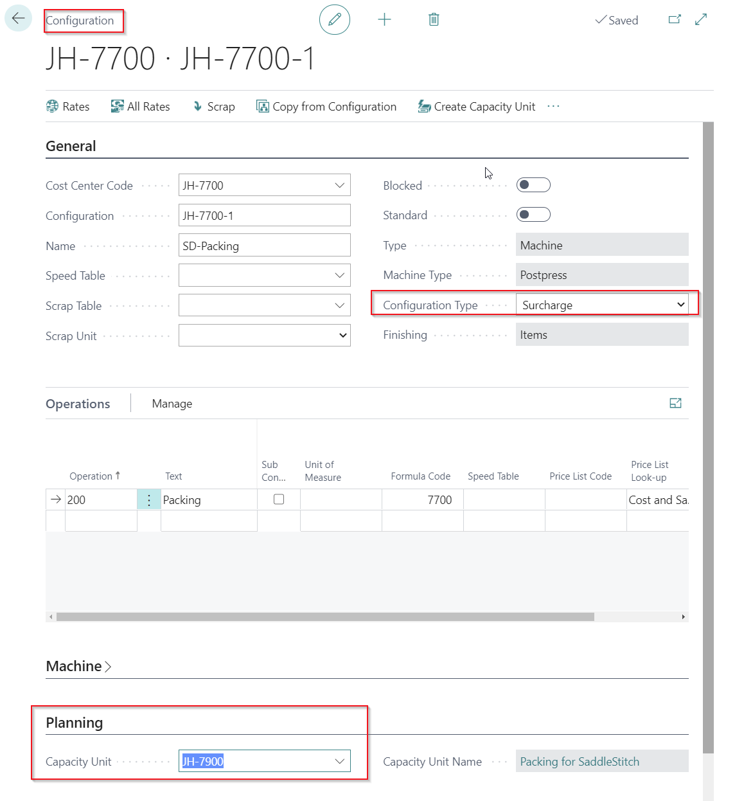
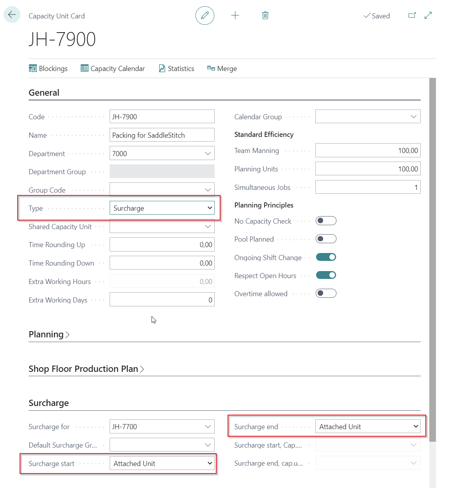
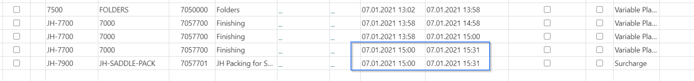

# Independent surcharge for several machines

## Introduction

In situations where production tools can be used across multiple machines on the shop floor, it makes sense to input these tools as independent surcharges. This is relevant for sheeter units, cylinders, slitters, or other types of tools that can be applied to several machines. An example at the end of this article involves a packing team in the finishing department that must be planned simultaneously with machine production.

These tools may be designated as extra tools for various (or similar) basic machines that might be used in estimation.

## Setup

To create this setup, follow these steps:

1. **Create Basic Machines**: Establish the basic printing/finishing machines on the shop floor as individual Cost Centers.
2. **Create Cost Center for Independent Surcharge**: If more independent tools are available, the Cost Center can accommodate multiple surcharge configurations.
3. **Create Surcharge Configuration**: On the Cost Center for the tool, create a surcharge configuration. This can include operations such as make-ready.
4. **Create a Price Unit**: Refer to the surcharge cost center and configuration.

   - Set the field **Surcharge To** to **Department**.
   - Set the **Surcharge to unit** field to limit the list of applicable machines (e.g., “700|710|720” for specific Price Unit codes).

5. **Setup Calculation Units**: In the calculation unit setup, you will find a new field option: **Surcharge to**.
   - The default for this field is **Cost Center**, meaning the system will operate as usual.
   - If you set the value to **Department** or **All**, the surcharge will not be tied to the cost center and can be used freely (possibly only within the department).
   - You can still use the **Surcharge to unit** field to limit which calculation units (machines) the surcharge can be used with.

**Note**: If you use “free” surcharge units, ensure that configuration codes are unique, as they will no longer be tied to the cost center. For planning purposes, do NOT specify a **Default planning unit** on the surcharge calculation unit, and do NOT specify a capacity unit on the configuration. These will be inherited from the base configuration.

## Capacity

| **Field**               | **Description**                                                                                                                                                                                                                                                                                                                                                                                       |
|-------------------------|---------------------------------------------------------------------------------------------------------------------------------------------------------------------------------------------------------------------------------------------------------------------------------------------------------------------------------------------------------------------------------------------------------|
| **Surcharge for**       | If this is a surcharge capacity, use this field to indicate which particular basic capacity it belongs to. This relates to the **Code** field in the **Capacity Unit** table. The value can be selected from the **Capacity Unit** table.                                                                                                                     |
| **Default Surcharge Group** | If this is a surcharge capacity that can be used for multiple machines, use this field to point to a group of capacities. This relates to the **Code** field in the **Additional Rates Group** table. The value can be selected from the **Additional Rates Group** table.                                                                                    |
| **Surcharge start**     | Determines the rule for calculating the **start time** of the surcharge capacity for auto-planning. Options include:  **Attached Unit** – Starts at the same time as the capacity it's attached to. **Job** – Starts at the same time as the entire job. **Spec. Unit** – Starts when a specifically selected capacity unit starts.                                                  |
| **Surcharge end**       | Determines the rule for calculating the **end time** of the surcharge capacity for auto-planning. Options include:  **Attached Unit** – Ends at the same time as the capacity it's attached to. **Job** – Ends at the same time as the entire job. **Spec. Unit** – Ends when a specifically selected capacity unit ends.                                                              |

### Result

When selecting a List of Units for the Job Item, the available surcharges created on the cost center will appear for the user to choose from. Additionally, independent surcharges will be visible in the list. The estimated time for the independent surcharge will be added to the time on the chosen printing machine, provided that:

- The machine is in the same department as the independent surcharge.
- The machines share the same process type (e.g., sheet fed, web, flexo).
- The machine is included in the filter specified in the **Surcharge to Unit** field, if filled.

The start and end time for the planning unit on the independent surcharge depend on the setup of the **Surcharge start** and **Surcharge end** fields.

## Example

In the example below, the setting "Attached Unit" for both **Surcharge start** and **Surcharge end** results in the independent surcharge being linked to a packing cost center. The planning unit for "packing" will be planned simultaneously with the saddle stitcher, meaning the packing team operates during the saddle stitcher’s production.

### Cost Center Configuration Setup for the Surcharge

### Capacity Unit Setup for the Surcharge

### Result in Job Planning

